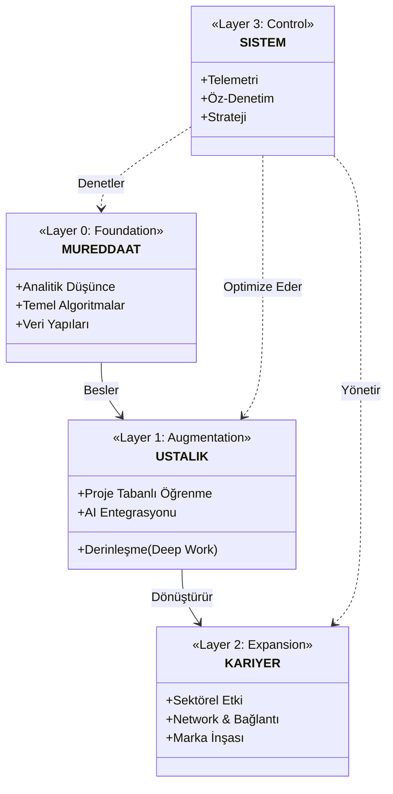

# 🛰️ STRATEJİK VERİ PROTOKOLÜ:# 🛰️ POST-AI MİMARİ YAPILANDIRMASI (SYSTEM ARCHITECTURE)

> **"Kaos, sadece anlaşılmamış bir düzendir. Bizim işimiz bu düzeni kurmaktır."**

Bu döküman; **KTÜ Yapay Zeka Sonrası Yazılım Mühendisliği Merkezi**'nin sinir sistemini, veri akış protokollerini ve hiyerarşik düzenini tanımlar. Bu yapı, rastgele açılmış klasörlerden ibaret değildir; her bir dizin, mühendisin zihnindeki bir "yetenek bloğunu" temsil eden canlı bir organdır.

---

Aşağıdaki şema, deponun (ve zihninizin) nasıl organize edilmesi gerektiğini gösteren ana haritadır:

---

## 🧬 GENETİK KATMANLAR (STRATA LAYERS)

### 🔻 STRATA 0: TEMEL (FOUNDATION) | `0_MUREDDAAT`
**Görevi:** Ham bilgiyi işleyerek zihinsel kas sistemi oluşturmak.
- **Doğa:** Teorik, Sert, Disiplinli.
- **Operasyon:** Akademik müfredatın "hacklenerek" en verimli hale getirilmesi.
- **Çıktı:** Konseptlere mutlak hakimiyet.

### ⚡ STRATA 1: GÜÇLENDİRME (AUGMENTATION) | `2_USTALIK`
**Görevi:** Temel bilgiyi silahlandırmak.
- **Doğa:** Pratik, Hızlı, Teknolojik.
- **Operasyon:** Öğrenilen teorinin projeye dökülmesi ve AI araçlarıyla (Copilot, GPT-4) hızlandırılması.
- **Çıktı:** Çalışan kod, somut ürün.

### 🌐 STRATA 2: YAYILIM (EXPANSION) | `3_KARIYER`
**Görevi:** Üretilen değeri pazara sunmak.
- **Doğa:** Sosyal, Stratejik, Politik.
- **Operasyon:** LinkedIn optimizasyonu, GitHub portföyü, ve sektör liderleriyle temas.
- **Çıktı:** İş teklifleri, prestij, saygı.

---

## 📜 3. PROTOKOL YÖNETİMİ (PROTOCOL GOVERNANCE)

Dosya isimlendirme ve yapılandırma kuralları "keyfi" değildir; **savaş alanı disiplini** (battlefield discipline) gerektirir.

1.  **Atomik İsimlendirme:** Dosyalar `Upper_Snake_Case` veya `lower_snake_case` olmalıdır. Asla boşluk kullanılamaz.
2.  **Sürdürülebilirlik:** Her klasörde mutlaka bir `README.md` (veya `OZET.md`) bulunmalı ve o klasörün amacını 1 cümle ile özetlemelidir.
3.  **Temizlik:** `node_modules`, `venv`, `.DS_Store` gibi gereksiz dosyalar anında imha edilmelidir.

---

`SİNYAL_SEVİYESİ: OPTİMAL`  
`PROTOKOL_TİPİ: GOD_MODE_ACTIVE`  
`MİMAR: @BAHATTINYUNUS`

