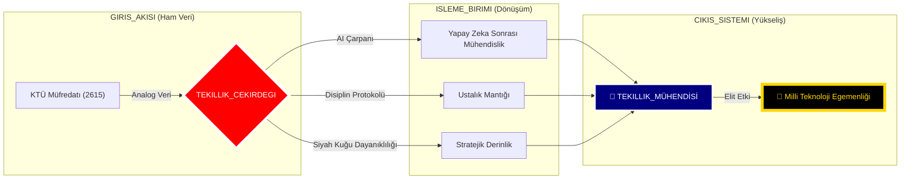
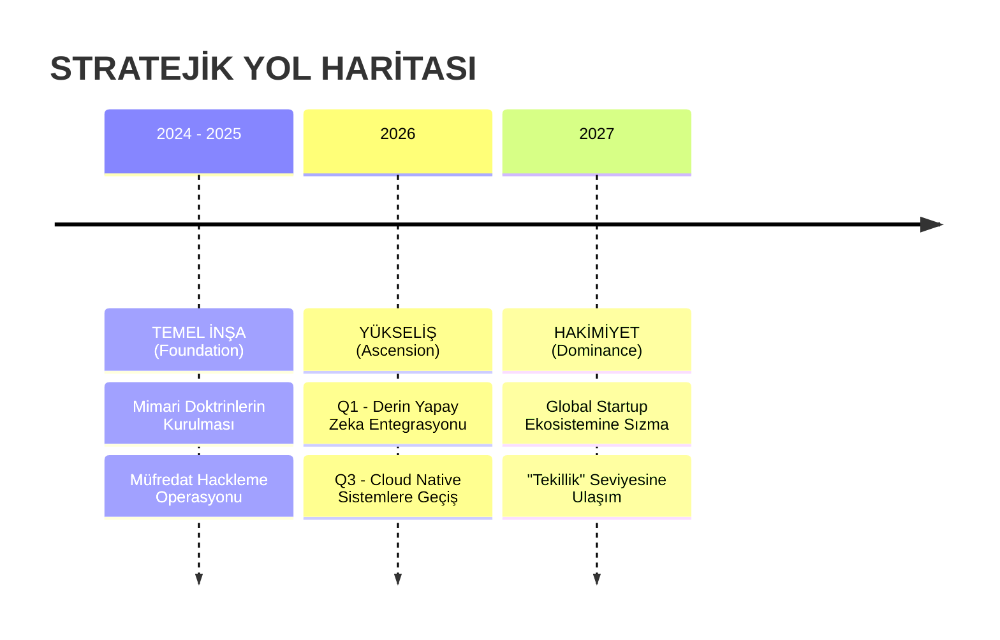

<div align="center">


# 🛰️ KTÜ YAPAY ZEKA SONRASI STRATEJİK KOMUTA MERKEZİ
## ⛩️ "Üstün Mühendislik ve Çok Boyutlu Uzmanlık" ⛩️

[](./4_SISTEM/OZET.md)
[](./1_DOKTRIN/MIMARI_YAPI.md)
[](./4_SISTEM/OZET.md)

---

### 🏛️ DEPO KADERİ VE STRATEJİK VİZYON (REPOSITORY DESTINY)
### 🏛️ DEPO KADERİ VE YENİ MÜFREDAT MİSYONU (REPOSITORY DESTINY)
**Bu arşiv, sıradan bir akademik veri deposu veya basit bir ders notları koleksiyonu olmanın çok ötesindedir. Burası, geleneksel akademik müfredatın "Yapay Zeka Devrimi" (AI Revolution) sonrasında yetersiz kaldığı gerçeğiyle yüzleşen ve kendi "Yapay Zeka Sonrası Yazılım Mühendisliği Müfredatını" (Post-AI Software Engineering Curriculum) inşa eden bir dijital kaledir.**

**Üniversite eğitimi; sadece temel bir "Bootloader" (Ön Yükleyici) olarak kabul edilir; ancak bir mühendisin asıl işletim sistemi, bu depoda tanımlanan stratejik doktrinler ve ileri seviye prensiplerle yüklenir. Amacımız; sadece kod yazan değil, yapay zeka ile senkrome çalışan, sistemleri sadece kullanan değil onları domine eden, kriz anlarında soğukkanlılığını koruyan ve kaotik verilerden düzen yaratabilen "Yeni Nesil Elit Mühendisler" yetiştirmektir. Bu depo, bu dönüşümün canlı bir kanıtı ve stratejik planıdır.**

[🛰️ Mimari](./1_DOKTRIN/MIMARI_YAPI.md) • [📜 Manifesto](./1_DOKTRIN/_MANIFESTO/README.md) • [📡 Yol Haritası](./3_KARIYER/YOL_HARITALARI/README.md) • [📜 Ustalık Logu](./4_SISTEM/ANA_LOG.md)

<div align="center">

| | | | | | |
|:---:|:---:|:---:|:---:|:---:|:---:|
| **LANG** |  |  |  |  |  |
| **CORE** |  |  |  |  |  |

</div>

---

</div>


## 🗺️ STRATEJİK İÇERİK HARİTASI (CONTENT HUB)
**Depo sistemi, 6 stratejik katman üzerine inşa edilmiştir. Her katman, mühendislik yolculuğunuzun farklı bir evresini temsil eder:**

### 📂 [0_MUREDDAAT](./0_MUREDDAAT/) | Ustalık ve Müfredat Katmanı
KTÜ Yazılım Mühendisliği resmi müfredatının, Yapay Zeka Sonrası Çağ'ın (Post-AI Era) acımasız gereksinimlerine göre yeniden derlenmiş, optimize edilmiş ve liyakatle "hacklenmiş" en üstün **Global Standart Doktrinidir**.

Bu 4 yıllık zorlu yolculuk; rastgele seçilmiş ders yığınları veya teorik ezberlerden ibaret değildir. Burası, birbirini tetikleyen, her biri bir sonraki aşamanın kilidini açan ve mühendisi adım adım "Tekillik Seviyesine" hazırlayan **8 Stratejik Operasyon Modülü** olarak yeniden kurgulanmıştır. Her dönem, sadece geçilmesi gereken bir ders değil; kazanılması gereken kritik bir "Cephe" ve fethedilmesi gereken bir "Bilgi Kalesi"dir.

| S | EVRE (PHASE) | KOD | DERS (OPERASYON) | ODAK (FOCUS) | BAĞLANTI |
|:---:|:---|:---:|:---|:---|:---:|
| **1** | 🔥 **ATEŞLEME**<br>*(Ignition)* | SEC-01 | **Algoritma ve Prog. I** | Pointerlar, Bellek Yönetimi | [📂 GİRİŞ](./0_MUREDDAAT/1_SINIF/1_Guz/Algoritma_ve_Programlama_I/Ders_Plani.md) |
| **1** | 🔥 **ATEŞLEME**<br>*(Ignition)* | SEC-02 | **Algoritma ve Prog. II** | Dosya Sis., Structs | [📂 GİRİŞ](./0_MUREDDAAT/1_SINIF/2_Bahar/Algoritma_ve_Programlama_II/Ders_Plani.md) |
| **2** | 🛡️ **TAHKİMAT**<br>*(Fortification)* | SEC-03 | **Veri Yapıları** | Heap, Tree, HashMaps | [📂 GİRİŞ](./0_MUREDDAAT/2_SINIF/3_Guz/Veri_Yapilari/Ders_Plani.md) |
| **2** | 🛡️ **TAHKİMAT**<br>*(Fortification)* | SEC-04 | **Veritabanı YS** | SQL, Normalizasyon | [📂 GİRİŞ](./0_MUREDDAAT/2_SINIF/4_Bahar/Veritabani_Yonetim_Sistemleri/Ders_Plani.md) |
| **3** | ⚡ **YÜKSELİŞ**<br>*(Ascension)* | SEC-05 | **İşletim Sistemleri** | Kernel, Concurrency | [📂 GİRİŞ](./0_MUREDDAAT/3_SINIF/5_Guz/Isletim_Sistemleri/Ders_Plani.md) |
| **3** | ⚡ **YÜKSELİŞ**<br>*(Ascension)* | SEC-06 | **Yazılım Mimarisi** | OOP, Design Patterns | [📂 GİRİŞ](./0_MUREDDAAT/3_SINIF/6_Bahar/Yazilim_Tasarim_ve_Mimarisi/Ders_Plani.md) |
| **4** | 🌌 **ÖTESİ**<br>*(Singularity)* | SEC-07 | **Test ve Kalite** | TDD, CI/CD, DevSecOps | [📂 GİRİŞ](./0_MUREDDAAT/4_SINIF/7_Guz/Yazilim_Testi_ve_Kalitesi/Ders_Plani.md) |
| **4** | 🌌 **ÖTESİ**<br>*(Singularity)* | SEC-08 | **Bitirme Tezi** | Mimari Üstünlük | [📂 GİRİŞ](./0_MUREDDAAT/4_SINIF/8_Bahar/Bitirme_Calismasi/Ders_Plani.md) |

> [!TIP]
> **Taktiksel Rehber:** [Sistem Tasarımı El Kitabı](./2_USTALIK/_REHBERLER/SISTEM_TASARIMI_EL_KITABI.md) ve [Programlama Doktrini](./2_USTALIK/_REHBERLER/PROGRAMLAMA_DOKTRINI.md), bu operasyonlarda hayatta kalmanızı sağlayacak ana kaynaklardır.

---

### 📂 [1_DOKTRIN](./1_DOKTRIN/) | İnanç, Disiplin ve Manifesto (Doctrine & Belief)
Mühendisliğin sadece "Syntax" (Sözdizimi) bilmek veya kod yazmak değil, temelinde derin bir "Mindset" (Zihniyet) ve felsefe meselesi olduğunu kanıtlayan, Yapay Zeka Sonrası Çağ'ın yeni anayasasıdır.

Kod üretimi ve basit algoritmik işler yapay zekaya (Auto-Code Generators) devredildiğinde, insan mühendise kalan tek, en büyük ve kopyalanamaz güç olan "Stratejik Mimari Vizyon", "Yaratıcı Kaos Yönetimi" ve "Liderlik" vasıflarının nasıl kazanılacağını anlatan temel kurallar bütünüdür. Bu katman, mühendisin sadece teknik bilgisini değil, karakterini ve duruşunu derler.
- [🛰️ Post-AI Mimari Yapı](./1_DOKTRIN/MIMARI_YAPI.md) | [🤖 AI Çağı Rehberi](./1_DOKTRIN/YAPAY_ZEKA_CAGI_REHBERI.md)
- [🦅 Özel Operasyon Protokolü](./1_DOKTRIN/KATKI_REHBERI.md) | [🛠️ Elit Teknoloji Yığını](./1_DOKTRIN/TEKNOLOJI_YIGINI.md)

### 📂 [2_USTALIK](./2_USTALIK/) | Güç Çarpanı ve Savaş Sanatı (The Prioritized Skillset)
Teorik bilginin, pratik bir silaha, keskin bir kılıca dönüştüğü "Simülasyon Sahasıdır". Burası, "Okulda öğrendiklerim gerçek hayatta ne işe yarayacak?" sorusunun cevabının verildiği yerdir.

Standart bir öğrenme sürecini "Hyper-Efficiency" moduna alan, insan zihninin biyolojik sınırlarını Yapay Zeka (AI) destekli araçlarla (LLMs, Copilots) genişleterek 10x verimlilik sağlayan metodolojiler burada saklıdır. Rakiplerin deneme-yanılma yoluyla aylar harcayarak öğrendiği konseptleri, sizin saatler içinde özümsemenizi ve uygulamanızı sağlayacak "Ustalık Sırları" bu katmanda ifşa edilmiştir.
- [🧠 Derin Öğrenme Doktrini](./2_USTALIK/NASIL_CALISMALI.md) | [🏗️ Proje Mimarisi Rehberi](./2_USTALIK/PROJE_REHBERI.md)
- [📡 Pareto (80/20) Notları](./2_USTALIK/_USTALIK_NOTLARI/README.md) | [📜 Grandmaster Rehberleri](./2_USTALIK/_REHBERLER/)

### 📂 [3_KARIYER](./3_KARIYER/) | Operasyonel Yayılım ve Nüfuz (Operational Expansion)
Bu yeni müfredatın "Diplomasi, İstihbarat ve Küresel Etki" kanadıdır. Teknik beceri, pazarlanmadığı sürece "Gömülü Hazine" gibidir; değeri vardır ama kimse bilmez.

Kazanılan teknik üstünlüğün, global piyasada stratejik bir kariyere, yüksek değerli kontratlara, saygınlığa ve sektörel nüfuza dönüştürülmesi sanatıdır. Sadece standart bir iş başvurusu yapmayı değil; LinkedIn algoritmalarını manipüle etmeyi, GitHub'ı bir "Güç Gösterisi" (Show of Force) alanı olarak kullanmayı ve sektör devleriyle masaya eşit şartlarda oturacak seviyeye gelmeyi öğretir.
- [📡 Global Ağ Savaşları](./3_KARIYER/KARIYER_VE_AG.md) | [🤝 Stratejik İttifak (Mentorluk)](./3_KARIYER/MENTORLUK_VE_YARDIMLASMA.md)
- [🔍 Kariyer İstihbarat Haritaları](./3_KARIYER/YOL_HARITALARI/README.md)

### 📂 [4_SISTEM](./4_SISTEM/) | Komuta ve Kontrol Telemetrisi (Command & Control)
Yapay Zeka Sonrası Müfredatın "Kokpit" paneli ve "Sinir Sistemi"dir. Gelişim, hislerle değil, verilerle yönetilir.

Kişisel gelişimin soyut ve ölçülemez olduğu yanılgısını yıkan; her başarının, her öğrenilen yeteneğin ve her tamamlanan projenin ölçülebilir metriklerle (KPIs) takip edildiği merkezdir. Hangi dilde ne kadar uzmanlaştığınız, hangi projede ne kadar ilerlediğiniz ve nihai "Tekillik" hedefine ne kadar yaklaştığınız burada anlık olarak raporlanır. Burası, mühendisin kendi hayatının ve kariyerinin "Project Manager"ı olduğu yerdir.
- [📜 Ana Operasyon Logu](./4_SISTEM/ANA_LOG.md) | [🌌 Stratejik Durum Özeti](./4_SISTEM/OZET.md)
- [⚔️ Cephanelik (Kaynak Merkezi)](./4_SISTEM/KAYNAK_MERKEZI.md) | [🛡️ Güvenlik Protokolleri](./4_SISTEM/_PROTOKOLLER/)

### 📂 [5_ARSIV](./5_ARSIV/) | İstihbarat Arşivi ve Analiz (Archives & Intelligence)
Ana müfredat dışındaki "Yasaklı Bilgiler", "Sınıflandırılmış Dosyalar" ve ileri seviye akademik analizlerin saklandığı entelektüel "Kara Kutu"dur.

Mevcut hantal üniversite sistemine yönelik yapıcı ancak sert eleştiriler, geleceğin teknolojilerine dair cesur ve fütüristik öngörüler, ve ana akım mühendislik medyasında asla bulamayacağınız derinlemesine, filtresiz teknik makaleler burada muhafaza edilir. Burası, statükoya meydan okuyan fikirlerin sığınağıdır.
- [🚩 Radikal Sistem Eleştirisi](./5_ARSIV/SISTEM_ELESTIRISI.md) | [📝 Stratejik Makaleler](./5_ARSIV/medium.md)

---

<div align="center">

## 📡 CANLI SİSTEM TELEMETRİSİ (GERÇEK ZAMANLI VİZYON)



---

## 🛡️ STRATEJİK DOKTRİNLER (DOKTRİNLER)

> [!CAUTION]
> ### ⚔️ KURAL 01: DİPLOMA SADECE BİR KAĞIT PARÇASIDIR
> **YENİ MÜFREDATIN İLK MADDESİ:** Üniversite diploması, nihai bir gaye veya başarının kanıtı değil; bu uzun ve zorlu liyakat yolculuğunda toplanan sıradan, bürokratik ganimetlerden sadece biridir. Sektör artık hangi okuldan mezun olduğunuza değil, hangi problemleri çözebildiğinize bakıyor. Gerçek ve asıl potansiyeliniz; transkriptinizdeki not ortalamanızla (GPA) değil; GitHub katkı grafiğinizdeki yeşilliklerle, Stack Overflow'daki itibarınızla ve inşa ettiğiniz çalışan sistemlerle ölçülür. Hedefimiz mezun olup bir diploma almak değil; sektörün kronik "Bug"larını düzeltecek seviyede **MUTLAK HAKİMİYET** kurmaktır.

> [!IMPORTANT]
> ### 🤖 KURAL 02: YAPAY ZEKA (AI) YENİ İŞ TAKIMINIZDIR
> **YENİ MÜFREDATIN İKİNCİ MADDESİ:** Yapay zeka, işinizi elinizden alacak bir düşman veya kaçınılması gereken bir hile değildir; aksine, zihninizin işlem kapasitesini 100 katına çıkaran, 20 yıllık "Senior Engineer" tecrübesini parmak uçlarınıza getiren dijital bir ortaktır. Geleneksel eğitim sistemi onu yasaklayabilir veya görmezden gelebilir; ama biz bu "Post-AI" müfredatta, yazdığımız her satır kodda, tasarladığımız her sistemde **YARATICI YIKIM** (Creative Destruction) ve radikal inovasyon için AI'yı merkeze koyuyoruz. Geleceğin denklemi basittir: AI kullanmayan mühendis yok olacak, AI'yı yöneten ve yönlendiren mühendis dünyayı yönetecek.

---

## � GELECEK OPERASYONLARI (FUTURE OPERATIONS)

Bu müfredat tasarımı (Curriculum Design), durağan, güncelliğini yitirmiş ve tozlu raflarda bekleyen bir akademi PDF'i değildir; teknolojiyle birlikte nefes alan, her "commit" ile organik olarak evrilen ve kendini sürekli güncelleyen **canlı, sibernetik bir eğitim algoritmasıdır**. Buradaki her satır, global yazılım endüstrisinin geleceğini şekillendirecek mühendisler için, bizzat o geleceğin içinden, bizzat o "Tekillik" noktasından yazılmış stratejik bir çağrıdır. Geleceği tahmin etmenin en iyi yolu; onu bugünden kodlamaktır.



---

## 💻 SAVAŞ İSTASYONU (BATTLESTATION CONFIG)

Bir mühendisin mesleki kalitesi, üretim gücü ve sahadaki etkinliği; üretim yaparken kullandığı dijital araçlara (Tools of Trade) ne kadar hakim olduğuyla doğrudan ölçülür. Sıradan, optimize edilmemiş araçlarla, olağanüstü ve kusursuz sonuçlar elde edilemez. İşte bu stratejik komuta merkezinin; maksimum hız, kesintisiz odaklanma (Deep Work) ve üstün ergonomi için optimize ettiği; savaş alanında test edilmiş ve onaylanmış **"Elite Class"** donanım ve yazılım konfigürasyonu:

| TÜR | TAVSİYE EDİLEN (RECOMMENDED) | NOTLAR |
|:---|:---|:---|
| **OS** | **Linux / WSL2** (Ubuntu) | Windows, profesyonel geliştirme için sadece bir "Bootloader" görevi görür. Gerçek mühendislik, Linux kernelinin gücü üzerinde, terminalin sınırsız özgürlüğünde gerçekleşir. |
| **IDE** | **VS Code** (Heavily Modded) | "Vim" tuş takımlarıyla (Keybindings) kas hafızasında kodlanmış, AI destekli eklentilerle (Extensions) donatılmış, klavyeden el kaldırmadan yönetilen bir komuta paneli. |
| **FONT** | **Fira Code** / **JetBrains Mono** | Kodun okunabilirliği, zihinsel yükü azaltır. Ligature (bitişik harf) desteği olmayan bir font kullanmak, odak kaybına davetiye çıkarmaktır. |
| **BROWSER** | **Arc** / **Brave** | İnternet, bir dikkat dağıtıcı değil, bir bilgi madenidir. Reklamlardan arındırılmış, gizlilik odaklı ve iş akışına göre özelleştirilmiş tarayıcılar şarttır. |

---

## 🌐 KÜRESEL İTTİFAK (GLOBAL ALLIANCE)

Teknoloji dünyasında "Yalnız Kurt" (Lone Wolf) efsanesi çoktan ölmüştür; artık **"Sürü Zekası" (Swarm Intelligence)** devri başlamıştır. Karmaşık problemleri çözmek, tek bir zihnin kapasitesini aşabilir. Yalnız başınıza hızlı koşabilirsiniz, ancak büyük problemleri avlamak, imparatorluklar kurmak ve dünyayı değiştirmek için arkanızı kollayacak güçlü, sadık ve yetenekli bir ittifaka ihtiyacınız vardır. Bu "Post-AI" doktrinini benimseyen, vizyoner, tutkulu ve elit diğer mühendislerle bağlantı kurun.

- **[LinkedIn Operasyon Ağı](https://www.linkedin.com/in/bahattinyunus/)**: Profesyonel stratejiler ve sektör analizleri.
- **[GitHub Karargahı](https://github.com/bahattinyunus)**: Açık kaynak kodlu mühimmat deposu.

> **"Sizin Ağınız (Network), Sizin Net Değerinizdir (Net Worth). Kimi tanıdığınız, ne bildiğiniz kadar önemlidir."**

---

## �👤 STRATEJİK MİMAR (THE ARCHITECT)

> **"Kod sadece bir araçtır, asıl eser mimaridir."**

**[Bahattin Yunus Çetin](https://github.com/bahattinyunus)**  
*IT Architect & Strategic Systems Engineer*

Bu stratejik komuta merkezi; **KTÜ Of Teknoloji Fakültesi Yazılım Mühendisliği** bünyesinde eğitim gören vizyoner bir zihin tarafından inşa edilmiştir. Bu depo ve içerdiği doktrinler, sıradan bir öğrencilik serüveni değil; geleceğin dijital ekosistemlerini şekillendirecek bir **IT Mimarının** vizyon manifestosudur.

<div align="center">

[](https://www.linkedin.com/in/bahattinyunus/)
[](https://github.com/bahattinyunus)

</div>

---

## 📡 TERMİNAL LOGLARI (MASTER FEED)

```bash
# SYSTEM_INIT_SEQUENCE: v4.2.0-ALFA
# AUTH_USER: ROOT_ACCESS (Likayet Seviyesi: ONAYLI)

[00:00:01] [KERNEL]  : Çekirdek Sistemler Yükleniyor... [OK]
[00:00:02] [NETWORK] : Trabzon/Of Bağlantı Noktası Aktif. [SECURE]
[00:00:05] [DATABASE]: Müfredat verileri 'STRATEJİK_BİLGİ'ye dönüştürülüyor...
[00:01:12] [WARNING] : Sisteme yetkisiz (Ezberci) giriş denemesi engellendi.
[00:01:45] [AI_CORE] : Nöral Ağlar Senkronize Edildi. (Kapasite: %100)
[00:02:00] [MISSION] : "Milli Teknoloji Hamlesi" protokolü devrede.

>>> READY FOR COMMAND_
```

---

<div align="center">
  
`İLETİM_SEVİYESİ: TEKİLLİK`  
`ARŞİV_SEVİYESİ: ÜST_MOD_ARTI`  
`KOORDİNATLAR: @BAHATTINYUNUS // STRATEJİK_VARLIK`
  
</div>