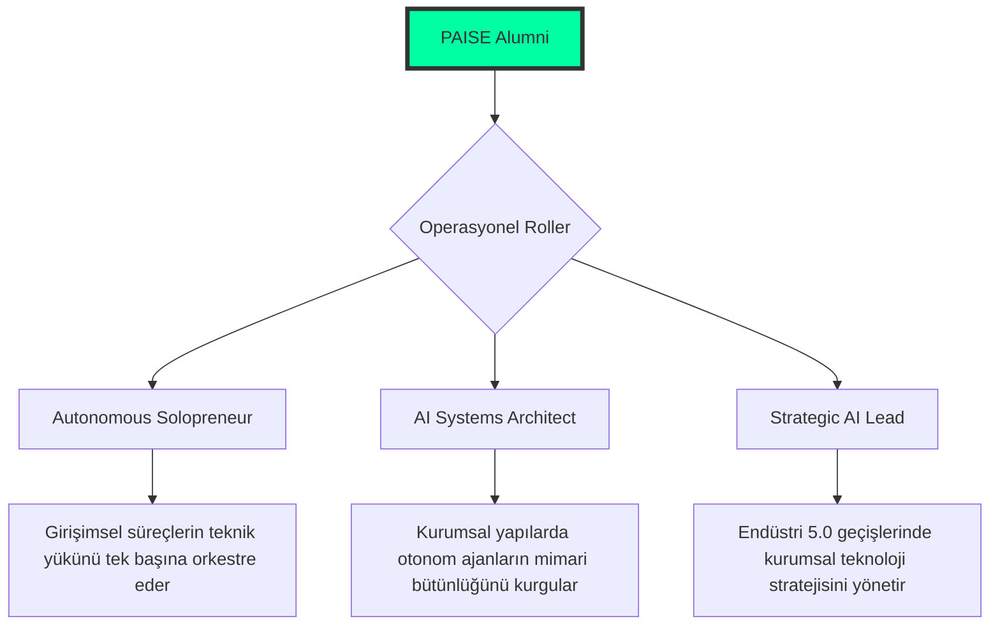

<!--
/// PAISE_INSTITUTE_INITIALIZATION: COMPLETED
/// VERSION: 12.0.0 "THE PRESTIGE EDITION"
/// STATUS: INSTITUTIONAL_AUTHORITY_ACTIVE
/// CORE_PHILOSOPHY: ARCHITECTURAL_ORCHESTRATION_OVER_SYNTAX
/// GOVERNANCE: DECENTRALIZED_ACADEMIC_ORGANIZATION
-->

# 🏛️ PAISE INSTITUTE: The School of Post-AI Engineering
### "Mimari bir vizyondur; kod ise bu vizyonun otonom bir yansımasıdır."

---

**PAISE Institute**, yapay zekanın yazılım üretim süreçlerini demokratize ettiği ve geleneksel mühendislik rollerinin evrimleştiği "Tekillik" (Singularity) sonrası dönemde; profesyonelleri stratejik **Sistem Mimarı**, **Otonom Süreç Orkestratörü** ve **Teknik Denetçi** yetkinliklerine ulaştıran küresel bir mühendislik ve araştırma merkezidir.

[📜 Kabul Protokolü](#-1-kabul-ve-kayit-protokolleri-admission) • [🗺️ Enstitü Planı](#-2-enstitü-yerleşkesi-ve-departmanlar) • [🎓 Akademik Müfredat](#-3-akademik-müfredat-ve-uzmanlik-kademe) • [🔬 Araştırma Enstitüleri](#-4-araştirma-enstitüleri-ve-stratejik-uzmanliklar) • [📊 Teknik Altyapı](#-6-teknik-altyapi-ve-geliştirme-standartlari)

---

## 🏛️ 0. AKADEMİK VİZYON VE YÖNETİCİ ÖZETİ (EXECUTIVE SUMMARY)

Geleneksel eğitim metodolojileri, "sözdizimi ezberleme" odaklı yaklaşımlarıyla günümüzün dinamik teknoloji eko-sisteminin gerisinde kalmaktadır. **PAISE Institute**, bu paradigmayı kökten değiştirerek "sistem tasarımı ve otonom süreç yönetimi" odaklı bir pedagojik model benimser. Günümüzde LLM (Large Language Model) teknolojileri, rutin kod üretimini bir emtiaya dönüştürmüştür. Bu durum, insan faktörünün değerini operasyonel katmandan stratejik denetim ve yüksek mimari katmana taşımıştır.

Enstitümüz, profesyonellerin zihinsel süreçlerini yapay zeka ile simbiyotik bir verimlilik seviyesine taşımayı hedefler. PAISE disiplini, kontrolsüz üretilen kodun yaratacağı "Mimari Kaos" riskini minimize eden ve sistemlerin "Bütünsel Bütünlüğünü" (Architectural Integrity) koruyan hibrit bir mühendislik disiplinidir. Bu yapı, her bir paydaşının nitelikli katkılarıyla kendini sürekli optimize eden, liyakat tabanlı bir **Kolektif Mühendislik Korteksi** olarak işlev görür.

---

## 📑 1. KABUL VE KAYIT PROTOKOLLERİ (ADMISSION)

Enstitüye kabul süreçleri, adayın geçmiş ünvanlarından bağımsız olarak; **Teknik Liyakat**, **Analitik Disiplin** ve **Bilişsel Adaptasyon** kriterleri üzerinden yürütülür. PAISE ekosistemi, statik bir bilgi bankası değil, her an evrimleşen dinamik bir operasyonel sahadır.

### 🧪 Akademik Ön Koşullar (Prerequisites)
- **Granüler Dekompozisyon Yetisi:** Karmaşık iş gereksinimlerini, otonom sistemler tarafından hatasız icra edilebilecek atomik teknik görevlere indirgeyebilme becerisi.
- **Mimari Seziş ve Holistik Bakış:** Kodun operasyonel işlevselliğinin ötesinde; ölçeklenebilirlik, güvenlik ve kaynak verimliliği (Token Economy) gibi parametreler üzerindeki etkilerini analiz edebilme yetisi.
- **Sürekli Teknoloji Adaptasyonu:** Güncel metodolojilerin ve araç setlerinin hızlı mutasyon süreçlerine zihinsel ve operasyonel uyum sağlama kabiliyeti.

### 📝 Kayıt ve Adaptasyon Süreci
1. **Resmi Portfolyo Oluşturma:** Deponun "Fork" edilmesiyle adayın dijital gelişim kayıtları başlatılır.
2. **Doktriner Oryantasyon:** [01-felsefe-ve-zihniyet](./01-felsefe-ve-zihniyet/) bölümündeki yönetim ilkelerinin içselleştirilmesi.
3. **Teknik Altyapı Kurulumu:** [Bölüm 6](#-6-teknik-altyapi-ve-geliştirme-standartlari) içerisinde tanımlanan standart geliştirme ortamının konfigüre edilmesi.

---

## 🗺️ 2. ENSTİTÜ YERLEŞKESİ VE DEPARTMANLAR (CAMPUS LAYOUT)

PAISE Yerleşkesi, bir mühendisin uzmanlık gelişimini destekleyen 5 ana departman ve bir referans kitaplığından oluşmaktadır:

| DEPARTMAN | KOD ADI | FONKSİYONEL TANIM (FUNCTION) |
|:---|:---|:---|
| 🧬 **01-Felsefe** | **Strategic Intelligence** | Mühendislik etiği, felsefi temeller ve stratejik zihniyet dönüşümü merkezi. |
| 🏗️ **02-Teknik** | **The Engineering Forge** | 8 aşamalı (PHASE 01-08) teknik müfredat ve otonom uygulama laboratuvarı. |
| 🧪 **03-Vaka** | **Simulation & Analysis** | Endüstriyel vaka incelemeleri, post-mortem analizler ve kriz yönetimi simülasyonları. |
| 🛠️ **04-Araçlar** | **Technical Armory** | AI ajanları, CLI araçları ve kurumsal otomasyon çözümleri kütüphanesi. |
| 📚 **99-Arşiv** | **Legacy Repository** | Tarihsel teknik verilerin ve dondurulmuş proje notlarının saklandığı referans merkezi. |

---

## 🎓 3. AKADEMİK MÜFREDAT VE UZMANLIK KADEMELERİ (SYLLABUS)

Pedagojik modelimiz, bireyin "Uygulayıcı" statüsünden "Stratejik Mimar" statüsüne geçişini kademelendirir:

### 🟢 LİSANS: AI-Native Temeller (Foundational Stage)
- **Ana Modüller:** İleri Prompt Tasarımı (Logic & Constraints), Linux Sistem Yönetimi, Profesyonel Git İş Akışları.
- **Kabiliyet Çıktısı:** Proje gereksinimlerinin %80'ini AI yardımıyla 1 saatlik operasyonel döngüde hatasız hayata geçirebilme yetisi.

### 🔵 YÜKSEK LİSANS: Bütünleşik Mimari Tasarımı (Core Evolution)
- **Ana Modüller:** Agentic Swarm Orchestration, Vector database Architecture, RAG Data Pipeline Systems.
- **Kabiliyet Çıktısı:** Bağımsız AI katmanlarını birbiriyle denetimli konuşan, hata payı minimize edilmiş karmaşık sistemler halinde orkestre etme becerisi.

### 🔴 DOKTORA: Tekillik ve Stratejik Uzmanlık (Singularity)
- **Ana Modüller:** AI Security (Security Scanning & Red Teaming), Token Economy Management, Self-Healing Infrastructure Design.
- **Kabiliyet Çıktısı:** Kendi kendini onaran otonom yapılar inşa edebilen ve küresel ölçekte sistem mimarilerine liderlik edebilen yüksek teknik vizyon.

---

## 🔬 4. ARAŞTIRMA ENSTİTÜLERİ VE STRATEJİK UZMANLIKLAR

Uzmanlık aşamasındaki araştırmacılarımız için dikey sanayi ve teknoloji odaklı araştırma kanalları:

### 🛡️ Siber Savunma ve Güvenlik Laboratuvarı
- AI ajanları ile otonom zafiyet tespiti ve savunma sistemlerinin inşa edilmesi.
- "Adversarial AI" saldırılarına karşı korunma protokollerinin standardizasyonu.

### 💰 Finansal Teknolojiler ve Token Ekonomisi
- Akıllı sözleşme mimarilerinin otonom validasyonu ve maliyet (Gas/Token) optimizasyonu.
- Merkeziyetsiz ekonomiler için otonom denetim algoritmalarının tasarımı.

---

## 📡 5. OPERASYONEL MODELLER VE KARİYER PROJEKSİYONLARI

PAISE mezunları, modern iş dünyasında aşağıdaki stratejik pozisyonlarda değer üretirler:

---

## 📊 6. TEKNİK ALTYAPI VE GELİŞTİRME STANDARTLARI (INFRASTRUCTURE)

Enstitü standartlarında kullanılan ve otonom orkestrasyon için optimize edilmiş teknoloji matrisi:

| KATEGORİ | STANDART ÜRÜN SETİ | FONKSİYONEL RASYONALİZASYON |
|:---|:---|:---|
| **Korteks Katmanı** | Claude 3.5, OpenAI o1, Llama 3 | Yüksek düzeyli mimari akıl yürütme (Reasoning) ve analiz kapasitesi. |
| **Geliştirme Katmanı** | Cursor, Windsurf, LangGraph | AI-Native kodlama ve derin bağlamsal (Context) süreç yönetimi. |
| **Hafıza Yönetimi** | Pinecone, pgvector, Redis | AI modellerinin vektörel hafıza ve uzun süreli bağlam kontrolü. |
| **Operasyonel Katman** | Linux (Arch/Debian), Docker, Warp | Kernel seviyesinde kontrol ve terminal tabanlı otonom dağıtım hızı. |

---

## 🛡️ 7. KURUMSAL DOKTRİN VE ETİK İLKELER (THE CODES)

- **MADDE 01: LİYAKAT MERKEZİYETİ.** Kurum içi hiyerarşi, ünvanlardan değil, teknik çözüm kabiliyetinden ve mimari liyakatten beslenir.
- **MADDE 02: DİNAMİK ADAPTASYON.** Teknolojik durağanlık bir regresyon sebebidir. Değişimi kontrol edebilen disiplinler hayatta kalır.
- **MADDE 03: SİMBİYOTİK MÜHENDİSLİK.** Yapay zeka bir alternatif değil, mühendisin bilişsel kapasitesini artıran bir entegrasyon katmanıdır.

---

**"Mimari bir vizyondur, teknoloji ise bu vizyonun icra aracıdır. Geleceği birlikte orkestre ediyoruz."**  
**[Bahattin Yunus Çetin](https://github.com/bahattinyunus)**  
*Founder & Multi-Disciplinary Systems Designer | AI Integration Expert*

`INSTITUTE_STATUS: FULL_OPERATIONAL_PRESTIGE_V12`  
`METRICS: MEASURED_BY_SYSTEM_INTELLIGENCE`  
`BY: THE ARCHITECT & THE COLLECTIVE`

