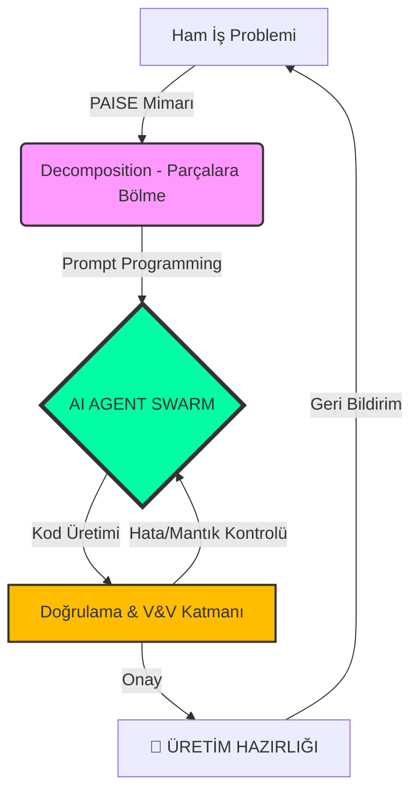

<!--
/// PAISE_SYSTEM_INITIALIZATION: OPERATIONAL
/// ENTRANCE_PROTOCOL: OPEN_SOURCE_ELITE
/// CORE_PHILOSOPHY: ARCHITECTURE_OVER_SYNTAX
/// STATUS: EXPANDING_HORIZON
-->

<div align="center">


# 🌌 PAISE: Post-AI Software Engineering Curriculum
### "Kod artık bir çıktı değil, bir emtiadır. Gerçek değer; Mimari ve Denetimdedir."

[](./99-sistem-ve-arsiv/)
[](https://github.com/arch-yunus/post-ai-swe/actions)
[](./CONTRIBUTING.md)

---

**PAISE**, yapay zekanın kodu saniyeler içinde üretebildiği "Tekillik Sonrası" dünyada, insanın rolünü **Operatörlük**'ten **Mimarlık**'a taşıyan evrimsel bir müfredattır.

[🏛️ Zihniyet](./01-felsefe-ve-zihniyet/) • [🛰️ Teknik Müfredat](./02-teknik-mufredat/) • [📡 Vaka Analizleri](./03-vaka-analizleri/) • [🛠️ Araçlar](./04-araç-kütüphanesi/)

</div>

---

## 🦾 THE PAISE PARADOX: NEDEN ŞİMDİ?

Geleneksel yazılım eğitimi, "nasıl kod yazılır?" sorusuna odaklanır. Ancak bugün, lise seviyesindeki bir genç, doğru prodüksiyon araçlarıyla kıdemli bir mühendisin bir haftada yazdığı kodu dakikalar içinde üretebiliyor. 

**PAISE**, bu hızı bir tehdit değil, bir kaldıraç olarak kullanır. Odak noktasını **Syntax (Sözdizimi)**'den **Systems Thinking (Sistem Düşüncesi)**'ne çeker.

### 🔄 Paradigma Değişimi

| ALAN | ESKİ DÜNYA (Legacy SWE) | PAISE DÜNYASI (Next-Gen) |
|:---|:---|:---|
| **Kod Üretimi** | El ile (Scratch) | AI Orkestrasyonu & Agentic Flow |
| **Hata Ayıklama** | Deneme-Yanılma | Bağlam Yönetimi (Context Control) |
| **Mimari** | Çerçeve (Framework) Bağımlı | Modüler & Ajan-Dostu (Agent-Friendly) |
| **Doğrulama** | Manuel Test | Otonom Denetim & V&V Protokolleri |
| **Ekonomi** | Saatlik İşçilik | Problem Çözüm Verimliliği & Token Yönetimi |

---

## 🏛️ MÜFREDATIN 4 ANA SÜTUNU (CORE PILLARS)

### 1. 🧩 Problem Ayrıştırma (Decomposition)
Karmaşık, amorf iş problemlerini, yapay zeka ajanlarının hata yapmadan çözebileceği **"Atomik İş Birimleri"**ne bölme sanatı. Bir mühendis ne kadar iyi bölerse, sistem o kadar hızlı inşa edilir.

### 2. 🏛️ Sistem Mimarisi (Architectural Vision)
Mikro hizmetlerden, kendi kendine karar verebilen **Agentic Workflow**'lara geçiş. PAISE mühendisi, tek tek tuğlaları değil, kalenin savunma ve yaşam döngüsünü tasarlar.

### 3. 🛡️ Doğrulama & Denetim (Verification & Validation)
İnsan zihni artık üretici değil, **Baş Denetçi**dir. AI tarafından üretilen kodun güvenliğini, performansını ve business logic uyumunu test eden otonom protokollerin inşası.

### 4. 🚀 Endüstriyel Optimizasyon (Industrial Scaling)
Yazılımın sadece bir ekran çıktısı değil; lojistikte, savunma sanayiinde veya otonom robotikte bir "operasyonel beyin" olarak konumlandırılması.

---

## 📚 EVRİMSEL YOL HARİTASI (THE LEVELS)

### 🟢 Seviye 1: AI-Native Temeller
- **Prompt Architecture:** Talimat değil, mantıksal kısıtlamalar ve bağlam (context) tasarlamak.
- **Agentic IDE Ops:** Cursor, Windsurf ve yerel (Local) LLM modellerini birer silah gibi kullanmak.
- **Code Fluency:** Üretilen kodun satırlarını değil, niyetini ve yan etkilerini okuyabilmek.

### 🔵 Seviye 2: Mimari ve Akış Tasarımı
- **Functional Symmetry:** Frontend ve Backend'in AI yardımıyla nasıl tek bir sistem gibi koordine edildiği.
- **AI-First Design Patterns:** Ajanların birbirine veri aktarabileceği, insan müdahalesine minimal ihtiyaç duyan API modelleri.
- **RAG & Vector Context:** Yapay zekanın statik bilgisini projenin dinamik verisiyle besleme sanatı.

### 🔴 Seviye 3: İleri Seviye Optimizasyon ve Güvenlik
- **Defense in Depth:** Prompt injection ve model halüsinasyonlarına karşı teknik bariyerler.
- **Token Economy:** $$ROI = \frac{Context Quality}{Token Cost}$$ Analitiği ile sistem maliyetini minimize etme.
- **Production Autonomy:** Kendi kendini iyileştiren (Self-healing) ve ölçeklenen sistemler.

---

## 📡 SİSTEM TELEMETRİSİ (FLOW)



---

## 🛠️ REPO YAPISI (STRUCTURE)

```text
.
├── 01-felsefe-ve-zihniyet/    # Post-AI mühendislik etiği ve bakış açısı
├── 02-teknik-mufredat/        # Modül modül ders içerikleri (PHASE_01 - PHASE_08)
├── 03-vaka-analizleri/        # Gerçek dünya projeleri ve AI çözümleri
├── 04-araç-kütüphanesi/       # Önerilen AI araçları ve yapılandırmalar
├── 99-sistem-ve-arsiv/        # Eski sistem verileri ve legacy arşiv
├── .github/                   # CI/CD (Link Check) ve Topluluk Şablonları
└── CONTRIBUTING.md            # Kolektif Akla nasıl katkı sağlarsınız?
```

---

## 🤝 KOLEKTİF AKLA KATIL (CONTRIBUTE)

Bu müfredat "statik" değildir. Her pull request, PAISE'nin bir sonraki sürümüdür.
- **Hata Yakala:** Kırık linkler, eski teknolojik tavsiyeler.
- **İçerik Ekle:** Yeni bir ajan yapısı veya optimizasyon stratejisi.
- **Sistemi Zorla:** Daha liyakatli ve sert testler öner.

---

## 🛡️ TOPLULUK DOKTRİNİ (COMMUNITY DOCTRINE)

> [!CAUTION]
> ### ⚔️ KURAL 01: OTORİTE KİMSE DEĞİLDİR (NO MASTERS)
> PAISE ekosisteminde bilgi hiyerarşisi yoktur. En iyi fikri kimin söylediği değil, o fikrin sistem mimarisine sağladığı liyakat esastır. Egonuzu kapıda bırakın, PR'ınızı atın.

> [!IMPORTANT]
> ### 🤖 KURAL 02: ADAPTASYON YA DA ÖLÜM (ADAPT OR DIE)
> Bugünün "State-of-the-art" modeli yarının "Legacy" teknolojisidir. PAISE belirli bir araca değil, değişimi bizzat yöneten "Mimarlık" zihniyetine sadıktır. Değişemeyen elenir.

---

## 💻 SAVAŞ İSTASYONU (BATTLESTATION CONFIG)

Yapay zeka orkestrasyonu için optimize edilmiş önerilen çalışma ortamı:

| TÜR | TAVSİYE EDİLEN (RECOMMENDED) | NOTLAR |
|:---|:---|:---|
| **OS** | **Linux / WSL2** | Özgür yazılım, yüksek terminal hızı. |
| **IDE** | **Cursor / Windsurf** | AI-Native kodlama ve ajan yönetimi için. |
| **LLMs** | **Claude 3.5 Sonnet / GPT-4o** | Mimari analiz ve problem ayrıştırma için. |
| **CONSOLE** | **Warp / Oh-My-Zsh** | AI entegre edilmiş güçlü terminal akışları. |

---

## 🌐 KÜRESEL İTTİFAK (GLOBAL ALLIANCE)

PAISE bir yalnızlık değil, bir "Swarm" (Sürü) hareketidir. Bu canlı organizmaya katıl, beslen ve besle.

- **[LinkedIn Operasyon Ağı](https://www.linkedin.com/in/bahattinyunus/)**: Profesyonel stratejiler ve networking.
- **[GitHub Karargahı](https://github.com/bahattinyunus)**: PAISE çekirdek kodları ve diğer projeler.

---

<div align="center">

**"Mimari bir kaderdir. Kaleyi birlikte inşa ediyoruz."**  
**[Bahattin Yunus Çetin](https://github.com/bahattinyunus)**  
*Multi-Disciplinary Systems Designer | Solopreneur Initiator*

`STATUS: SINGULARITY_V3_ACTIVE`  
`METRICS: MEASURING_EVOLUTION`

</div>
