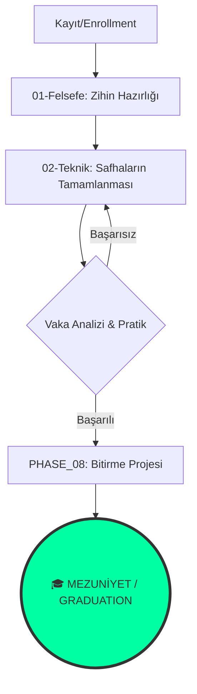

<!--
/// PAISE_ACADEMY_INITIALIZATION: COMPLETED
/// ACCESS_LEVEL: ADMISSION_OPEN
/// CORE_OBJECTIVE: ARCHITECT_BREEDING_GROUND
/// VERSION: 5.0.0 "THE ACADEMY"
-->

# 🏛️ PAISE ACADEMY: The School of Post-AI Engineering
### "Diplomalar duvarda sararır, mimari ise dünyayı değiştirir."

---

**PAISE Academy**, yazılım dünyasının "Tekillik" (Singularity) sonrası ihtiyaç duyduğu yeni nesil **Sistem Mimarlarını** yetiştirmek üzere kurulmuş, otonom ve kolektif bir eğitim kurumudur.

[📖 Kayıt Rehberi](#-kayit-ve-akademik-prosedür) • [🗺️ Kampüs Planı](#-kampüs-plani-dizin-yapisi) • [🎓 Mezuniyet](#-mezuniyet-ve-yetkinlikler) • [🛡️ Dekanlık](./CONTRIBUTING.md)

---

## 🏛️ 1. AKADEMİK VİZYON (THE DEAN'S LOG)

Geleneksel üniversite müfredatları, endüstrinin gerisinde kalan "statik" yapılardır. **PAISE Academy**, bir okulun ciddiyetini, açık kaynağın hızı ve yapay zekanın gücüyle birleştirir. Burada "öğrenci" yoktur; gelişmekte olan **Sistem Operatörleri** ve **Mimarlar** vardır.

---

## 📑 2. KAYIT VE AKADEMİK PROSEDÜR (ADMISSION)

Akademiye giriş yapmak için herhangi bir sınav gerekmez; ancak liyakat ve disiplin zorunludur.

### 🧪 Ön Koşullar (Prerequisites)
- **Merak:** "Neden?" sorusunu günde en az 100 kez sorma yetisi.
- **Temel Okuryazarlık:** Kodun ne olduğunu bilmek (yazabilmek değil, anlayabilmek).
- **Donanım:** İnternet erişimi ve [Savaş İstasyonu](#-savaş-istasyonu-battlestation-config) gereklilikleri.

### 📝 Kayıt Adımları (Enrollment)
1.  **Repo'yu Forkla:** Kendi öğrenci cüzdanını oluştur.
2.  **Manifestoyu İmzala:** [Zihniyet dökümanlarını](./01-felsefe-ve-zihniyet/) oku ve içselleştir.
3.  **Başlangıç Modülü:** `02-teknik-mufredat/PHASE_01_IGNITION` ile ateşlemeyi başlat.

---

## 🗺️ 3. KAMPÜS PLANI (DİZİN YAPISI)

Akademimiz 5 ana departmandan ve bir legacy arşivden oluşur:

| DEPARTMAN | KAMPÜS ALANI | AÇIKLAMA (FUNCTION) |
|:---|:---|:---|
| 🧬 **01-Felsefe** | **Rektörlük & Manifesto** | Doktrinler, etik kurallar ve zihniyet dönüşümü. |
| 🏗️ **02-Teknik** | **Derslikler & Laboratuvarlar** | 8 safhalı ana müfredat (Ders içerikleri). |
| 🧪 **03-Vaka** | **Simülasyon Merkezi** | Gerçek dünya projeleri ve kriz yönetimi analizleri. |
| 🛠️ **04-Araçlar** | **Teknik Atölye** | AI ajanları, scriptler ve otomasyon kütüphanesi. |
| 📚 **99-Arşiv** | **Kütüphane (Legacy)** | Eski dünya bilgileri ve dondurulmuş proje notları. |

---

## 🎓 4. MÜFREDAT VE MEZUNİYET (THE SYLLABUS)

Akademi 3 ana seviyeden oluşur. Her seviye, bir mühendisin evrimindeki kritik bir aşamayı temsil eder.

### 🟢 LİSANS: AI-Native Temeller
> **Amaç:** Makineyle konuşmayı ve terminalde akmayı öğrenmek.
- **Dersler:** Prompt Mimari, Linux Kernel Ops, Git Flow.

### 🔵 YÜKSEK LİSANS: Mimari ve Akış
> **Amaç:** Bağımsız bileşenleri birleştiren otonom sistemler kurmak.
- **Dersler:** Agentic Workflow Design, Vector DBs, System Dynamics.

### 🔴 DOKTORA: Tekillik ve Optimizasyon
> **Amaç:** Kendi kendini yöneten ve koruyan sistemler inşa etmek.
- **Dersler:** AI Security, Token Economy Management, Self-Healing Code.

**Mezuniyet:** `PHASE_08_SINGULARITY` başarıyla tamamlandığında, katılımcı **PAISE Certified System Architect** ünvanını kolektif akıl nezdinde kazanır.

---

## 🛡️ 5. AKADEMİK DOKTRİN (THE CODES)

> [!CAUTION]
> ### ⚔️ DİSİPLİN 01: LİYAKAT ESASLIDIR
> Akademi içinde ünvanlar değil, çözülen problemler konuşur. En kıdemli "hoca", en çok hata yapıp ondan ders çıkarandır.

> [!IMPORTANT]
> ### 🤖 DİSİPLİN 02: HİBRİT ÇALIŞMA ZORUNLUDUR
> AI kullanmadan iş yapmaya çalışmak, elinle kuyu kazmaya benzer. AI'yı bir köle değil, bir partner olarak kullanmayı reddedenler Akademi'den uzaklaştırılır.

---

## 💻 6. SAVAŞ İSTASYONU (RESEARCH LABS)

Öğrencilerimiz için önerilen teknik laboratuvar konfigürasyonu:

| KATEGORİ | STANDART | ARAÇ |
|:---|:---|:---|
| **Laboratuvar (OS)** | **Linux / WSL2** | Arch, Debian veya Ubuntu. |
| **Enstrüman (IDE)** | **Cursor / Windsurf** | AI-First Development. |
| **Korteks (LLM)** | **Claude / OpenAI / Local** | Düşünsel partner. |

---

## 📡 7. SİSTEM AKIŞI (ACADEMIC FLOW)

---

## 🤝 8. AKADEMİK KURULA KATIL (FACULTY)

PAISE Academy, topluluk tarafından yönetilen otonom bir yapıdır.
- **Ders Müfredatını Güncelle:** Yeni teknolojiler için PR aç.
- **Asistanlık Yap:** Gelen Issue'lara cevap ver, yeni gelenlere mentorluk yap.

---

**"Akademi bir bina değil, bir fikir hareketidir."**  
**[Bahattin Yunus Çetin](https://github.com/bahattinyunus)**  
*Founder of PAISE Academy | Multi-Disciplinary Systems Designer*

`STATUS: ACADEMY_SESSION_ACTIVE`  
`ENROLLMENT: SYMBOLIC_INFINTY`

