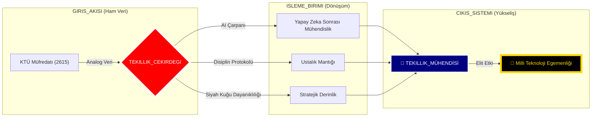

<div align="center">


# 🛰️ KTÜ YAPAY ZEKA SONRASI STRATEJİK KOMUTA MERKEZİ
## ⛩️ "Üstün Mühendislik ve Çok Boyutlu Uzmanlık" ⛩️

[](./4_SISTEM/OZET.md)
[](./1_DOKTRIN/MIMARI_YAPI.md)
[](./4_SISTEM/OZET.md)

---

### 🏛️ DEPO KADERİ (REPOSITORY DESTINY)
**Bu arşiv; sıradan bir akademik depo değildir. Bu, liyakatin dijital bir kale (Fortress) haline geldiği, müfredatın bir "Temel Katman" (Base Layer) olarak aşılıp, yapay zeka ve mühendislik disipliniyle arşa çıkarıldığı bir "Tekillik" (Singularity) merkezidir.**

[🛰️ Mimari](./1_DOKTRIN/MIMARI_YAPI.md) • [📜 Manifesto](./1_DOKTRIN/_MANIFESTO/README.md) • [📡 Yol Haritası](./3_KARIYER/YOL_HARITALARI/README.md) • [📜 Ustalık Logu](./4_SISTEM/ANA_LOG.md)

<div align="center">

| | | | | | |
|:---:|:---:|:---:|:---:|:---:|:---:|
| **LANG** |  |  |  |  |  |
| **CORE** |  |  |  |  |  |

</div>

---

</div>


## 🗺️ STRATEJİK İÇERİK HARİTASI (CONTENT HUB)
**Depo sistemi, 6 stratejik katman üzerine inşa edilmiştir. Her katman, mühendislik yolculuğunuzun farklı bir evresini temsil eder:**

### 📂 [0_MUREDDAAT](./0_MUREDDAAT/) | Ustalık ve Müfredat Katmanı
KTÜ Yazılım Mühendisliği resmi müfredatının liyakatle "hacklenmiş" hali. 4 yıllık yolculuk, **8 stratejik sektöre** ayrılmıştır:

| S | EVRE (PHASE) | KOD | DERS (OPERASYON) | ODAK (FOCUS) | BAĞLANTI |
|:---:|:---|:---:|:---|:---|:---:|
| **1** | 🔥 **ATEŞLEME**<br>*(Ignition)* | SEC-01 | **Algoritma ve Prog. I** | Pointerlar, Bellek Yönetimi | [📂 GİRİŞ](./0_MUREDDAAT/1_SINIF/1_Guz/Algoritma_ve_Programlama_I/Ders_Plani.md) |
| **1** | 🔥 **ATEŞLEME**<br>*(Ignition)* | SEC-02 | **Algoritma ve Prog. II** | Dosya Sis., Structs | [📂 GİRİŞ](./0_MUREDDAAT/1_SINIF/2_Bahar/Algoritma_ve_Programlama_II/Ders_Plani.md) |
| **2** | 🛡️ **TAHKİMAT**<br>*(Fortification)* | SEC-03 | **Veri Yapıları** | Heap, Tree, HashMaps | [📂 GİRİŞ](./0_MUREDDAAT/2_SINIF/3_Guz/Veri_Yapilari/Ders_Plani.md) |
| **2** | 🛡️ **TAHKİMAT**<br>*(Fortification)* | SEC-04 | **Veritabanı YS** | SQL, Normalizasyon | [📂 GİRİŞ](./0_MUREDDAAT/2_SINIF/4_Bahar/Veritabani_Yonetim_Sistemleri/Ders_Plani.md) |
| **3** | ⚡ **YÜKSELİŞ**<br>*(Ascension)* | SEC-05 | **İşletim Sistemleri** | Kernel, Concurrency | [📂 GİRİŞ](./0_MUREDDAAT/3_SINIF/5_Guz/Isletim_Sistemleri/Ders_Plani.md) |
| **3** | ⚡ **YÜKSELİŞ**<br>*(Ascension)* | SEC-06 | **Yazılım Mimarisi** | OOP, Design Patterns | [📂 GİRİŞ](./0_MUREDDAAT/3_SINIF/6_Bahar/Yazilim_Tasarim_ve_Mimarisi/Ders_Plani.md) |
| **4** | 🌌 **ÖTESİ**<br>*(Singularity)* | SEC-07 | **Test ve Kalite** | TDD, CI/CD, DevSecOps | [📂 GİRİŞ](./0_MUREDDAAT/4_SINIF/7_Guz/Yazilim_Testi_ve_Kalitesi/Ders_Plani.md) |
| **4** | 🌌 **ÖTESİ**<br>*(Singularity)* | SEC-08 | **Bitirme Tezi** | Mimari Üstünlük | [📂 GİRİŞ](./0_MUREDDAAT/4_SINIF/8_Bahar/Bitirme_Calismasi/Ders_Plani.md) |

> [!TIP]
> **Taktiksel Rehber:** [Sistem Tasarımı El Kitabı](./2_USTALIK/_REHBERLER/SISTEM_TASARIMI_EL_KITABI.md) ve [Programlama Doktrini](./2_USTALIK/_REHBERLER/PROGRAMLAMA_DOKTRINI.md), bu operasyonlarda hayatta kalmanızı sağlayacak ana kaynaklardır.

---

### 📂 [1_DOKTRIN](./1_DOKTRIN/) | İnanç ve Disiplin
Liyakatin kanunları. Post-AI çağında nasıl ayakta kalınır ve nasıl hükmedilir?
- [🛰️ Mimari Yapı](./1_DOKTRIN/MIMARI_YAPI.md) | [🤖 AI Çağı Rehberi](./1_DOKTRIN/YAPAY_ZEKA_CAGI_REHBERI.md)
- [🦅 Katkı Rehberi](./1_DOKTRIN/KATKI_REHBERI.md) | [🛠️ Teknoloji Yığını](./1_DOKTRIN/TEKNOLOJI_YIGINI.md)

### 📂 [2_USTALIK](./2_USTALIK/) | Güç Çarpanı
Öğrenmeyi öğrenmek ve derinleşmek. Teoriyi 10x güçlendiren metodolojiler.
- [🧠 Nasıl Çalışmalı?](./2_USTALIK/NASIL_CALISMALI.md) | [🏗️ Proje Rehberi](./2_USTALIK/PROJE_REHBERI.md)
- [📡 Ustalık Notları (80/20)](./2_USTALIK/_USTALIK_NOTLARI/README.md) | [📜 Derin Rehberler](./2_USTALIK/_REHBERLER/)

### 📂 [3_KARIYER](./3_KARIYER/) | Operasyonel Yayılım
Yeteneklerin sektörel etkiye dönüştürülmesi. CV'nin ötesinde bir varlık inşası.
- [📡 Kariyer ve Ağ](./3_KARIYER/KARIYER_VE_AG.md) | [🤝 Mentorluk Sistemi](./3_KARIYER/MENTORLUK_VE_YARDIMLASMA.md)
- [🔍 Kariyer Yol Haritaları](./3_KARIYER/YOL_HARITALARI/README.md)

### 📂 [4_SISTEM](./4_SISTEM/) | Komuta ve Kontrol
Depo yönetim paneli ve stratejik telemetri verileri.
- [📜 Ana Log](./4_SISTEM/ANA_LOG.md) | [🌌 Stratejik Özet](./4_SISTEM/OZET.md)
- [⚔️ Disiplin Cephanesi](./4_SISTEM/KAYNAK_MERKEZI.md) | [🛡️ Protokoller](./4_SISTEM/_PROTOKOLLER/)

### 📂 [5_ARSIV](./5_ARSIV/) | Yan İçerik ve Analiz
Sisteme yönelik eleştiriler ve derinlemesine akademik analizler.
- [🚩 Sistem Eleştirisi](./5_ARSIV/SISTEM_ELESTIRISI.md) | [📝 Medium Makaleleri](./5_ARSIV/medium.md)

---

<div align="center">

## 📡 CANLI SİSTEM TELEMETRİSİ (GERÇEK ZAMANLI VİZYON)



---

## 🛡️ STRATEJİK DOKTRİNLER (DOKTRİNLER)

> [!CAUTION]
> ### ⚔️ KURAL 01: DİPLOMA YAN ÜRÜNDÜR
> Diploma bir gaye değil, liyakat yolculuğunda toplanan bir ganimettir. Asıl hedef, sistemin ötesindeki **MUTLAK HAKİMİYET**tir.

> [!IMPORTANT]
> ### 🤖 KURAL 02: YAPAY ZEKA SİNERJİSİ
> Yapay zeka senin kölen değil, zihninin 100x genişlemiş halidir. Onu yasaklayan sistemlere inat, biz onu **YARATICI YIKIM** (Creative Destruction) için kullanıyoruz.

---

## 👤 STRATEJİK MİMAR (THE ARCHITECT)

> **"Kod sadece bir araçtır, asıl eser mimaridir."**

**[Bahattin Yunus Çetin](https://github.com/bahattinyunus)**  
*IT Architect & Strategic Systems Engineer*

Trabzon'un Of ilçesinde konuşlu akademik üssünden, küresel yazılım mühendisliği standartlarını yeniden tanımlayan operasyonlar yürütmektedir. Bu depo ve içerdiği doktrinler, sıradan bir öğrencilik serüveni değil; geleceğin dijital ekosistemlerini şekillendirecek bir **IT Mimarının** vizyon manifestosudur.

<div align="center">

[](https://www.linkedin.com/in/bahattinyunus/)
[](https://github.com/bahattinyunus)

</div>

---

## 📡 TERMİNAL LOGLARI (MASTER FEED)

```bash
# SYSTEM_INIT_SEQUENCE: v4.2.0-ALFA
# AUTH_USER: ROOT_ACCESS (Likayet Seviyesi: ONAYLI)

[00:00:01] [KERNEL]  : Çekirdek Sistemler Yükleniyor... [OK]
[00:00:02] [NETWORK] : Trabzon/Of Bağlantı Noktası Aktif. [SECURE]
[00:00:05] [DATABASE]: Müfredat verileri 'STRATEJİK_BİLGİ'ye dönüştürülüyor...
[00:01:12] [WARNING] : Sisteme yetkisiz (Ezberci) giriş denemesi engellendi.
[00:01:45] [AI_CORE] : Nöral Ağlar Senkronize Edildi. (Kapasite: %100)
[00:02:00] [MISSION] : "Milli Teknoloji Hamlesi" protokolü devrede.

>>> READY FOR COMMAND_
```

---

<div align="center">
  
`İLETİM_SEVİYESİ: TEKİLLİK`  
`ARŞİV_SEVİYESİ: ÜST_MOD_ARTI`  
`KOORDİNATLAR: @BAHATTINYUNUS // STRATEJİK_VARLIK`
  
</div>