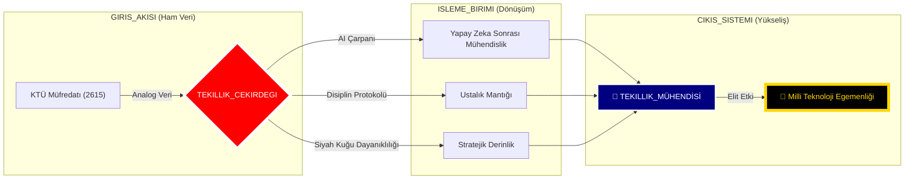
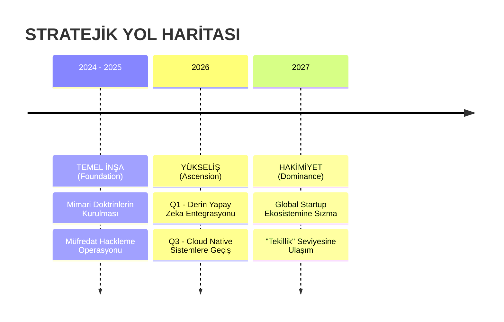

<div align="center">


# 🛰️ KTÜ YAPAY ZEKA SONRASI STRATEJİK KOMUTA MERKEZİ
## ⛩️ "Üstün Mühendislik ve Çok Boyutlu Uzmanlık" ⛩️

[](./4_SISTEM/OZET.md)
[](./1_DOKTRIN/MIMARI_YAPI.md)
[](./4_SISTEM/OZET.md)

---

### 🏛️ DEPO KADERİ VE STRATEJİK VİZYON (REPOSITORY DESTINY)
### 🏛️ DEPO KADERİ VE YENİ MÜFREDAT MİSYONU (REPOSITORY DESTINY)
**Bu arşiv, sıradan bir akademik veri deposu olmanın çok ötesindedir. Burası, geleneksel akademik müfredatın "Yapay Zeka Devrimi" (AI Revolution) sonrasında yetersiz kaldığı gerçeğiyle yüzleşen ve kendi "Yapay Zeka Sonrası Yazılım Mühendisliği Müfredatını" (Post-AI Software Engineering Curriculum) inşa eden bir dijital kaledir. Üniversite eğitimi sadece temel bir "Bootloader" olarak kabul edilir; asıl işletim sistemi burada, bu stratejik doktrinlerle yüklenir. Amacımız; sadece kod yazan değil, yapay zeka ile senkrome çalışan, sistemleri sadece kullanan değil onları domine eden "Yeni Nesil Elit Mühendisler" yetiştirmektir.**

[🛰️ Mimari](./1_DOKTRIN/MIMARI_YAPI.md) • [📜 Manifesto](./1_DOKTRIN/_MANIFESTO/README.md) • [📡 Yol Haritası](./3_KARIYER/YOL_HARITALARI/README.md) • [📜 Ustalık Logu](./4_SISTEM/ANA_LOG.md)

<div align="center">

| | | | | | |
|:---:|:---:|:---:|:---:|:---:|:---:|
| **LANG** |  |  |  |  |  |
| **CORE** |  |  |  |  |  |

</div>

---

</div>


## 🗺️ STRATEJİK İÇERİK HARİTASI (CONTENT HUB)
**Depo sistemi, 6 stratejik katman üzerine inşa edilmiştir. Her katman, mühendislik yolculuğunuzun farklı bir evresini temsil eder:**

### 📂 [0_MUREDDAAT](./0_MUREDDAAT/) | Ustalık ve Müfredat Katmanı
KTÜ Yazılım Mühendisliği resmi müfredatının, Yapay Zeka Sonrası Çağ'ın (Post-AI Era) gereksinimlerine göre yeniden derlenmiş, optimize edilmiş ve liyakatle "hacklenmiş" en üstün **Global Standart Doktrinidir**. 4 yıllık bu akademik maraton; rastgele seçilmiş ders yığınları değil, birbirini tetikleyen ve mühendisi "Tekillik Seviyesine" hazırlayan **8 Stratejik Operasyon Modülü** olarak yeniden kurgulanmıştır. Her dönem, bir ders değil, kazanılması gereken bir "Cephe"dir.

| S | EVRE (PHASE) | KOD | DERS (OPERASYON) | ODAK (FOCUS) | BAĞLANTI |
|:---:|:---|:---:|:---|:---|:---:|
| **1** | 🔥 **ATEŞLEME**<br>*(Ignition)* | SEC-01 | **Algoritma ve Prog. I** | Pointerlar, Bellek Yönetimi | [📂 GİRİŞ](./0_MUREDDAAT/1_SINIF/1_Guz/Algoritma_ve_Programlama_I/Ders_Plani.md) |
| **1** | 🔥 **ATEŞLEME**<br>*(Ignition)* | SEC-02 | **Algoritma ve Prog. II** | Dosya Sis., Structs | [📂 GİRİŞ](./0_MUREDDAAT/1_SINIF/2_Bahar/Algoritma_ve_Programlama_II/Ders_Plani.md) |
| **2** | 🛡️ **TAHKİMAT**<br>*(Fortification)* | SEC-03 | **Veri Yapıları** | Heap, Tree, HashMaps | [📂 GİRİŞ](./0_MUREDDAAT/2_SINIF/3_Guz/Veri_Yapilari/Ders_Plani.md) |
| **2** | 🛡️ **TAHKİMAT**<br>*(Fortification)* | SEC-04 | **Veritabanı YS** | SQL, Normalizasyon | [📂 GİRİŞ](./0_MUREDDAAT/2_SINIF/4_Bahar/Veritabani_Yonetim_Sistemleri/Ders_Plani.md) |
| **3** | ⚡ **YÜKSELİŞ**<br>*(Ascension)* | SEC-05 | **İşletim Sistemleri** | Kernel, Concurrency | [📂 GİRİŞ](./0_MUREDDAAT/3_SINIF/5_Guz/Isletim_Sistemleri/Ders_Plani.md) |
| **3** | ⚡ **YÜKSELİŞ**<br>*(Ascension)* | SEC-06 | **Yazılım Mimarisi** | OOP, Design Patterns | [📂 GİRİŞ](./0_MUREDDAAT/3_SINIF/6_Bahar/Yazilim_Tasarim_ve_Mimarisi/Ders_Plani.md) |
| **4** | 🌌 **ÖTESİ**<br>*(Singularity)* | SEC-07 | **Test ve Kalite** | TDD, CI/CD, DevSecOps | [📂 GİRİŞ](./0_MUREDDAAT/4_SINIF/7_Guz/Yazilim_Testi_ve_Kalitesi/Ders_Plani.md) |
| **4** | 🌌 **ÖTESİ**<br>*(Singularity)* | SEC-08 | **Bitirme Tezi** | Mimari Üstünlük | [📂 GİRİŞ](./0_MUREDDAAT/4_SINIF/8_Bahar/Bitirme_Calismasi/Ders_Plani.md) |

> [!TIP]
> **Taktiksel Rehber:** [Sistem Tasarımı El Kitabı](./2_USTALIK/_REHBERLER/SISTEM_TASARIMI_EL_KITABI.md) ve [Programlama Doktrini](./2_USTALIK/_REHBERLER/PROGRAMLAMA_DOKTRINI.md), bu operasyonlarda hayatta kalmanızı sağlayacak ana kaynaklardır.

---

### 📂 [1_DOKTRIN](./1_DOKTRIN/) | İnanç, Disiplin ve Manifesto (Doctrine & Belief)
Mühendisliğin sadece "Syntax" (Sözdizimi) bilmek değil, bir "Mindset" (Zihniyet) meselesi olduğunu kanıtlayan, Yapay Zeka Sonrası Çağ'ın yeni anayasasıdır. Kod üretimi yapay zekaya devredildiğinde, insan mühendise kalan tek ve en büyük güç olan "Stratejik Mimari Vizyon", "Yaratıcı Kaos Yönetimi" ve "Liderlik" vasıflarının nasıl kazanılacağını anlatan temel kurallar bütünüdür. Bu katman, mühendisin karakterini derler.
- [🛰️ Post-AI Mimari Yapı](./1_DOKTRIN/MIMARI_YAPI.md) | [🤖 AI Çağı Rehberi](./1_DOKTRIN/YAPAY_ZEKA_CAGI_REHBERI.md)
- [🦅 Özel Operasyon Protokolü](./1_DOKTRIN/KATKI_REHBERI.md) | [🛠️ Elit Teknoloji Yığını](./1_DOKTRIN/TEKNOLOJI_YIGINI.md)

### 📂 [2_USTALIK](./2_USTALIK/) | Güç Çarpanı ve Savaş Sanatı (The Prioritized Skillset)
Teorik bilginin, pratik bir silaha dönüştüğü "Simülasyon Sahasıdır". Standart bir öğrenme sürecini "Hyper-Efficiency" moduna alan, insan zihninin sınırlarını Yapay Zeka (AI) destekli araçlarla genişleterek 10x verimlilik sağlayan metodolojiler burada saklıdır. Rakiplerin aylar harcadığı konseptleri saatler içinde özümsemenizi sağlayacak "Ustalık Sırları" bu katmanda ifşa edilmiştir.
- [🧠 Derin Öğrenme Doktrini](./2_USTALIK/NASIL_CALISMALI.md) | [🏗️ Proje Mimarisi Rehberi](./2_USTALIK/PROJE_REHBERI.md)
- [📡 Pareto (80/20) Notları](./2_USTALIK/_USTALIK_NOTLARI/README.md) | [📜 Grandmaster Rehberleri](./2_USTALIK/_REHBERLER/)

### 📂 [3_KARIYER](./3_KARIYER/) | Operasyonel Yayılım ve Nüfuz (Operational Expansion)
Bu yeni müfredatın "Diplomasi ve İstihbarat" kanadıdır. Kazanılan teknik üstünlüğün, global piyasada stratejik bir kariyere, yüksek değerli kontratlara ve saygınlığa dönüştürülmesi sanatıdır. Sadece iş başvurusu yapmayı değil; LinkedIn algoritmalarını manipüle etmeyi, GitHub'ı bir "Güç Gösterisi" (Show of Force) alanı olarak kullanmayı ve sektör devleriyle masaya oturacak seviyeye gelmeyi öğretir.
- [📡 Global Ağ Savaşları](./3_KARIYER/KARIYER_VE_AG.md) | [🤝 Stratejik İttifak (Mentorluk)](./3_KARIYER/MENTORLUK_VE_YARDIMLASMA.md)
- [🔍 Kariyer İstihbarat Haritaları](./3_KARIYER/YOL_HARITALARI/README.md)

### 📂 [4_SISTEM](./4_SISTEM/) | Komuta ve Kontrol Telemetrisi (Command & Control)
Yapay Zeka Sonrası Müfredatın "Kokpit" panelidir. Kişisel gelişimin soyut değil, ölçülebilir metriklerle (KPIs) takip edildiği merkezdir. Hangi dilde ne kadar uzmanlaştığınız, hangi projede ne kadar ilerlediğiniz ve "Tekillik" hedefine ne kadar yaklaştığınız burada anlık olarak raporlanır. Burası, mühendisin kendi kendisinin "Project Manager"ı olduğu yerdir.
- [📜 Ana Operasyon Logu](./4_SISTEM/ANA_LOG.md) | [🌌 Stratejik Durum Özeti](./4_SISTEM/OZET.md)
- [⚔️ Cephanelik (Kaynak Merkezi)](./4_SISTEM/KAYNAK_MERKEZI.md) | [🛡️ Güvenlik Protokolleri](./4_SISTEM/_PROTOKOLLER/)

### 📂 [5_ARSIV](./5_ARSIV/) | İstihbarat Arşivi ve Analiz (Archives & Intelligence)
Ana müfredat dışındaki "Yasaklı Bilgiler" veya ileri seviye akademik analizlerin saklandığı "Kara Kutu"dur. Üniversite sistemine yönelik yapıcı ancak sert eleştiriler, geleceğin teknolojilerine dair fütüristik öngörüler ve ana akım medyada bulunmayan derinlemesine teknik makaleler burada muhafaza edilir.
- [🚩 Radikal Sistem Eleştirisi](./5_ARSIV/SISTEM_ELESTIRISI.md) | [📝 Stratejik Makaleler](./5_ARSIV/medium.md)

---

<div align="center">

## 📡 CANLI SİSTEM TELEMETRİSİ (GERÇEK ZAMANLI VİZYON)



---

## 🛡️ STRATEJİK DOKTRİNLER (DOKTRİNLER)

> [!CAUTION]
> ### ⚔️ KURAL 01: DİPLOMA SADECE BİR KAĞIT PARÇASIDIR
> YENİ MÜFREDATIN İLK MADDESİ: Üniversite diploması, nihai bir gaye değil; bu uzun ve zorlu liyakat yolculuğunda toplanan sıradan ganimetlerden sadece biridir. Gerçek ve asıl potansiyeliniz; not ortalamanızla (GPA) değil, GitHub katkı grafiğinizle, çözdüğünüz problemlerle ve inşa ettiğiniz sistemlerle ölçülür. Hedefimiz mezun olmak değil, sektörün "Bug"larını düzeltecek seviyede **MUTLAK HAKİMİYET** kurmaktır.

> [!IMPORTANT]
> ### 🤖 KURAL 02: YAPAY ZEKA (AI) YENİ İŞ TAKIMINIZDIR
> YENİ MÜFREDATIN İKİNCİ MADDESİ: Yapay zeka, işinizi elinizden alacak bir düşman değil; zihninizin kapasitesini 100 katına çıkaran, "Senior Engineer" tecrübesini parmak uçlarınıza getiren dijital bir ortaktır. Geleneksel eğitim onu yasaklayabilir; ama biz bu "Post-AI" müfredatta, her satır kodumuzda, her tasarımımızda **YARATICI YIKIM** (Creative Destruction) ve inovasyon için AI'yı merkeze koyuyoruz. AI kullanmayan mühendis yok olacak, AI'yı yöneten mühendis dünyayı yönetecek.

---

## � GELECEK OPERASYONLARI (FUTURE OPERATIONS)

Bu müfredat tasarımı (Curriculum Design), durağan bir akademi PDF'i değildir; teknolojiyle birlikte nefes alan, her "commit" ile evrilen ve kendini sürekli güncelleyen **canlı bir eğitim algoritmasıdır**. Buradaki her satır, global yazılım endüstrisinin geleceğini şekillendirecek mühendisler için bizzat o geleceğin içinden yazılmış stratejik bir çağrıdır.



---

## 💻 SAVAŞ İSTASYONU (BATTLESTATION CONFIG)

Bir mühendisin kalitesi, üretim yaparken kullandığı araçlara ne kadar hakim olduğuyla doğrudan orantılıdır. Sıradan araçlarla ustalık eseri üretilemez. İşte bu stratejik karargahın; hız, verimlilik ve ergonomi odaklı olarak optimize ettiği "Elite Class" donanım ve yazılım konfigürasyonu:

| TÜR | TAVSİYE EDİLEN (RECOMMENDED) | NOTLAR |
|:---|:---|:---|
| **OS** | **Linux / WSL2** (Ubuntu) | Windows, profesyonel geliştirme için sadece bir "Bootloader" görevi görür. Gerçek mühendislik, Linux kernelinin gücü üzerinde, terminalin sınırsız özgürlüğünde gerçekleşir. |
| **IDE** | **VS Code** (Heavily Modded) | "Vim" tuş takımlarıyla (Keybindings) kas hafızasında kodlanmış, AI destekli eklentilerle (Extensions) donatılmış, klavyeden el kaldırmadan yönetilen bir komuta paneli. |
| **FONT** | **Fira Code** / **JetBrains Mono** | Kodun okunabilirliği, zihinsel yükü azaltır. Ligature (bitişik harf) desteği olmayan bir font kullanmak, odak kaybına davetiye çıkarmaktır. |
| **BROWSER** | **Arc** / **Brave** | İnternet, bir dikkat dağıtıcı değil, bir bilgi madenidir. Reklamlardan arındırılmış, gizlilik odaklı ve iş akışına göre özelleştirilmiş tarayıcılar şarttır. |

---

## 🌐 KÜRESEL İTTİFAK (GLOBAL ALLIANCE)

Teknoloji dünyasında "Yalnız Kurt" (Lone wolf) efsanesi ölmüştür; artık "Sürü Zekası" (Swarm Intelligence) devri başlamıştır. Yalnız başınıza hızlı koşabilirsiniz, ancak büyük problemleri avlamak için güçlü bir ittifaka ihtiyacınız vardır. Bu doktrini benimseyen, vizyoner ve tutkulu diğer mühendislerle bağlantı kurun.

- **[LinkedIn Operasyon Ağı](https://www.linkedin.com/in/bahattinyunus/)**: Profesyonel stratejiler ve sektör analizleri.
- **[GitHub Karargahı](https://github.com/bahattinyunus)**: Açık kaynak kodlu mühimmat deposu.

> **"Sizin Ağınız (Network), Sizin Net Değerinizdir (Net Worth). Kimi tanıdığınız, ne bildiğiniz kadar önemlidir."**

---

## �👤 STRATEJİK MİMAR (THE ARCHITECT)

> **"Kod sadece bir araçtır, asıl eser mimaridir."**

**[Bahattin Yunus Çetin](https://github.com/bahattinyunus)**  
*IT Architect & Strategic Systems Engineer*

Bu stratejik komuta merkezi; **KTÜ Of Teknoloji Fakültesi Yazılım Mühendisliği** bünyesinde eğitim gören vizyoner bir zihin tarafından inşa edilmiştir. Bu depo ve içerdiği doktrinler, sıradan bir öğrencilik serüveni değil; geleceğin dijital ekosistemlerini şekillendirecek bir **IT Mimarının** vizyon manifestosudur.

<div align="center">

[](https://www.linkedin.com/in/bahattinyunus/)
[](https://github.com/bahattinyunus)

</div>

---

## 📡 TERMİNAL LOGLARI (MASTER FEED)

```bash
# SYSTEM_INIT_SEQUENCE: v4.2.0-ALFA
# AUTH_USER: ROOT_ACCESS (Likayet Seviyesi: ONAYLI)

[00:00:01] [KERNEL]  : Çekirdek Sistemler Yükleniyor... [OK]
[00:00:02] [NETWORK] : Trabzon/Of Bağlantı Noktası Aktif. [SECURE]
[00:00:05] [DATABASE]: Müfredat verileri 'STRATEJİK_BİLGİ'ye dönüştürülüyor...
[00:01:12] [WARNING] : Sisteme yetkisiz (Ezberci) giriş denemesi engellendi.
[00:01:45] [AI_CORE] : Nöral Ağlar Senkronize Edildi. (Kapasite: %100)
[00:02:00] [MISSION] : "Milli Teknoloji Hamlesi" protokolü devrede.

>>> READY FOR COMMAND_
```

---

<div align="center">
  
`İLETİM_SEVİYESİ: TEKİLLİK`  
`ARŞİV_SEVİYESİ: ÜST_MOD_ARTI`  
`KOORDİNATLAR: @BAHATTINYUNUS // STRATEJİK_VARLIK`
  
</div>