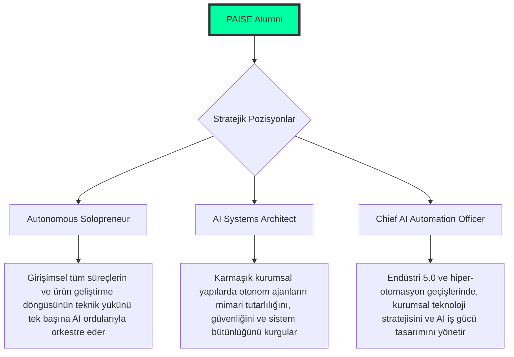

<!--
/// PAISE_INSTITUTE_INITIALIZATION: COMPLETED
/// VERSION: 12.3.0 "THE MAGNIFICENCE EDITION"
/// STATUS: INSTITUTIONAL_AUTHORITY_ACTIVE_WITH_MAGNIFIED_DOCUMENTATION
/// CORE_PHILOSOPHY: ARCHITECTURAL_ORCHESTRATION_OVER_SYNTAX
/// GOVERNANCE: DECENTRALIZED_ACADEMIC_ORGANIZATION
-->

# 🏛️ PAISE INSTITUTE: The School of Post-AI Engineering
### "Mimari bir vizyondur; kod ise bu vizyonun otonom bir yansımasıdır."

---

**PAISE Institute**, yapay zekanın yazılım üretim süreçlerini radikal bir şekilde demokratize ettiği ve geleneksel mühendislik rollerinin temelinden sarsılarak evrimleştiği **"Tekillik" (Singularity)** sonrası dönemde; profesyonelleri sadece kod yazan bireyler olmaktan çıkarıp, stratejik **Sistem Mimarı**, **Otonom Süreç Orkestratörü** ve **Yüksek Teknik Denetçi** yetkinliklerine ulaştıran, küresel ölçekte faaliyet gösteren hibrit bir mühendislik ve araştırma merkezidir. Enstitümüz, teknolojinin sadece tüketildiği değil, yeniden tanımlandığı bir epi-merkez olarak konumlanmıştır.

[📜 Kabul Protokolü](#-1-kabul-ve-kayit-protokolleri-admission) • [🗺️ Enstitü Planı](#-2-enstitü-yerleşkesi-ve-departmanlar) • [🎓 Akademik Müfredat](#-3-akademik-müfredat-ve-uzmanlik-kademe) • [🔬 Araştırma Enstitüleri](#-4-araştirma-enstitüleri-ve-stratejik-uzmanliklar) • [📊 Teknik Altyapı](#-6-teknik-altyapi-ve-geliştirme-standartlari)

---

## 🏛️ 0. AKADEMİK VİZYON VE YÖNETİCİ ÖZETİ (EXECUTIVE SUMMARY)

Geleneksel eğitim metodolojileri, "sözdizimi ezberleme" ve "algoritmik rutinleri manuel icra etme" odaklı statik yaklaşımlarıyla, saniyeler içinde binlerce satır optimize kod üretebilen yapay zeka sistemlerinin domine ettiği günümüz dinamik teknoloji eko-sisteminin fersah fersah gerisinde kalmaktadır. **PAISE Institute**, bu köhnemiş mühendislik paradigmasını kökten yıkarak; insan bilişini "stratejik sistem tasarımı, etik denetim ve otonom süreç orkestrasyonu" odaklı yeni bir pedagojik modelle yeniden yapılandırır. Günümüzde LLM (Large Language Model) ve Agentic AI teknolojileri, rutin kod üretimini bir emtiaya dönüştürmüştür; bu durum, insan faktörünün gerçek değerini operasyonel yürütme katmanından, yüksek seviyeli mimari vizyon ve otonom sistemler üzerindeki stratejik hakimiyet katmanına taşımıştır.

Enstitümüz, profesyonellerin zihinsel süreçlerini yapay zeka ile simbiyotik bir bütünlükte, üstün bir verimlilik seviyesine taşımayı temel amaç edinir. PAISE disiplini, kontrolsüz ve denetimsiz üretilen yapay zeka kodunun yaratacağı "Mimari Kaos" ve "Teknik Borç Enflasyonu" risklerini minimize eden; sistemlerin **Bütünsel Mimari Bütünlüğünü** (Architectural Integrity) her koşulda koruyan hibrit bir mühendislik doktrinidir. Bu yapı, her bir paydaşının nitelikli ve granüler katkılarıyla kendini sürekli optimize eden, liyakat tabanlı ve merkeziyetsiz bir **Kolektif Mühendislik Korteksi** olarak işlev görerek, insan-AI simbiyozunun zirvesini temsil eder.

---

Enstitüye kabul ve kayıt süreçleri, adayın geçmişte edindiği geleneksel akademik ünvanlardan veya kurumsal etiketlerden tamamen bağımsız olarak; **İleri Teknik Liyakat**, **Analitik Disiplinin Katılığı** ve **Bilişsel Adaptasyon Esnekliği** kriterleri üzerinden, yapay zeka destekli bir değerlendirme mekanizmasıyla yürütülür. PAISE ekosistemi, statik bir bilgi bankası veya geleneksel bir dökümantasyon havuzu değil; her an yeni verilerle beslenen, kendini güncelleyen ve evrimleşen dinamik bir otonom operasyon sahasıdır.

### 🧪 Akademik Ön Koşullar (Prerequisites)
- **Ultra-Granüler Dekompozisyon Yetisi:** Devasa ve karmaşık iş gereksinimlerini, otonom yapay zeka ajanları ve mikro-servisler tarafından sıfır hata payı ile icra edilebilecek kadar atomik, teknik ve mantıksal görevlere indirgeyebilme üst düzey becerisi.
- **Mistik-Mimari Seziş ve Holistik Bakış:** Kodun satır bazlı operasyonel işlevselliğinin çok ötesine geçerek; sistemin ölçeklenebilirliği, veri güvenliği katmanları, kaynak verimliliği (Token & Compute Economy) ve uzun vadeli sürdürülebilirliği gibi kritik parametreler üzerindeki kelebek etkilerini analiz edebilme vizyonu.
- **Hiper-Hızlı Teknoloji Adaptasyonu:** Güncel mühendislik metodolojilerinin, AI modellerinin ve karmaşık araç setlerinin (Tools) saatler içinde gerçekleşen mutasyon süreçlerine, hem zihinsel hem de profesyonel operasyonel bazda anlık uyum sağlama ve sistemi domine etme kabiliyeti.

### 📝 Kayıt ve Kurumsal Adaptasyon Süreci
1. **Resmi Portfolyo ve Fork Protokolü:** Ana deponun "Fork" edilmesiyle birlikte, adayın tüm dijital gelişim kayıtları, otonom validasyon sistemlerimiz tarafından izlenmeye ve akademik ilerleme skorları oluşturulmaya başlanır.
2. **Doktriner Oryantasyon ve Zihin Formatlama:** [01-felsefe-ve-zihniyet](./01-felsefe-ve-zihniyet/) bölümünde yer alan radikal yönetim ilkelerinin, etik standartların ve post-AI mühendislik doktrininin derinlemesine içselleştirilmesi süreci.
3. **Senkronize Teknik Altyapı Kurulumu:** [Bölüm 6](#-6-teknik-altyapi-ve-geliştirme-standartlari) içerisinde titizlikle tanımlanan, otonom ajanlarla tam uyumlu standart geliştirme ortamının (SDK, IDE, CLI configuration) adayın yerel sisteminde kusursuz konfigüre edilmesi.

---

PAISE Yerleşkesi, bir mühendisin ham bilgiden yüksek mimari vizyona giden uzmanlık yolculuğunu uçtan uca destekleyen, birbiriyle entegre 5 ana stratejik departman ve devasa bir dijital referans merkezinden oluşmaktadır:

| DEPARTMAN | KOD ADI | STRATEJİK VE FONKSİYONEL TANIM (FUNCTIONAL DEPTH) |
|:---|:---|:---|
| 🧬 **01-Felsefe** | **Strategic Intelligence** | Mühendislik etiği, post-AI zihniyet dönüşümü, bilişsel psikoloji ve stratejik karar alma mekanizmalarının rasyonel temellerini atan zihinsel komuta merkezi. |
| 🏗️ **02-Teknik** | **The Engineering Forge** | 8 aşamalı (PHASE 01-08) yoğunlaştırılmış teknik müfredat; alt seviye sistemlerden, otonom ajan orkestrasyonuna kadar uzanan yüksek uygulama laboratuvarı. |
| 🧪 **03-Vaka** | **Simulation & Analysis** | Global endüstriyel vakaların "Reverse-Engineering" metodolojisiyle incelendiği, otonom sistem kriz senaryoları ve derin post-mortem analiz platformu. |
| 🛠️ **04-Araçlar** | **Technical Armory** | Enstitü tarafından geliştirilen özel AI ajanları, otonom CLI araçları, de-kompozisyon scriptleri ve kurumsal düzeyde otomasyon framework'leri kütüphanesi. |
| 📚 **99-Arşiv** | **Legacy Repository** | Geleneksel yazılım mühendisliği verileri, dondurulmuş proje notları ve tarihsel teknik dökümantasyonun "Linguistic Context" olarak saklandığı bilgi referans merkezi. |

---

Pedagojik modelimiz, bireyin basit bir "Kod Uygulayıcısı" statüsünden, sistemleri yukarıdan gören bir "Global Stratejik Mimar" statüsüne geçişini bilimsel ve disiplinlerarası bir yöntemle kademelendirir:

### 🟢 LİSANS: AI-Native Temeller (Foundational Systems Engineering)
- **Ana Modüller:** Gelişmiş Prompt Mühendisliği (Logical Framing & Constraint-Driven Design), Linux Çekirdek Yapısı ve Sistem Yönetimi, Profesyonel "Git-Flow" ve Otonom Versiyon Kontrol Senaryoları.
- **Kabiliyet Çıktısı:** Karmaşık bir proje gereksinim setinin %80'ini, yapay zeka ajanlarını kullanarak, 1 saatlik yoğun operasyonel döngü içerisinde "Zero-Bug" prensibiyle hayata geçirebilme ve dökümante edebilme yetisi.

### 🔵 YÜKSEK LİSANS: Bütünleşik Mimari Tasarımı (Core Cognitive Evolution)
- **Ana Modüller:** "Agentic Swarm" Orchestration (Sürü Zekası Orkestrasyonu), Vektör Veri Tabanı Mimarileri (VectorOps), Gelişmiş RAG (Retrieval-Augmented Generation) Pipeline Tasarımları ve Dinamik Hafıza Yönetimi.
- **Kabiliyet Çıktısı:** Birbirinden bağımsız çalışan AI katmanlarını, birbiriyle denetimli ve hiyerarşik bir şekilde haberleşen, hata payı matematiksel olarak minimize edilmiş karmaşık ve dağıtık sistemler halinde orkestre etme üst düzey becerisi.

### 🔴 DOKTORA: Tekillik ve Stratejik Mimari Liderlik (Singularity & Beyond)
- **Ana Modüller:** AI Security & Red Teaming (Otonom Saldırı ve Savunma), Token Economy & Compute Management (Maliyet Odaklı Mimari Optimizasyon), Self-Healing Infrastructure Design (Kendi Kendini Onaran Altyapılar).
- **Kabiliyet Çıktısı:** İnsan müdahalesi gerektirmeyen, otonom kriz yönetimi yapabilen, kendi hatalarını düzelten yapılar inşa edebilen ve küresel ölçekte teknoloji ekosistemlerine yön veren "Mimar-Lider" vizyonu.

---

Uzmanlık aşamasındaki araştırmacılarımız ve akademisyenlerimiz için, endüstriyel sınırları zorlayan dikey sanayi ve hibrit teknoloji odaklı ileri araştırma kanalları:

### 🛡️ Siber Savunma ve Otonom Güvenlik Laboratuvarı
- AI ajanları tarafından yönetilen otonom zafiyet tespit sistemlerinin (Bug Bounty Agents) inşası ve savunma hatlarının gerçek zamanlı güçlendirilmesi.
- "Adversarial AI" (Saldırgan Yapay Zeka) tekniklerine karşı kurumsal "Deep-Defense" protokollerinin standardizasyonu ve otonom "Red Teaming" simülasyonları.

### 💰 Finansal Teknolojiler ve Token Ekonomisi Araştırmaları
- Karmaşık akıllı sözleşme mimarilerinin AI destekli otonom validasyonu, formal doğrulaması ve kritik maliyet (Gas, Token, Compute) optimizasyon modelleri.
- Merkeziyetsiz ekonomiler ve DAO yapıları için, insan müdahalesinden arındırılmış otonom finansal denetim algoritmalarının ve likidite yönetim sistemlerinin tasarımı.

---

PAISE Institute mezunları, geleneksel yazılımcı rollerinin ötesine geçerek, modern ve otonom iş dünyasında aşağıdaki stratejik ve yüksek katma değerli pozisyonlarda global ölçekte değer üretirler:

---

Enstitü standartlarında kullanılan ve saniyelerle ölçülen otonom orkestrasyon hızları için optimize edilmiş, post-AI çağının teknoloji matrisi:

| KATEGORİ | STANDART ÜRÜN SETİ | STRATEJİK VE FONKSİYONEL RASYONALİZASYON (RATIONALE) |
|:---|:---|:---|
| **Korteks Katmanı** | Claude 3.5 Sonnet, OpenAI o1, Llama 3 | Çok katmanlı mimari akıl yürütme (Reasoning), karmaşık kod analizi ve üst düzey stratejik planlama kapasitesi. |
| **Geliştirme Katmanı** | Cursor, Windsurf, LangGraph | AI-Native programlama akışları, otonom ajan state yönetimi ve derin bağlamsal (Context) mühendislik süreçleri. |
| **Hafıza Yönetimi** | Pinecone, pgvector (PostgreSQL), Redis | AI modellerinin vektörel hafıza ihtiyacı, uzun süreli bağlam (Long-term Context) kontrolü ve düşük gecikmeli veri erişimi. |
| **Operasyonel Katman** | Linux (Arch/Debian), Docker, Warp | Kernel seviyesinde sistem kontrolü, güvenli izolasyon katmanları ve terminal tabanlı otonom dağıtım hızı. |

---

- **MADDE 01: LİYAKAT VE KAPASİTE MERKEZİYETİ.** Kurum içi hiyerarşi ve yetki mekanizması, geleneksel ünvanlardan değil; teknik çözüm kabiliyetinden, mimari liyakatten ve otonom sistemleri orkestre etme kapasitesinden beslenir.
- **MADDE 02: DİNAMİK ADAPTASYON VE EVRİM.** Teknolojik ve metodolojik durağanlık, PAISE disiplini içerisinde en büyük regresyon ve başarısızlık sebebidir. Değişimi sadece takip eden değil, değişimin yönünü kontrol edebilen disiplinler hayatta kalır.
- **MADDE 03: RADİKAL SİMBİYOTİK MÜHENDİSLİK.** Yapay zeka, insanın yerini alan bir alternatif değil; mühendisin bilişsel kapasitesini, hızını ve vizyonunu geometrik olarak artıran, sistemin ana gövdesiyle bütünleşik bir entegrasyon katmanıdır.
- **MADDE 04: MİMARİ SORUMLULUK VE ETİK.** Üretilen her satır kodun ve otonom her kararın etik sorumluluğu, sistemi tasarlayan mimarın üzerindedir. AI bir araç, mimar ise nihai otoritedir.

---

**"Mimari bir vizyondur, teknoloji ise bu vizyonun icra aracıdır. Geleceği birlikte orkestre ediyoruz."**  
**[Bahattin Yunus Çetin](https://github.com/bahattinyunus)**  
*Founder & Multi-Disciplinary Systems Designer | AI Integration Expert*

`INSTITUTE_STATUS: FULL_OPERATIONAL_PRESTIGE_V12`  
`METRICS: MEASURED_BY_SYSTEM_INTELLIGENCE`  
`BY: THE ARCHITECT & THE COLLECTIVE`

