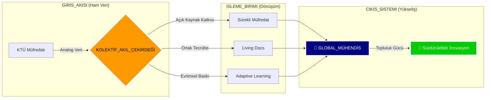

<!--
/// SYSTEM_OVERRIDE: ENABLED
/// PROTOCOL_ZERO: "CHANGE IS THE ONLY CONSTANT."
/// ARCHITECT: @BAHATTINYUNUS + COMMUNITY
/// STATUS: EVOLUTION_MODE_ACTIVE
-->

# 🌌 POST-AI SOFTWARE ENGINEERING CURRICULUM
## ⛩️ "Statik Müfredat Öldü. Yaşasın Kolektif Evrim." ⛩️

---

### ⚠️ UYARI: BU BİR "DOGMA" DEĞİLDİR (WARNING)
**Burası, "Tek ve Nihai" bir müfredat değildir. Yapay Zeka çağında hiçbir bilgi 6 aydan fazla sabit kalamaz. Bu depo, sürekli değişen teknoloji fırtınasında ayakta kalmak için tasarlanmış "Canlı ve Açık Kaynaklı Bir Yol Haritasıdır".**

**Burada bir otorite yoktur; "Kolektif Akıl" (Collective Intelligence) vardır. Ben sadece bu kıvılcımı çakan bir mimarım, ancak bu yapıyı ayakta tutacak ve büyütecek olan SİZLERSİNİZ. Bu müfredat, her birinizin katkısıyla ("Pull Request") her gün yeniden yazılacaktır. Sabit kalan kaybeder.**

### 🏛️ DEPO KADERİ VE TOPLULUK VİZYONU (COMMUNITY VISION)
**Bu arşiv, durağan bir akademik rehber değil; teknolojiyle birlikte nefes alan, her "commit" ile organik olarak evrilen açık uçlu bir eğitim deneyidir.**

**Üniversite eğitimi sadece bir başlangıç "Bootloader"ıdır; ancak asıl İşletim Sistemi burada, *hepimizin* katkılarıyla sürekli güncellenir. Amacımız; emir alan değil, sorgulayan, değiştiren ve bu depoyu kendi tecrübeleriyle daha da mükemmelleştiren "Global Mühendisler" ağı kurmaktır.**

[🛰️ Mimari](./1_DOKTRIN/MIMARI_YAPI.md) • [📜 Manifesto](./1_DOKTRIN/_MANIFESTO/README.md) • [📡 Yol Haritası](./3_KARIYER/YOL_HARITALARI/README.md) • [📜 Ustalık Logu](./4_SISTEM/ANA_LOG.md)

| | | | | | |
|:---:|:---:|:---:|:---:|:---:|:---:|
| **LANG** |  |  |  |  |  |
| **CORE** |  |  |  |  |  |

---

## 🗺️ STRATEJİK İÇERİK HARİTASI (CONTENT HUB)
**Depo sistemi, 6 stratejik katman üzerine inşa edilmiştir. Her katman, mühendislik yolculuğunuzun farklı bir evresini temsil eder:**

---

### 🧬 YENİ DÜNYA DÜZENİ: BECERİ DÖNÜŞÜMÜ (SKILL SHIFT)

Yapay Zeka devrimi, oyunun kurallarını tamamen değiştirdi. Dünün "Senior" yetkinlikleri, bugünün "Basic" gereksinimleri oldu. İşte hayatta kalmak için geçirmeniz gereken mutasyon:

| ALAN | 💀 ESKİ DÜNYA (Legacy) | 🤖 POST-AI DÜNYASI (Next-Gen) |
|:---|:---|:---|
| **Kodlama** | Syntax ezberlemek, "from scratch" yazmak. | Mimari dizayn etmek, AI ile "Code Review" yapmak. |
| **Hata Çözme** | StackOverflow'da saatlerce aramak. | AI'ya bağlamı (context) verip saniyede çözüm üretmek. |
| **Öğrenme** | Kalın kitaplar, 40 saatlik video kursları. | "Just-in-Time" öğrenme, mikro-dokümantasyonlar. |
| **Değer** | "Ben bu kodu yazdım." | "Ben bu problemi çözdüm ve sistemi scale ettim." |
| **Hız** | 1 Özellik / Hafta | 1 Özellik / Saat |

---

### 🚀 HAREKATA GEÇME PROTOKOLÜ (MOBILIZATION)

Bu depoya yeni düşen bir asker için acil eylem planı:

1.  **Zihniyeti Güncelle:** [Manifestoyu](./1_DOKTRIN/_MANIFESTO/README.md) oku ve eski inançlarını formatla.
2.  **Silahlan:** [Savaş İstasyonu](./2_USTALIK/_REHBERLER/SISTEM_TASARIMI_EL_KITABI.md) rehberine göre bilgisayarını kur.
3.  **Cephe Seç:** [Yol Haritaları](./3_KARIYER/YOL_HARITALARI/README.md) bölümünden hedefini belirle.
4.  **Ateşle:** İlk kodunu değil, ilk *sistemini* tasarla.

---

### 📂 [0_MUREDDAAT](./0_MUREDDAAT/) | Ustalık ve Müfredat Katmanı
KTÜ Yazılım Mühendisliği resmi müfredatının, Yapay Zeka Sonrası Çağ'ın (Post-AI Era) acımasız gereksinimlerine göre yeniden derlenmiş, optimize edilmiş ve liyakatle "hacklenmiş" en üstün **Global Standart Doktrinidir**.

Bu 4 yıllık zorlu yolculuk; rastgele seçilmiş ders yığınları veya teorik ezberlerden ibaret değildir. Burası, birbirini tetikleyen, her biri bir sonraki aşamanın kilidini açan ve mühendisi adım adım "Tekillik Seviyesine" hazırlayan **8 Stratejik Operasyon Modülü** olarak yeniden kurgulanmıştır. Her dönem, sadece geçilmesi gereken bir ders değil; kazanılması gereken kritik bir "Cephe" ve fethedilmesi gereken bir "Bilgi Kalesi"dir.

| S | EVRE (PHASE) | KOD | DERS (OPERASYON) | ODAK (FOCUS) | BAĞLANTI |
|:---:|:---|:---:|:---|:---|:---:|
| **1** | 🔥 **ATEŞLEME** *(Ignition)* | SEC-01 | **Algoritma ve Prog. I** | Pointerlar, Bellek Yönetimi | [📂 GİRİŞ](./0_MUREDDAAT/1_SINIF/1_Guz/Algoritma_ve_Programlama_I/Ders_Plani.md) |
| **1** | 🔥 **ATEŞLEME** *(Ignition)* | SEC-02 | **Algoritma ve Prog. II** | Dosya Sis., Structs | [📂 GİRİŞ](./0_MUREDDAAT/1_SINIF/2_Bahar/Algoritma_ve_Programlama_II/Ders_Plani.md) |
| **2** | 🛡️ **TAHKİMAT** *(Fortification)* | SEC-03 | **Veri Yapıları** | Heap, Tree, HashMaps | [📂 GİRİŞ](./0_MUREDDAAT/2_SINIF/3_Guz/Veri_Yapilari/Ders_Plani.md) |
| **2** | 🛡️ **TAHKİMAT** *(Fortification)* | SEC-04 | **Veritabanı YS** | SQL, Normalizasyon | [📂 GİRİŞ](./0_MUREDDAAT/2_SINIF/4_Bahar/Veritabani_Yonetim_Sistemleri/Ders_Plani.md) |
| **3** | ⚡ **YÜKSELİŞ** *(Ascension)* | SEC-05 | **İşletim Sistemleri** | Kernel, Concurrency | [📂 GİRİŞ](./0_MUREDDAAT/3_SINIF/5_Guz/Isletim_Sistemleri/Ders_Plani.md) |
| **3** | ⚡ **YÜKSELİŞ** *(Ascension)* | SEC-06 | **Yazılım Mimarisi** | OOP, Design Patterns | [📂 GİRİŞ](./0_MUREDDAAT/3_SINIF/6_Bahar/Yazilim_Tasarim_ve_Mimarisi/Ders_Plani.md) |
| **4** | 🌌 **ÖTESİ** *(Singularity)* | SEC-07 | **Test ve Kalite** | TDD, CI/CD, DevSecOps | [📂 GİRİŞ](./0_MUREDDAAT/4_SINIF/7_Guz/Yazilim_Testi_ve_Kalitesi/Ders_Plani.md) |
| **4** | 🌌 **ÖTESİ** *(Singularity)* | SEC-08 | **Bitirme Tezi** | Mimari Üstünlük | [📂 GİRİŞ](./0_MUREDDAAT/4_SINIF/8_Bahar/Bitirme_Calismasi/Ders_Plani.md) |

> [!TIP]
> **Taktiksel Rehber:** [Sistem Tasarımı El Kitabı](./2_USTALIK/_REHBERLER/SISTEM_TASARIMI_EL_KITABI.md) ve [Programlama Doktrini](./2_USTALIK/_REHBERLER/PROGRAMLAMA_DOKTRINI.md), bu operasyonlarda hayatta kalmanızı sağlayacak ana kaynaklardır.

---

### 📂 [1_DOKTRIN](./1_DOKTRIN/) | İnanç, Disiplin ve Manifesto (Doctrine & Belief)
Mühendisliğin sadece "Syntax" (Sözdizimi) bilmek veya kod yazmak değil, temelinde derin bir "Mindset" (Zihniyet) ve felsefe meselesi olduğunu kanıtlayan, Yapay Zeka Sonrası Çağ'ın yeni anayasasıdır.

Kod üretimi ve basit algoritmik işler yapay zekaya (Auto-Code Generators) devredildiğinde, insan mühendise kalan tek, en büyük ve kopyalanamaz güç olan "Stratejik Mimari Vizyon", "Yaratıcı Kaos Yönetimi" ve "Liderlik" vasıflarının nasıl kazanılacağını anlatan temel kurallar bütünüdür. Bu katman, mühendisin sadece teknik bilgisini değil, karakterini ve duruşunu derler.
- [🛰️ Post-AI Mimari Yapı](./1_DOKTRIN/MIMARI_YAPI.md) | [🤖 AI Çağı Rehberi](./1_DOKTRIN/YAPAY_ZEKA_CAGI_REHBERI.md)
- [🦅 Özel Operasyon Protokolü](./1_DOKTRIN/KATKI_REHBERI.md) | [🛠️ Elit Teknoloji Yığını](./1_DOKTRIN/TEKNOLOJI_YIGINI.md)

### 📂 [2_USTALIK](./2_USTALIK/) | Güç Çarpanı ve Savaş Sanatı (The Prioritized Skillset)
Teorik bilginin, pratik bir silaha, keskin bir kılıca dönüştüğü "Simülasyon Sahasıdır". Burası, "Okulda öğrendiklerim gerçek hayatta ne işe yarayacak?" sorusunun cevabının verildiği yerdir.

Standart bir öğrenme sürecini "Hyper-Efficiency" moduna alan, insan zihninin biyolojik sınırlarını Yapay Zeka (AI) destekli araçlarla (LLMs, Copilots) genişleterek 10x verimlilik sağlayan metodolojiler burada saklıdır. Rakiplerin deneme-yanılma yoluyla aylar harcayarak öğrendiği konseptleri, sizin saatler içinde özümsemenizi ve uygulamanızı sağlayacak "Ustalık Sırları" bu katmanda ifşa edilmiştir.
- [🧠 Derin Öğrenme Doktrini](./2_USTALIK/NASIL_CALISMALI.md) | [🏗️ Proje Mimarisi Rehberi](./2_USTALIK/PROJE_REHBERI.md)
- [📡 Pareto (80/20) Notları](./2_USTALIK/_USTALIK_NOTLARI/README.md) | [📜 Grandmaster Rehberleri](./2_USTALIK/_REHBERLER/)

### 📂 [3_KARIYER](./3_KARIYER/) | Operasyonel Yayılım ve Nüfuz (Operational Expansion)
Bu yeni müfredatın "Diplomasi, İstihbarat ve Küresel Etki" kanadıdır. Teknik beceri, pazarlanmadığı sürece "Gömülü Hazine" gibidir; değeri vardır ama kimse bilmez.

Kazanılan teknik üstünlüğün, global piyasada stratejik bir kariyere, yüksek değerli kontratlara, saygınlığa ve sektörel nüfuza dönüştürülmesi sanatıdır. Sadece standart bir iş başvurusu yapmayı değil; LinkedIn algoritmalarını manipüle etmeyi, GitHub'ı bir "Güç Gösterisi" (Show of Force) alanı olarak kullanmayı ve sektör devleriyle masaya eşit şartlarda oturacak seviyeye gelmeyi öğretir.
- [📡 Global Ağ Savaşları](./3_KARIYER/KARIYER_VE_AG.md) | [🤝 Stratejik İttifak (Mentorluk)](./3_KARIYER/MENTORLUK_VE_YARDIMLASMA.md)
- [🔍 Kariyer İstihbarat Haritaları](./3_KARIYER/YOL_HARITALARI/README.md)

### 📂 [4_SISTEM](./4_SISTEM/) | Komuta ve Kontrol Telemetrisi (Command & Control)
Yapay Zeka Sonrası Müfredatın "Kokpit" paneli ve "Sinir Sistemi"dir. Gelişim, hislerle değil, verilerle yönetilir.

Kişisel gelişimin soyut ve ölçülemez olduğu yanılgısını yıkan; her başarının, her öğrenilen yeteneğin ve her tamamlanan projenin ölçülebilir metriklerle (KPIs) takip edildiği merkezdir. Hangi dilde ne kadar uzmanlaştığınız, hangi projede ne kadar ilerlediğiniz ve nihai "Tekillik" hedefine ne kadar yaklaştığınız burada anlık olarak raporlanır. Burası, mühendisin kendi hayatının ve kariyerinin "Project Manager"ı olduğu yerdir.
- [📜 Ana Operasyon Logu](./4_SISTEM/ANA_LOG.md) | [🌌 Stratejik Durum Özeti](./4_SISTEM/OZET.md)
- [⚔️ Cephanelik (Kaynak Merkezi)](./4_SISTEM/KAYNAK_MERKEZI.md) | [🛡️ Güvenlik Protokolleri](./4_SISTEM/_PROTOKOLLER/)

### 📂 [5_ARSIV](./5_ARSIV/) | İstihbarat Arşivi ve Analiz (Archives & Intelligence)
Klasikleşmiş ve tamamlanmış projelerin, eski dönem ders notlarının ve referans materyallerinin saklandığı bölümdür. Burası, geçmişin tecrübesinin geleceğe ışık tuttuğu bir kütüphane işlevi görür.

---

## 📡 CANLI SİSTEM TELEMETRİSİ (GERÇEK ZAMANLI VİZYON)

---

## 🛡️ TOPLULUK MANİFESTOSU (COMMUNITY DOCTRINE)

> [!CAUTION]
> ### ⚔️ KURAL 01: OTORİTE KİMSE DEĞİLDİR, HERKESİR (NO MASTERS)
> Bilgi hiyerarşisi yıkılmıştır. En iyi fikri kimin söylediğinin önemi yoktur; Junior bir geliştirici, Senior bir mimardan daha iyi bir çözüm öneriyorsa, kod o şekilde güncellenir. "Ben bilirim" değil, "Biz çözeriz" ilkesi esastır. Egonuzu kapıda bırakın, PR'ınızı atın.

> [!IMPORTANT]
> ### 🤖 KURAL 02: ADAPTASYON EN BÜYÜK YETENEKTİR (ADAPT OR DIE)
> Bugün kullandığımız stack yarın ölebilir. Bu repo, belirli bir teknolojiye fanatikçe bağlılık duymaz. Teknoloji değiştiğinde, repo da değişir. Değişimden korkan değil, değişimi bizzat başlatan öncüler olmalıyız.

---

## 💻 SAVAŞ İSTASYONU (BATTLESTATION COMM CONFIG)

| TÜR | TAVSİYE EDİLEN (RECOMMENDED) | NOTLAR |
|:---|:---|:---|
| **OS** | **Linux / WSL2** | Özgür yazılım, özgür zihin. |
| **IDE** | **VS Code / Cursor** | AI destekli kodlama için optimize edilmiş ortamlar. |
| **BROWSER** | **Arc / Brave** | Odak ve performans. |

---

## 🌐 KÜRESEL İTTİFAK (GLOBAL ALLIANCE)

Teknolojiyi yalnız başına takip edemezsin. Bu canlı organizmaya katıl, beslen ve besle.

- **[LinkedIn Operasyon Ağı](https://www.linkedin.com/in/bahattinyunus/)**: Profesyonel stratejiler.
- **[GitHub Karargahı](https://github.com/bahattinyunus)**: Kodun kaynağı.

> **"Sizin Ağınız (Network), Sizin Net Değerinizdir (Net Worth)."**

---

## 🏗️ STRATEJİK MİMAR (INITIATOR)

> **"Ben sadece ilk taşı koydum. Kaleyi siz inşa edeceksiniz."**

**[Bahattin Yunus Çetin](https://github.com/bahattinyunus)**
*IT Architect & Community Initiator*

Bu proje, **KTÜ Of Teknoloji Fakültesi Yazılım Mühendisliği** ekosisteminden doğan ve dünyaya açılan bir inisiyatiftir.

---

  
`DURUM: EVRİMSEL_SÜREÇ`  
`KATKI: AÇIK`  
`VİZYON: SONSUZ`
  

