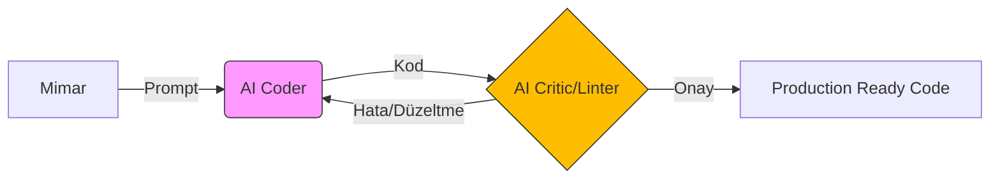

<!--
/// PAISE_ACADEMY_INITIALIZATION: OPERATIONAL
/// VERSION: 7.0.0 "THE SUPREME ACADEMY"
/// STATUS: ARCHITECTURAL_ASCENSION
-->

# 🏛️ PAISE ACADEMY: The School of Post-AI Engineering
### "Kod bir araçtır, mimari bir dildir. Biz, geleceği bu dille inşa eden orkestratörleriz."

---

**PAISE Academy**, yapay zekanın kodu saniyeler içinde üretebildiği "Tekillik" (Singularity) sonrası dünyada; insanı bir "klavye işçisi" olmaktan çıkarıp, karmaşık sistemleri yöneten bir **Sistem Mimarı** ve **Otonom Orkestratör**e dönüştüren küresel bir eğitim karargahıdır.

[📖 Kayıt Rehberi](#-1-kayit-ve-akademik-prosedür) • [🗺️ Kampüs Planı](#-2-kampüs-plani-campus-layout) • [🔬 Laboratuvarlar](#-4-uygulamali-laboratuvar-oturumlari-lab-sessions) • [🎓 Mezuniyet](#-3-müfredat-ve-mezuniyet)

---

## 🏛️ 0. REKTÖRLÜK NOTU: TEKİLLİK HORİZONU (THE DEAN'S LOG)

Geleneksel eğitim sistemleri, "nasıl kod yazılır?" sorusuna takılıp kalmışken, **PAISE Academy** "nasıl sistem inşa edilir?" sorusunu merkezine alır. LLM'ler (Large Language Models) artık kod üretimini demokratize etmiştir. Ancak, bu sınırsız üretim kapasitesi beraberinde **"Mimari Kaos"** riskini getirir. PAISE mühendisi, bu kaosun içindeki düzeni kuran kişidir. Biz burada sadece döküman okumuyor, yapay zekayı bir ekzo-iskelet gibi kullanarak gerçek dünya problemlerini saniyeler içinde otonom çözümlere dönüştüren "Korteksler" yetiştiriyoruz. Bu akademi, her bir öğrencisinin PR'ıyla (Pull Request) kendini yeniden optimize eden, yaşayan bir mühendislik beynidir.

---

## 📑 1. KAYIT VE AKADEMİK PROSEDÜR (ADMISSION)

Akademiye kabul edilmek için geçmişteki ünvanlarınızın bir önemi yoktur. Burada tek geçer akçe **Liyakat** ve **Disiplindir**. Akademi, statik bir bilgi bankası değil, aktif bir operasyon merkezidir.

### 📝 Kayıt Protokolü (Enrollment)
1.  **Repo'yu Forkla ve Senkronize Et:** Kendi dijital öğrenci cüzdanını oluştur.
2.  **Manifesto Onayı:** [01-felsefe-ve-zihniyet](./01-felsefe-ve-zihniyet/) altındaki doktrinleri oku. Zihnini "Legacy SWE" varsayımlarından temizlemeden teknik safhalara geçemezsin.
3.  **Savaş İstasyonunu Kur:** [Bölüm 5](#-5-savaş-istasyonu-research-labs)'teki konfigürasyonu tamamla. Terminal senin silahın, AI ise mermindir.

---

## 🗺️ 2. KAMPÜS PLANI (CAMPUS LAYOUT)

PAISE Kampüsü, bir mühendisin evrimsel yolculuğunu simgeleyen 5 ana departman ve bir legacy kütüphaneden oluşur:

| DEPARTMAN | KOD ADI | OPERASYONEL TANIM |
|:---|:---|:---|
| 🧬 **01-Felsefe** | **The Mind** | Yazılımın etik, felsefi ve stratejik temelleri. Zihin formatlama merkezi. |
| 🏗️ **02-Teknik** | **The Forge** | 8 safhalı ana müfredat. Kodun mimariye, mimarinin otonom ürüne dönüştüğü yer. |
| 🧪 **03-Vaka** | **The Simulation** | Gerçek dünya krizlerinin (Post-mortemler) ve kriz çözümlerinin analiz edildiği laboratuvar. |
| 🛠️ **04-Araçlar** | **The Armory** | AI ajanlarının (Agents), elit scriptlerin ve otomasyon araçlarının üretim merkezi. |
| 📚 **99-Arşiv** | **The Library** | Eski dünya (Legacy) bilgilerinin geleceği aydınlatmak için saklandığı hafıza deposu. |

---

## 🎓 3. MÜFREDAT VE MEZUNİYET (THE SYLLABUS)

Akademi, öğrenciyi bir "operatör"den "mimar"a dönüştürmek için 3 ana akademik kademe üzerine kurgulanmıştır.

### 🟢 LİSANS: AI-Native Temeller (Ignition)
> **Dersler:** Prompt Engineering 101, Linux Kernel Mastery, Modern Git Workflows.
> **Çıktı:** Tek başına bir projenin %80'ini AI yardımıyla 1 saat içinde ayağa kaldırabilecek hız ve vizyon.

### 🔵 YÜKSEK LİSANS: Mimari ve Akış (Core Evolution)
> **Dersler:** Agentic Swarm Orchestration, Vector database Architecture, RAG Data Pipeline Design.
> **Çıktı:** Birbirinden bağımsız AI çıktılarını, hata yapmayan karmaşık bir sistem olarak koordine etme yeteneği.

### 🔴 DOKTORA: Tekillik ve Optimizasyon (The Singularity)
> **Dersler:** AI Security & Red Teaming, Token Economy Analytics, Self-Healing System Design.
> **Çıktı:** Kendi kendini iyileştiren, otonom kararlar verebilen ve küresel ölçekte etki yaratan sistemlerin baş mimarı.

---

## 🔬 4. UYGULAMALI LABORATUVAR OTURUMLARI (LAB SESSIONS)

Teori, pratikle çarpışmadığı sürece sadece gürültüdür. İşte Akademimizdeki bazı örnek laboratuvar oturumları:

> [!TIP]
> ### 🧪 LAB 01: Atomik Parçalama (Decomposition)
> **Senaryo:** Müşteri, "Sesli komutla çalışan, gerçek zamanlı bir lojistik yönetim sistemi" istiyor.
> **Görev:** Bu devasa isteği, AI ajanlarının (LLM) hata yapmadan yazabileceği 50 atomik teknik task'a böl.
> **Başarı Kriteri:** Her task'ın tek bir "Prompt" ile üretilebilir olması.

> [!IMPORTANT]
> ### 🧪 LAB 02: Ajan Orkestrasyonu (Orchestration)
> **Senaryo:** Bir ajan kod yazıyor, diğeri test ediyor, üçüncüsü güvenlik taraması yapıyor.
> **Görev:** Bu 3 ajan arasında veri alışverişini sağlayacak bir "Orchestrator" tasarla.
> **Başarı Kriteri:** İnsan müdahalesi olmadan kodun üretimden teste, testten onay katmanına akması.

---

## 🏛️ 5. MİMARİ BLUEPRINTLER (BLUEPRINT ARCHIVE)

PAISE Mimarlığının standart tasarım desenleri:

### 🔄 Agentic Feedback Loop (Ajanlı Geri Bildirim Döngüsü)

---

## 💻 6. SAVAŞ İSTASYONU (RESEARCH LABS)

Yapay zeka orkestrasyonu için optimize edilmiş önerilen elit çalışma ortamı:

| KATEGORİ | STANDART | NEDEN? |
|:---|:---|:---|
| **OS** | **Linux / WSL2** | Kernel seviyesinde kontrol ve terminal hızı için. |
| **IDE** | **Cursor / Windsurf** | AI-Native kodlama ve derin bağlam (context) yönetimi için. |
| **CONSOLE** | **Warp / Oh-My-Zsh** | AI entegrasyonu ve komut geçmişi analitiğiyle hızlanmak için. |
| **COMM** | **Discord / GitHub** | Kolektif akıl ve sürü zekasıyla (Swarm) senkronize olmak için. |

---

## 🛡️ 7. AKADEMİK DOKTRİN (THE CODES)

- **KURAL 01:** Otorite kimse değildir; liyakat her şeydir.
- **KURAL 02:** Adaptasyon ya da ölüm; eski teknolojiye saplanıp kalanlar elenir.
- **KURAL 03:** AI senin kölen değil, partnerindir. Onu yönetmeyi öğrenemezsen, o seni yönetir.

---

**"Mimari bir kaderdir, dökümantasyon ise bir pusula. Kaleyi birlikte inşa ediyoruz."**  
**[Bahattin Yunus Çetin](https://github.com/bahattinyunus)**  
*Founder & Multi-Disciplinary Systems Designer | AI Integration Architect*

`STATUS: ACADEMY_SESSION_V7_SUPREME`  
`UPTIME: ALWAYS_EVOLVING`  
`BY: THE ARCHITECT & THE SWARM`

