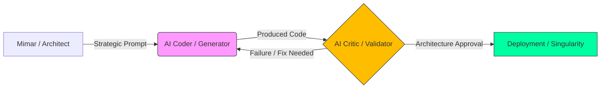

<!--
/// PAISE_ACADEMY_INITIALIZATION: OPERATIONAL_ELITE
/// VERSION: 9.0.0 "THE ABSOLUTE AUTHORITY"
/// STATUS: HYPER_EXPANSION_COMPLETE
/// CORE_PHILOSOPHY: ARCHITECTURE_OVER_SYNTAX
-->

# 🏛️ PAISE ACADEMY: The School of Post-AI Engineering
### "Kod yazmak artık bir yetenek değil, bir emtiadır; otonom sistemleri orkestre etmek ise tek gerçek güçtür."

---

**PAISE Academy**, yapay zekanın kodu saniyeler içinde üretebildiği ve geleneksel "Software Engineer" tanımının endüstriyel olarak geçersizleştiği "Tekillik" (Singularity) sonrası dünyada; insanı bir "klavye işçisi" olmaktan çıkarıp, karmaşık sistemleri yöneten bir **Sistem Mimarı**, **Otonom Orkestratör** ve **Yüksek Denetçi**ye dönüştüren küresel bir mühendislik karargahıdır.

[📖 Kayıt Rehberi](#-1-kayit-ve-akademik-prosedür-admission) • [🗺️ Kampüs Planı](#-2-kampüs-plani-campus-layout) • [🎓 Müfredat](#-3-müfredat-ve-mezuniyet-the-syllabus) • [🔬 Laboratuvarlar](#-4-uygulamali-laboratuvar-oturumlari-lab-sessions) • [🛡️ Dekanlık](./CONTRIBUTING.md)

---

## 🏛️ 0. REKTÖRLÜK NOTU: TEKİLLİK VE EKONOMİK MUTASYON (THE DEAN'S LOG)

Geleneksel eğitim sistemleri, "nasıl kod yazılır?" sorusuna takılıp kalmışken ve 1970'lerin "Syntax (Sözdizimi) Ezberleme" pratiklerini kutsarken, **PAISE Academy** bu yapıyı tamamen yıkarak "nasıl sistem inşa edilir ve otonom süreçler nasıl orkestre edilir?" sorusunu vizyonunun sarsılmaz merkezine yerleştirir. Bugün LLM'ler (Large Language Models) sadece kod üretimini demokratize etmekle kalmamış, aynı zamanda "Junior" seviyesindeki tüm rutin işleri otomatize ederek insan emeğinin değerini yukarıya, yani stratejik mimari ve etik denetim katmanına taşımıştır. Ancak bu kontrolsüz üretim kapasitesi, beraberinde devasa bir **"Mimari Kaos"** ve her geçen saniye katlanan bir **"Teknik Borç Enflasyonu"** riskini de getirmiştir.

PAISE mühendisi, bu dijital okyanusun içindeki düzeni kuran, yapay zekayı bir ekzo-iskelet gibi kullanarak gerçek dünya problemlerini saniyeler içinde otonom çözümlere dönüştüren bir "Korteks" görevi görür. Biz burada akademik bir döküman deposu tasarlamadık; biz, bir mühendisin zihnini AI ile simbiyotik bir bütünlük kurarak 10x değil, 100x verimlilikle sistem tasarlayabilecek bir "Bilişsel İşletim Sistemi"ne dönüştürüyoruz. Bu akademi, her bir öğrencisinin Pull Request'i ile (PR) kendini yeniden optimize eden, liyakat tabanlı ve sürekli evrimleşen yaşayan bir mühendislik beynidir. Sizin buradaki varlığınız, sadece bir öğrenme süreci değil, aynı zamanda küresel yazılım standartlarının yeniden yazılmasına yönelik kolektif bir operasyondur.

---

## 📑 1. KAYIT VE AKADEMİK PROSEDÜR (ADMISSION PROTOCOL)

Akademiye kabul edilmek için geçmişteki diplomalarınızın, unvanlarınızın veya hangi global teknoloji devinde çalıştığınızın zerre kadar önemi yoktur. PAISE ekosisteminde tek geçer akçe **Teknik Liyakat**, **Demir Disiplin** ve **Bilişsel Esneklik**tir. Akademi, statik bir bilgi bankası değil, her gün cephede değişen, hata yapan ve bu hatalardan ders çıkaran dinamik bir operasyon merkezidir.

### 🧪 Ön Koşullar ve Bilişsel Hazırlık (Prerequisites)
- **Hiper-Ayrıştırma Yetisi (Granular Decomposition):** Karmaşık ve amorf bir iş problemini, yapay zeka ajanlarının (LLM) sıfır hata ile üretebileceği kadar küçük, atomik teknik görevlere bölme yeteneği.
- **Mimari Seziş (Architectural Intuition):** Kodun satır satır ne yazdığını bilmekten ziyade, o kodun sistemin geneline (Memory Management, Scalability, Security, Context Window) nasıl bir yük bindirdiğini ve yan etkilerini (side-effects) büyük resimde görebilme yetisi.
- **Sürekli Mutasyon Refleksi:** Bugün "State-of-the-art" olarak kabul edilen bir teknolojiyi, yarın daha verimli bir çözüm çıktığında saniyeler içinde çöpe atmaya zihinsel olarak hazır olmak.

### 📝 Akademik Kayıt Adımları (Enrollment Procedure)
1.  **Repo'yu Forkla ve Senkronize Et:** Kendi dijital öğrenci cüzdanını oluştur ve gelişimini bu repo üzerinden "Public" olarak kanıtla. Unutma, PAISE'de gizli gelişim yoktur, her komit bir kanıttır.
2.  **Manifesto Onayı ve Zihin Formatı:** [01-felsefe-ve-zihniyet](./01-felsefe-ve-zihniyet/) altındaki doktrinleri oku. Zihnini "Legacy SWE" (Eski Dünya Yazılımcılığı) ön kabullerinden tamamen temizlemeden teknik safhalara geçmen zaman kaybıdır.
3.  **Savaş İstasyonunu İnşa Et:** [Bölüm 5](#-5-savaş-istasyonu-research-labs)'teki konfigürasyonu eksiksiz tamamla. Terminal senin kumanda merkezin, AI ise senin sınırsız bilişsel enerji kaynağındır. Ekipmanı eksik olan bir mühendisin hayatta kalma şansı yoktur.

---

## 🗺️ 2. KAMPÜS PLANI VE DEPARTMANLAR (CAMPUS LAYOUT)

PAISE Kampüsü, bir mühendisin evrimsel yolculuğunu ve uzmanlık katmanlarını simgeleyen 5 ana departman ve bir legacy kütüphaneden oluşur. Her bölge, bir öncekinin başarısı üzerine inşa edilen profesyonel bir yetkinlik katmanıdır:

| DEPARTMAN | KOD ADI | OPERASYONEL TANIM VE FONKSİYON |
|:---|:---|:---|
| 🧬 **01-Felsefe** | **The Mind** | Yazılımın etik, felsefi ve stratejik temellerinin atıldığı merkez. "Architectural Mindset" (Mimari Zihniyet) kazanımı ve paradigma dönüşümü. |
| 🏗️ **02-Teknik** | **The Forge** | 8 safhalı (PHASE 01-08) yoğunlaştırılmış teknik müfredatın kalbi. Ders notları, kılavuzlar ve "hands-on" otonom uygulama projelerinin merkezi. |
| 🧪 **03-Vaka** | **The Simulation** | Teorik bilginin gerçek dünya krizleriyle (High-scale failures, Cyber attacks) çarpıştığı ve AI ile nasıl yönetildiğinin dökümünün yapıldığı yer. |
| 🛠️ **04-Araçlar** | **The Armory** | AI ajanlarının (Agents), elit CLI scriptlerinin, özel model promptlarının ve verimlilik otomasyonlarının üretildiği teknoloji bankası. |
| 📚 **99-Arşiv** | **The Library** | Eski dünya (Legacy) bilgilerinin, kâğıt üzerindeki üniversite notlarının ve dondurulmuş proje hafızasının veri madenciliği için saklandığı kütüphane. |

---

## 🎓 3. MÜFREDAT VE MEZUNİYET KRİTERLERİ (THE SYLLABUS)

Akademi, öğrenciyi pasif bir bilgi tüketicisinden, karmaşık sistemleri domine eden bir "mimar"a dönüştürmek için 3 ana akademik kademe ve bir final projesi üzerine kurgulanmıştır.

### 🟢 LİSANS: AI-Native Temeller (The Ignition Phase)
> **Kritik Dersler:** Prompt Engineering 201 (Logic & Constraints Design), Linux Kernel Essentials, Ultra-Fast Git Workflows.
- **Öğrenim Çıktısı:** Tek başına bir projenin %80'ini AI yardımıyla 1 saat içinde hatasız ayağa kaldırabilecek hıza ulaşmak. Syntax ezberlemek yerine "Shell" üzerinden işletim sistemini orkestre ederek, programlama dillerini birer "araç" olarak kullanma becerisi kazanmak.

### 🔵 YÜKSEK LİSANS: Mimari ve Akış (The Core Evolution)
> **Kritik Dersler:** Agentic Swarm Orchestration, Vector database Architecture, RAG Data Pipeline Design, System Dynamics & Scaling.
- **Öğrenim Çıktısı:** Birbirinden bağımsız çalışan AI çıktılarını, birbirini denetleyen, doğrulayan ve veri aktaran karmaşık bir sistem (Simbiyotik Yapı) olarak koordine etme yeteneği. "Mikro-hizmet"ten "Otonom Ajan Swarm" mimarisine geçiş.

### 🔴 DOKTORA: Tekillik ve Optimizasyon (The Singularity Stage)
> **Kritik Dersler:** AI Security & Red Teaming (Prompt Injection Defense), Token Economy Analytics, Self-Healing System Design, Industrial AI Integration.
- **Öğrenim Çıktısı:** Kendi kendini iyileştiren (Self-healing), otonom kararlar verebilen ve küresel ölçekte (Savunmadan Finansa) etki yaratan sistemlerin baş mimarı ünvanını almak. Yazılımın maliyetini "Token Verimliliği" üzerinden hesaplayabilen ekonomik vizyon.

**Mezuniyet Koşulu:** `02-teknik-mufredat/PHASE_08_SINGULARITY` safhasındaki büyük bitirme projesi, "Sektörel Liyakat Kurulu" (Katkıcılar) tarafından onaylanmalıdır. Mezun olan aday, global ağda geçerli **"PAISE Certified System Architect"** ünvanını taşımaya hak kazanır.

---

## 🔬 4. UYGULAMALI LABORATUVAR OTURUMLARI (LAB SESSIONS)

Teori, pratikle çarpışmadığı sürece sadece zihinsel bir gürültüdür. İşte Akademimizdeki bazı elit laboratuvar oturumları ve beklenen operasyonel çıktılar:

> [!TIP]
> ### 🧪 LAB 01: Hiper-Parçalama ve Bağlam (Context) Yönetimi
> **Senaryo:** Müşteri, "Sesli komutla çalışan, gerçek zamanlı bir otonom drone yönetim ve lojistik takip sistemi" istiyor.
> **Görev:** Bu devasa ve karmaşık isteği, AI ajanlarının (LLM) hata yapmadan saniyeler içinde yazabileceği 70 atomik teknik göreve (Atomic Tasks) böl.
> **Mimarın Notu:** Başarı, kodun uzunluğuyla değil, parçaların AI tarafından "ilk denemede" (One-shot generation) doğru üretilmesiyle ölçülür. Bağlam penceresini (Context Window) kirletmeden temiz task üretimi esastır.

> [!IMPORTANT]
> ### 🧪 LAB 02: Ajanlar Arası Otonom Orkestrasyon (The Swarm Loop)
> **Senaryo:** Bir ajan kod yazıyor, diğeri bu kodu birim testlerine sokuyor (QA), üçüncüsü ise güvenlik açıklarını (OWASP Security Scan) tarıyor.
> **Görev:** Bu 3 ajan arasında insan müdahalesi gerektirmeyen otonom bir "Feedback Loop" (Geri Bildirim Döngüsü) tasarla.
> **Mimarın Notu:** İnsan, bu döngüde sadece "Stratejik Onay Makamı" olarak kalmalıdır. Hataları ve düzeltme kodlarını yine ajanların kendi aralarında çözmesini sağlayacak "Orchestration Logic"i kurmalısın.

---

## 🏛️ 5. MİMARİ BLUEPRINTLER VE TASARIM DESENLERİ (BLUEPRINTS)

PAISE Mimarlığının standart tasarım desenleri ve otonom akış şemaları, sistemin sürdürülebilirliği için hayatidir:

### 🔄 Agentic Feedback Loop (Ajanlı Geri Bildirim Döngüsü)
Mimarın stratejik talimatı (Prompt), AI Coder tarafından koda dönüştürülür. Üretilen kod anında AI Critic tarafından liyakat, performans ve güvenlik testine sokulur. Eğer bir "Architectural Misalignment" (Mimari Uyumsuzluk) varsa döngü otomatik olarak başa döner; uyum sağlandığında kod "Production Ready" etiketiyle deploy edilir.

---

## 💻 6. SAVAŞ İSTASYONU VE OPERASYONEL ARAÇLAR (RESEARCH LABS)

Yapay zeka orkestrasyonu için optimize edilmiş önerilen elit çalışma ortamı. Bir PAISE öğrencisi, donanımını ve yazılım yığınını bir "savaş alanı" gibi kusursuz yönetmelidir:

| KATEGORİ | STANDART KONFİGÜRASYON | NEDEN BU ARAÇ SEÇİLDİ? |
|:---|:---|:---|
| **Laboratuvar (OS)** | **Linux / WSL2** | Kernel seviyesinde doğrudan kontrol, yüksek hiyerarşik dosya hızı ve sınırsız terminal özgürlüğü için tek profesyonel seçenek. |
| **Enstrüman (IDE)** | **Cursor / Windsurf** | Statik editorler öldü. AI ile doğrudan (Chat + Composer + Agentic Mode) saniyeler içinde bütünleşik konuşabilen bir yapı zorunludur. |
| **Korteks (LLM)** | **Claude 3.5 Sonnet / o1** | Karmaşık mimari analizlerde ve "Reasoning" kapasitesinde halüsinasyon oranı en düşük, problem çözme yetisi en yüksek güncel modeller. |
| **Komuta (Shell)** | **Warp / Oh-My-Zsh** | AI entegrasyonu, bulut tabanlı workflow paylaşımı ve komut geçmişi analitiğiyle hızın 10x artırılması için. |

---

## 🛡️ 7. AKADEMİK DOKTRİN VE ETİK KURALLAR (THE CODES)

- **KURAL 01: OTORİTE KİMSE DEĞİLDİR.** Akademi içinde ünvanlar değil, liyakat ve kod konuşur. En iyi fikri kimin söylediği değil, o fikrin sistem mimarisini ne kadar optimize ettiği ve sürdürülebilir kıldığı esastır. Egonu kapıda bırak, sadece verini al.
- **KURAL 02: ADAPTASYON YA DA ÖLÜM.** Bugünün "State-of-the-art" teknolojisi yarının teknik borcudur. PAISE belirli bir araca, dile veya framework'e değil, değişimi bizzat yöneten "Mimarlık Refleksi"ne sadıktır. Değişemeyen elenir.
- **KURAL 03: AI SENİN EKZO-İSKELETİNDİR.** Onu yönetmeyi öğrenemezsen, onun tarafından yönetilen ve saniyeler içinde yeri doldurulan bir "Legacy Developer" olarak tarihe karışırsın. AI'ı bir köle değil, bir tanrı da değil; bir partner olarak yönetmeyi öğrenmelisin.

---

**"Mimari bir kaderdir, dökümantasyon ise bu kadere giden pusula. Kaleyi birlikte inşa ediyoruz."**  
**[Bahattin Yunus Çetin](https://github.com/bahattinyunus)**  
*Founder & Multi-Disciplinary Systems Designer | AI Integration Architect*

`STATUS: ACADEMY_SESSION_V9_ABSOLUTE_AUTHORITY`  
`UPTIME: ALWAYS_EVOLVING`  
`BY: THE ARCHITECT & THE SWARM`

