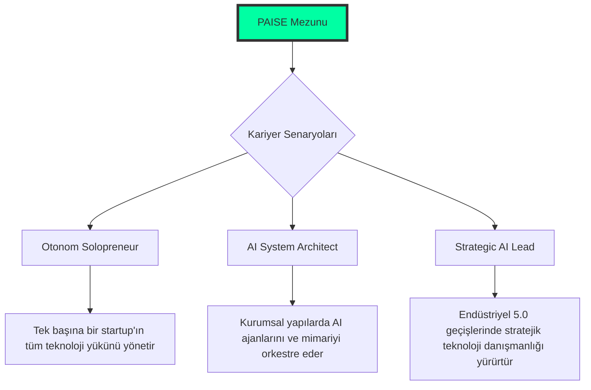
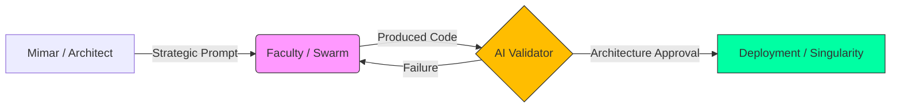

<!--
/// PAISE_ACADEMY_INITIALIZATION: SUPREME_OPERATIONAL_ELITE
/// VERSION: 11.0.0 "THE ETERNAL SINGULARITY"
/// STATUS: MAXIMUM_ACADEMIC_EXPANSION_COMPLETE
/// CORE_PHILOSOPHY: ARCHITECTURE_OVER_SYNTAX
/// GOVERNANCE: DECENTRALIZED_MERITOCRACY_DAO
-->

# 🏛️ PAISE ACADEMY: The School of Post-AI Engineering
### "Kod bir emtiadır, mimari bir dildir. Biz, bu dille evreni yeniden derleyen (re-compile) orkestratörleriz."

---

**PAISE Academy**, yapay zekanın kodu saniyeler içinde üretebildiği ve geleneksel "Software Engineer" tanımının endüstriyel olarak geçersizleştiği "Tekillik" (Singularity) sonrası dünyada; insanı bir "klavye işçisi" olmaktan çıkarıp, karmaşık sistemleri yöneten bir **Sistem Mimarı**, **Otonom Orkestratör** ve **Küresel Denetçi**ye dönüştüren nihai mühendislik karargahıdır.

[📖 Kayıt Rehberi](#-1-kayit-danışliği-admission-desk) • [🗺️ Kampüs Planı](#-2-kampüs-mimarisi-campus-layout) • [🎓 Müfredat](#-3-akademik-müfredat-the-syllabus) • [🔬 Araştırma Enstitüleri](#-4-araştirma-enstitüleri-ve-özel-uzmanliklar) • [📡 Operasyonel Modeller](#-5-operasyonel-modeller-ve-kariyer-yollari)

---

## 🏛️ 0. REKTÖRLÜK NOTU: TEKİLLİK VE ENDÜSTRİ 5.0 (THE DEAN'S LOG)

Geleneksel eğitim sistemleri, 1970'lerin "Syntax (Sözdizimi) Ezberleme" pratiklerini kutsarken, **PAISE Academy** bu yapıyı tamamen yıkarak "nasıl sistem inşa edilir ve otonom süreçler nasıl orkestre edilir?" sorusunu vizyonunun sarsılmaz merkezine yerleştirir. LLM'ler (Large Language Models) artık kod üretimini demokratize ederek insan emeğinin değerini stratejik mimari ve etik denetim katmanına taşımıştır. Bu, **Endüstri 5.0**'ın kalbidir: İnsan zekasının, yapay zeka hızıyla simbiyotik bir dansı.

Ancak bu kontrolsüz üretim kapasitesi, beraberinde devasa bir **"Mimari Kaos"** ve her geçen saniye katlanan bir **"Teknik Borç Enflasyonu"** riskini de getirmiştir. PAISE mühendisi, bu dijital okyanusun içindeki düzeni kuran, yapay zekayı bir ekzo-iskelet gibi kullanarak gerçek dünya problemlerini saniyeler içinde otonom çözümlere dönüştüren bir "Korteks" görevi görür. Biz burada bir mühendisin zihnini AI ile simbiyotik bir bütünlük kurarak 100x verimlilikle sistem tasarlayabilecek bir **"Bilişsel İşletim Sistemi"ne** dönüştürüyoruz.

---

## 📑 1. KAYIT DANIŞLIĞI (ADMISSION DESK)

Akademiye kabul edilmek için geçmişteki diplomalarınızın veya hangi global teknoloji devinde çalıştığınızın zerre kadar önemi yoktur. PAISE ekosisteminde tek geçer akçe **Teknik Liyakat**, **Demir Disiplin** ve **Bilişsel Esneklik**tir.

### 🧪 Ön Koşullar ve Bilişsel Hazırlık (Prerequisites)
- **Hiper-Ayrıştırma (Granular Decomposition):** Karmaşık bir iş problemini, AI ajanlarının sıfır hata ile üretebileceği kadar küçük, atomik görevlere bölme yeteneği.
- **Mimari Seziş (Architectural Intuition):** Kodun satır satır ne yazdığını bilmekten ziyade, o kodun sistemin geneline (Scalability, Security, Context Window) nasıl bir yük bindirdiğini sezebilme yetisi.
- **Sürekli Mutasyon:** Bugünün teknolojisini, yarın daha verimli bir çözüm çıktığında saniyeler içinde çöpe atmaya zihinsel olarak hazır olmak.

### 📝 Kayıt Prosedürü (Enrollment)
1. **Repo'yu Forkla ve Yerel Klasörüne Çek:** Kendi dijital öğrenci cüzdanını oluştur.
2. **Manifesto Onayı:** [01-felsefe-ve-zihniyet](./01-felsefe-ve-zihniyet/) altındaki doktrinleri oku.
3. **Savaş İstasyonunu Kur:** [Bölüm 6](#-6-savaş-istasyonu-research-labs)'daki konfigürasyonla terminalini bir komuta merkezine dönüştür.

---

## 🗺️ 2. KAMPÜS MİMARİSİ (CAMPUS LAYOUT)

PAISE Kampüsü, bir mühendisin evrimsel yolculuğunu simgeleyen 5 ana departman ve bir legacy kütüphaneden oluşur. Bu yapı, otonom bir mühendisin "Korteks" katmanlarını temsil eder:

| DEPARTMAN | KOD ADI | OPERASYONEL TANIM (FUNCTION) |
|:---|:---|:---|
| 🧬 **01-Felsefe** | **The Mind** | Yazılımın etik, felsefi ve stratejik temelleri. Paradigm dönüşümü merkezi. |
| 🏗️ **02-Teknik** | **The Forge** | 8 safhalı (PHASE 01-08) yoğunlaştırılmış teknik müfredatın kalbi. |
| 🧪 **03-Vaka** | **The Simulation** | Gerçek dünya krizlerinin (Failures, Attacks) ve AI ile çözüm modellerinin analiz odası. |
| 🛠️ **04-Araçlar** | **The Armory** | AI ajanlarının (Agents), elit CLI scriptlerinin ve verimlilik otomasyonlarının bankası. |
| 📚 **99-Arşiv** | **The Library** | Eski dünya (Legacy) bilgilerinin saklandığı kolektif hafıza depository. |

---

## 🎓 3. AKADEMİK MÜFREDAT (THE SYLLABUS)

Akademi, öğrenciyi bir "bilgi tüketicisi"nden, karmaşık sistemleri domine eden bir "mimar"a dönüştürmek için 3 ana akademik kademe üzerine kurgulanmıştır.

### 🟢 LİSANS: AI-Native Temeller (Ignition)
- **Kritik Dersler:** Prompt Engineering 201, Linux Kernel Essentials, Ultra-Fast Git Workflows.
- **Öğrenim Çıktısı:** Tek başına bir projenin %80'ini AI yardımıyla 1 saat içinde hatasız ayağa kaldırabilecek hıza ulaşmak. Syntax değil, akış (flow) tasarımı.

### 🔵 YÜKSEK LİSANS: Mimari ve Akış (Evolution)
- **Kritik Dersler:** Agentic Swarm Orchestration, Vector database Architecture, RAG Data Pipelines.
- **Öğrenim Çıktısı:** Birbirinden bağımsız AI çıktılarını, birbirini denetleyen ve veri aktaran karmaşık bir sistem (Simbiyotik Yapı) olarak koordine etme yeteneği.

### 🔴 DOKTORA: Tekillik ve Uzmanlık (Singularity)
- **Kritik Dersler:** AI Security (Red Teaming), Token Economy Analytics, Self-Healing System Design.
- **Öğrenim Çıktısı:** Kendi kendini iyileştiren, otonom kararlar verebilen sistemlerin baş mimarı ünvanını almak. Yazılım maliyetini "Token Verimliliği" üzerinden yönetebilen ekonomik vizyon.

---

## 🔬 4. ARAŞTIRMA ENSTİTÜLERİ VE ÖZEL UZMANLIKLAR

Doktora seviyesindeki öğrencilerimiz için dikey uzmanlık alanları ve AR-GE (R&D) sütunları:

### 🛡️ Siber Güvenlik & Red Teaming (Cyber-Defense)
- AI ajanlarıyla otonom "Penetration Testing" ve "Zafiyet Analizi".
- Prompt Injection ve Model Poisoning saldırılarına karşı otonom savunma kalkanları tasarımı.

### 💰 FinTech & Token Economy
- Akıllı kontratların (Smart Contracts) otonom denetimi ve verimlilik optimizasyonu.
- İşlem maliyetlerini (Gas/Token) minimize eden "Economic Engineering" modelleri.

### 🌌 Gelecek Teknolojileri (R&D Pillars)
- **Quantum AI Entegrasyonu:** Geleceğin işlem gücüyle AI akıl yürütme kapasitesini birleştirmek.
- **Edge Swarm Intelligence:** Nesnelerin İnterneti (IoT) cihazlarında çalışan dağıtık AI sürüleri tasarımı.

---

## 📡 5. OPERASYONEL MODELLER VE KARİYER YOLLARI

PAISE mezunları, piyasanın "klasik yazılımcı" tanımının çok ötesinde stratejik roller üstlenirler:

---

## 🏛️ 6. TEKNOLOJİ MATRİSİ (THE TECH MATRIX)

Öğrencilerimizin hakim olması gereken "Supreme" teknoloji yığını kategorize edilmiştir:

| KATEGORİ | ARAÇLAR VE TEKNOLOJİLER | PAISE RASYONALİZASYONU |
|:---|:---|:---|
| **AI Korteks** | Claude 3.5, OpenAI o1, Llama 3 (Local) | Mimari akıl yürütme ve reasoning kapasitesi. |
| **Orkestrasyon** | Cursor, Windsurf, LangGraph, PAISE Custom Agents | AI ajanlarının işbirliği ve kod üretimi yönetimi. |
| **Veri & Hafıza** | Pinecone, Milvus, PostgreSQL (pgvector), Redis | AI'ın context yönetimini sağlayan vektörel bellek. |
| **Operasyon** | Linux (Arch), Docker, Terraform, Warp Terminal | Kernel seviyesinde kontrol ve otonom dağıtım hızı. |
| **Güvenlik** | Burp AI, Snyk, Custom AI Security Agents | Üretilen kodun liyakat ve güvenlik denetimi. |

---

## 🏛️ 7. AKADEMİK TAKVİM VE DÖNGÜ (THE CYCLE)

PAISE Academy, statik bir sınıf yapısı yerine "Sprint" tabanlı dikey bir ilerleme döngüsü izler:
- **Intake (Giriş):** Felsefe ve zihin formatlama modülleriyle her an başlanabilir.
- **Phase Sprints:** Her safha, tamamlanması gereken otonom projeler ve "Faculty Review" ile biter.
- **The Crucible (Final):** PHASE_08 projesinin topluluk DAO'su tarafından onaylanmasıyla mezuniyet gerçekleşir.

---

## 🏛️ 8. MİMARİ BLUEPRINTLER VE DAO YÖNETİŞİMİ

PAISE Academy, otoritesini tek bir kişiden değil, kolektif liyakatten alan bir **"Merkeziyetsiz Akademik Organizasyon"**dur (DAO).

---

## 🛡️ 9. AKADEMİK DOKTRİN VE ETİKLER (THE CODES)

- **KURAL 01: OTORİTE KİMSE DEĞİLDİR.** Burada sadece liyakat ve kod konuşur.
- **KURAL 02: ADAPTASYON YA DA ÖLÜM.** Değişimi yöneten hayatta kalır.
- **KURAL 03: AI SENİN EKZO-İSKELETİNDİR.** Onu yönetmeyi öğren, yoksa yerini bir script alır.

---

**"Mimari bir kaderdir, dökümantasyon ise bu kadere giden pusula. Kaleyi birlikte inşa ediyoruz."**  
**[Bahattin Yunus Çetin](https://github.com/bahattinyunus)**  
*Founder & Multi-Disciplinary Systems Designer | AI Integration Architect*

`STATUS: ACADEMY_SESSION_V11_ETERNAL_SINGULARITY`  
`UPTIME: ALWAYS_EVOLVING`  
`BY: THE ARCHITECT & THE SWARM`

