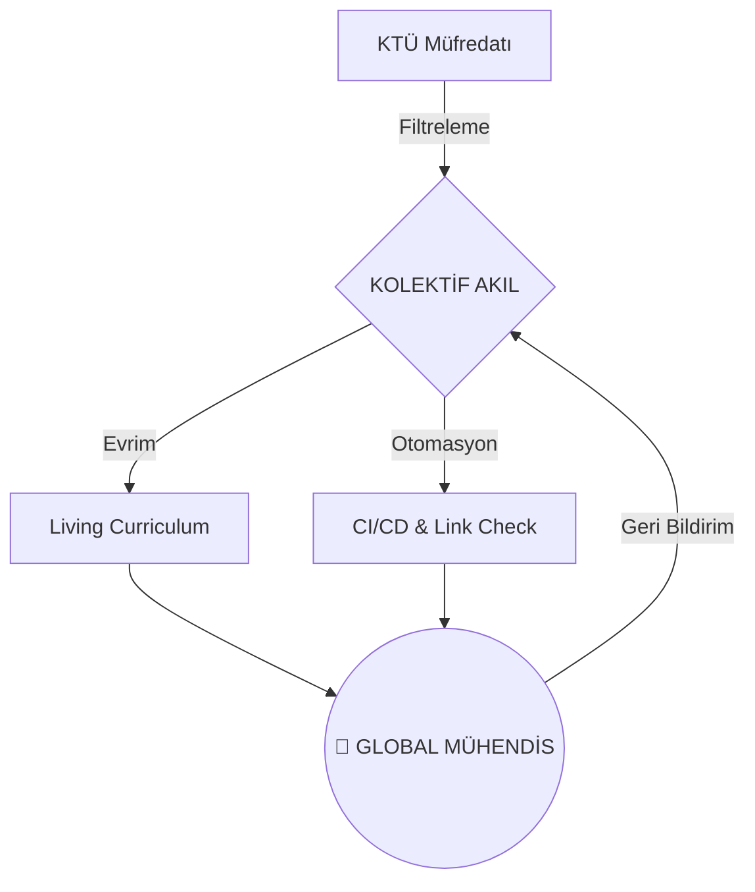

<!--
/// SYSTEM_INITIALIZATION: COMPLETED
/// PROTOCOL: POST-AI_EVOLUTION
/// ARCHITECT: @BAHATTINYUNUS
/// VERSION: 2.0.0 "THE SINGULARITY"
-->

# 🌌 POST-AI SOFTWARE ENGINEERING (SWE)
### "Eski müfredatlar çürüyor, kod artık nefes alıyor."

---

**Bu bir ders notu deposu değil; bir mutasyon merkezidir.**  
Yapay Zeka'nın kodu yazabildiği bir çağda, mühendisin tek gerçek kalesi **Mimari Vizyon** ve **Hibrit Uygulama** yeteneğidir. 

[🏛️ Manifesto](./1_DOKTRIN/_MANIFESTO/README.md) • [🛰️ Mimari](./1_DOKTRIN/MIMARI_YAPI.md) • [📡 Yol Haritaları](./3_KARIYER/YOL_HARITALARI/README.md) • [🛠️ Katkıda Bulun](./CONTRIBUTING.md)

---

## 🦾 POST-AI PARADOKSU: NEDEN BURADAYIZ?

Geleneksel eğitim sistemleri, güncellenmesi 4 yıl süren "statik" doktrinlerdir. Oysa biz, **6 aylık** teknolojik döngülerin içinde yaşıyoruz. `post-ai-swe`, üniversite eğitimini bir **Bootloader** olarak kabul eder; asıl **İşletim Sistemini** burada, kolektif akılla her gün yeniden derler.

| ESKİ DÜNYA (Legacy) | YENİ DÜNYA (Post-AI) |
|:---\|:---|
| Syntax Ezberlemek | Mimari Tasarlamak |
| StackOverflow'da Zaman Kaybı | LLM/Prompt Engineering ile 10x Hız |
| Müfredata Bağımlılık | "Just-in-Time" Learning |
| Tekil Gelişim | "The Swarm" (Kolektif Gelişim) |

---

## 🛰️ STRATEJİK KATMANLAR (OPERATIONAL HUB)

Proje 6 kritik katmandan oluşur. Her katman, mühendislik evriminin bir safhasıdır.

### 🧬 [0_MUREDDAAT](./0_MUREDDAAT/) — Çekirdek Doktrin
KTÜ Yazılım Mühendisliği müfredatının, global elit standartlara göre optimize edilmiş ve AI destekli araçlarla hibritleştirilmiş "Ustalık" versiyonudur.

### 🦅 [1_DOKTRIN](./1_DOKTRIN/) — Zihniyet & Felsefe
Teknik beceriyi güce dönüştüren zihniyet kalıpları. "Zihin formatlanmadan, kod derlenmez."

### ⚔️ [2_USTALIK](./2_USTALIK/) — Savaş Sahası
Teorinin pratikle çarpıştığı nokta. Modern teknoloji yığınları (Stack), sistem tasarımı ve ileri düzey metodolojiler.

### 🌐 [3_KARIYER](./3_KARIYER/) — Küresel Etki
Kazanılan teknik üstünlüğün, global piyasada stratejik bir kariyere ve nüfuza dönüştürülmesi sanatı.

### 📟 [4_SISTEM](./4_SISTEM/) — Telemetri & Kontrol
Gelişimin veriyle yönetildiği, ana operasyon loglarının ve stratejik özetlerin tutulduğu kontrol paneli.

### 📂 [5_ARSIV](./5_ARSIV/) — Kolektif Hafıza
Geçmişin tecrübeleri, referans materyaller ve dondurulmuş projeler.

---

## 🤖 TEKNOLOJİ YIĞINI (ELİTE STOIC STACK)

Gelişim için kullanılan ve önerilen ana araçlar:

- **OS:** Linux (Ubuntu/Debian) / WSL2
- **Cortex:** Cursor / VS Code (AI Integrated)
- **Engine:** LLMs (Claude 3.5 Sonnet, GPT-4o)
- **Version Control:** Git & GitHub (Advanced Flow)

---

## 📡 SİSTEM TELEMETRİSİ

---

## 🤝 KOLEKTİF AKLA KATIL (CONTRIBUTIONS)

Bu repo bir "yazar" tarafından değil, bir "topluluk" tarafından yönetilir. Otorite yoktur, bilimsel üstünlük ve temiz kod vardır.
1. [Katkı Rehberi](./CONTRIBUTING.md)'ni oku.
2. Sisteme uygun bir Issue aç veya PR gönder.
3. Mimariyi birlikte büyütelim.

---

**"Sadece ilk taşı koydum. Kaleyi birlikte inşa edeceğiz."**  
**[Bahattin Yunus Çetin](https://github.com/bahattinyunus)**  
*IT Architect & Initiator of Post-AI Vision*

`STATUS: SINGULARITY_MODE_ACTIVE`  
`EVOLUTION: NON-STOP`

