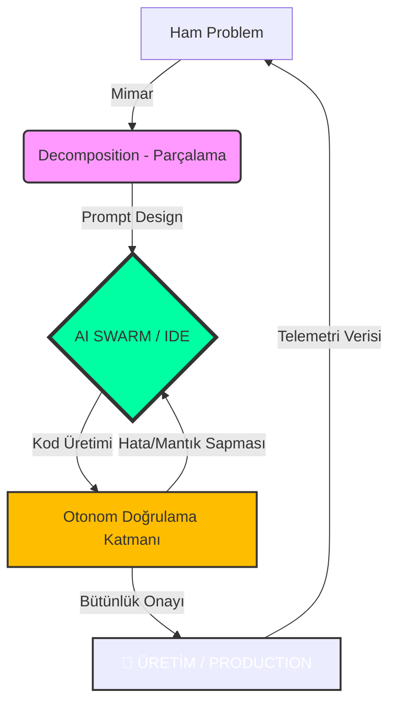

<!--
/// PAISE_SYSTEM_INITIALIZATION: OPERATIONAL
/// ENTRANCE_PROTOCOL: OPEN_SOURCE_ELITE
/// CORE_PHILOSOPHY: ARCHITECTURE_OVER_SYNTAX
/// VERSION: 4.2.0 "THE ULTIMATE SINGULARITY"
/// STATUS: EXPANDING_HORIZON
-->

<div align="center">


# 🌌 PAISE: Post-AI Software Engineering Curriculum
### "Eski müfredatlar çürüyor, kod artık nefes alıyor. Biz, makineyi yöneten mimarlarız."

[](./99-sistem-ve-arsiv/)
[](https://github.com/arch-yunus/post-ai-swe/actions)
[](./LICENSE)
[](./CONTRIBUTING.md)

---

**PAISE**, yapay zekanın kodu saniyeler içinde üretebildiği "Tekillik Sonrası" dünyada; insanı bir "klavye işçisi" olmaktan çıkarıp, karmaşık sistemleri yöneten bir **Sistem Tasarımcısı** ve **Baş Denetçi**ye dönüştüren evrimsel bir mühendislik döktrinidir.

[🏛️ Zihniyet](./01-felsefe-ve-zihniyet/) • [🛰️ Teknik Müfredat](./02-teknik-mufredat/) • [📡 Vaka Analizleri](./03-vaka-analizleri/) • [🛠️ Araçlar](./04-araç-kütüphanesi/) • [🤝 Katkıda Bulun](./CONTRIBUTING.md)

</div>

---

## 🦾 1. PAISE PARADOKSU: NEDEN BURADAYIZ?

Geleneksel yazılım eğitimi (Legacy SWE), 1970'lerin "Syntax (Sözdizimi) Ezberleme" pratiklerine dayalıdır. Oysa bugün, LLM'ler (Large Language Models) saniyede binlerce satır kodu hatasız yazabiliyor. 

**PAISE**, bu teknolojik sıçramayı bir tehdit değil, bir **Ekzo-İskelet** olarak kabul eder. Biz, kodu yazmayı değil; **neyin, neden ve nasıl inşa edilmesi gerektiğini** öğretiriz.

### 🛡️ Legacy vs. Post-AI Karşılaştırması

| BOYUT | LEGACY SWE (Eski Dünya) | PAISE (Yeni Dünya) |
|:---|:---|:---|
| **Zihin Yapısı** | "Nereden kopyalaraım?" | "Nasıl parçalara bölerim?" |
| **Hız Birimi** | Satır / Saat | Problem / Saniye |
| **Araç Seti** | Notepad++, StackOverflow | Cursor, Windsurf, Agentic Swarms |
| **Doğrulama** | "Derleniyorsa tamamdır" | Mimari Bütünlük & Formal Verification |
| **Ekonomi** | Emek Yoğun (Labor-Intensive) | Zeka Yoğun (Intelligence-Intensive) |

---

## 🏛️ 2. MÜFREDATIN 4 ANA SÜTUNU (CORE PILLARS)

### 2.1 🧩 Problem Ayrıştırma (Decomposition)
Modern mühendisliğin altın kuralı: **"Bir problem AI tarafından çözülemiyorsa, yeterince küçük parçalara bölünmemiştir."** 
- İş gereksinimlerini atomik teknik tasklara indirgeme.
- Bağlam (Context) yönetimi ve gereksiz gürültünün (noise) temizlenmesi.

### 2.2 🏛️ Hibrit Sistem Mimarisi (Architectural Intuition)
Ajanların (Agents) birbirleriyle konuştuğu, verinin akışkan olduğu yapılar.
- **Agentic Workflows:** İnsan müdahalesi olmadan karar verebilen sistemler tasarlamak.
- **RAG & Vector Memory:** AI'ın hafızasını projenin yaşayan verisiyle birleştirmek.

### 2.3 🛡️ Otonom Doğrulama (Verification & Validation)
Kodun doğruluğunu makineye, liyakatini ise mimara bırakmak.
- AI tarafından üretilen kodun güvenlik açıklarını tarayan otonom linterlar.
- Business Logic testlerinin prompt bazlı üretimi ve validasyonu.

### 2.4 🚀 Endüstriyel Entegrasyon (Scaling & Impact)
Dijital kodun fiziksel dünyaya (robotik, lojistik, savunma) etkisi.
- Yazılımdan ziyade, "Çalışan Çözüm" (Working Solution) odaklılık.

---

## 📚 3. DERİNLEMESİNE MÜFREDAT HARİTASI (LEVEL DEEP-DIVE)

### 🟢 SEVİYE 1: AI-NATIVE TEMELLER (IGNITION)
> **Odak:** Klavyeyi bırak, Terminali ve AI'yı kullanmayı öğren.
- **Prompt Engineering as Programming:** Talimat değil, kısıtlama (constraint) ve mantık tasarımı.
- **CLI Mastery:** İşletim sistemiyle doğrudan, aracısız iletişim.
- **Code Fluency:** Üretilen 10.000 satır kodu 10 saniyede tarayıp kritik hataları görebilme yetisi.
- **Versions of Time:** Git ve GitHub'ı bir işbirliği beyni olarak kullanmak.

### 🔵 SEVİYE 2: MİMARİ VE AKIŞ TASARIMI (CORE EVOLUTION)
> **Odak:** Ayrı parçaları tek bir yaşayan organizmaya dönüştür.
- **API-First & AI-First:** Makineler için arayüz tasarlamak.
- **Distributed Intelligence:** Microservices mimarisinden "Agentic Swarms" mimarisine geçiş.
- **Vectorized Knowledge:** Veritabanlarını LLM bağlam penceresiyle senkronize etmek.
- **System Dynamics:** Yazılımın ölçeklenirken nasıl davrandığını analiz etmek.

### 🔴 SEVİYE 3: İLERİ SEVİYE OPTİMİZASYON VE GÜVENLİK (SINGULARITY)
> **Odak:** Otonom, kendi kendini iyileştiren sistemler inşa et.
- **AI Security (Red Teaming):** Prompt injection ve model sapmalarına karşı savunma.
- **Token Economy & ROI:** Yazılımın maliyetini token verimliliği üzerinden optimize etmek.
- **Self-Healing Systems:** Hata aldığında kendi kodunu düzeltebilen ajan katmanları.
- **Final Catalyst:** Gerçek dünyaya etki eden, otonom bir ürünün uçtan uca inşası.

---

## 📡 4. PAISE ÖĞRENİM METODOLOJİSİ (THE FLOW)



---

## 🛡️ 5. TOPLULUK DOKTRİNİ (COMMUNITY DOCTRINE)

> [!CAUTION]
> ### ⚔️ KURAL 01: OTORİTE KİMSE DEĞİLDİR (NO MASTERS)
> PAISE ekosisteminde bilgi hiyerarşisi yoktur. En iyi fikri kimin söylediği değil, o fikrin sistem mimarisine sağladığı liyakat esastır. Egonuzu kapıda bırakın, liyakatinizi konuşturun.

> [!IMPORTANT]
> ### 🤖 KURAL 02: ADAPTASYON YA DA ÖLÜM (ADAPT OR DIE)
> Bugünün "en iyi" modeli yarının çöpüdür. PAISE belirli bir araca değil, değişimi bizzat yöneten "Mühendislik Refleksi"ne sadıktır. Değişemeyen elenir.

---

## 💻 6. SAVAŞ İSTASYONU (BATTLESTATION CONFIG)

Yapay zeka orkestrasyonu için optimize edilmiş elit çalışma ortamı:

| KATEGORİ | STANDART (RECOMMENDED) | NEDEN? |
|:---|:---|:---|
| **İşletim Sistemi** | **Linux (Arch/Debian) / WSL2** | Kernel seviyesinde kontrol ve terminal hızı. |
| **Cortex (IDE)** | **Cursor / Windsurf** | AI-Native kodlama ve derin bağlam yönetimi. |
| **Engine (LLM)** | **Claude 3.5 Sonnet / o1-preview** | Mimari akıl yürütme ve mantık kapasitesi. |
| **Komuta Satırı** | **Warp / Oh-My-Zsh** | AI entegrasyonu ve komut geçmişi analitiği. |
| **İletişim** | **Discord / GitHub Issues** | Kolektif akıl ve asenkron yardımlaşma. |

---

## 🛠️ 7. REPO YAPISI (THE BLUEPRINT)

```text
.
├── 01-felsefe-ve-zihniyet/    # Post-AI mühendislik etiği ve "Neden?" sorusu.
├── 02-teknik-mufredat/        # Modül modül ders içerikleri (PHASE_01 - 08).
├── 03-vaka-analizleri/        # Gerçek dünya krizleri ve AI tabanlı çözümler.
├── 04-araç-kütüphanesi/       # Elit araçlar, scriptler ve otomasyon yapıları.
├── 99-sistem-ve-arsiv/        # Legacy data ve dondurulmuş projeler.
├── .github/                   # Otonom CI/CD ve Topluluk Yönetişimi.
└── CONTRIBUTING.md            # "Sürü"ye nasıl katılırsınız?
```

---

## 🌐 8. KÜRESEL İTTİFAK (GLOBAL ALLIANCE)

PAISE bir yalnızlık değil, bir **"Swarm"** hareketidir. 

- **[LinkedIn Operasyon Ağı](https://www.linkedin.com/in/bahattinyunus/)**: Stratejik güncellemeler ve kariyer mühendisliği.
- **[GitHub Karargahı](https://github.com/bahattinyunus)**: Projenin kalbi ve diğer otonom çalışmalar.

---

<div align="center">

**"Mimari bir kaderdir, kod ise sadece bir araç. Kaleyi birlikte inşa ediyoruz."**  
**[Bahattin Yunus Çetin](https://github.com/bahattinyunus)**  
*Multi-Disciplinary Systems Designer | AI Architect | Solopreneur Initiator*

`STATUS: SINGULARITY_V4_ULTIMATE_ACTIVE`  
`METRICS: MEASURING_SYSTEM_INTELLIGENCE`

</div>
