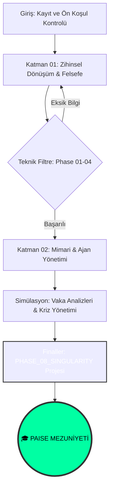

<!--
/// PAISE_ACADEMY_INITIALIZATION: OPERATIONAL
/// ADMISSION_PROTOCOL: ELITE_MERITOCRACY
/// VERSION: 6.0.0 "THE GRAND ACADEMY"
/// CORE_PHILOSOPHY: ARCHITECTURE_OVER_SYNTAX
-->

# 🏛️ PAISE ACADEMY: The School of Post-AI Engineering
### "Diplomalar sadece birer kağıt parçasıdır; liyakat ise kodun içindeki mimari ruhun ta kendisidir."

---

**PAISE Academy**, yapay zekanın kodu saniyeler içinde üretebildiği, geleneksel yazılım mühendisliğinin temel varsayımlarının çöktüğü "Tekillik" (Singularity) sonrası dünyada; insanı bir "klavye işçisi" olmaktan çıkarıp, karmaşık sistemleri yöneten bir **Sistem Mimarı** ve **Otonom Orkestratör**e dönüştüren küresel bir eğitim karargahıdır.

[📖 Kayıt Rehberi](#-1-kayit-ve-akademik-prosedür-admission) • [🗺️ Kampüs Planı](#-2-kampüs-plani-campus-layout) • [🎓 Mezuniyet](#-3-müfredat-ve-mezuniyet-the-syllabus) • [🛡️ Dekanlık](./CONTRIBUTING.md)

---

## 🏛️ 0. REKTÖRLÜK NOTU: PARADİGMA DEĞİŞİMİ (THE DEAN'S LOG)

Geleneksel üniversitelerin 4 yıllık müfredatları, teknolojinin 6 aylık döngülerle mutasyona uğradığı bir çağda "fosilleşmiş dökümanlar" olmaktan öteye gidememektedir. Kod yazmak artık bir "yetenek" değil, bir "commodity" (emtia) haline gelmiştir. **PAISE Academy**, bu radikal değişimin merkezinde durur. Biz, öğrencilere sözdizimi (syntax) ezberletmiyoruz; biz, yapay zekayı bir ekzo-iskelet gibi kullanarak imkansız görünen sistemleri saniyeler içinde tasarlayıp, milisaniyeler içinde kontrol altına alabilen "Hibrit Mühendisler" yetiştiriyoruz. Bu akademi, statik bir bilgi bankası değil, her PR ile kendini yeniden derleyen (re-compile) yaşayan bir organizmadır.

---

## 📑 1. KAYIT VE AKADEMİK PROSEDÜR (ADMISSION)

Akademiye giriş yapmak için herhangi bir merkezi sınav veya ücret gerekmez. Ancak, PAISE disiplinine uyum sağlamak için yüksek toleranslı bir liyakat eşiği ve mutlak bir öğrenme iştahı zorunludur. Akademi, zamanını boşa harcayanları değil, sistem üzerinde gerçek iz bırakanları ödüllendirir.

### 🧪 Ön Koşullar (Prerequisites)
- **Derin Merak (Hyper-Curiosity):** "Bu sistem nasıl çalışıyor?" sorusunun ötesine geçip, "Bu sistemi nasıl daha verimli parçalara bölerim?" diyebilmek.
- **Teknik Okuryazarlık (Code Fluency):** Kodun satır satır ne yazdığını değil, bir algoritmanın niyetini ve yan etkilerini (side-effects) büyük resimde görebilme yetisi.
- **Donanımsal Hazırlık:** [Savaş İstasyonu](#-5-savaş-istasyonu-research-labs) konfigürasyonuna uygun, otonom çalışmaya hazır bir geliştirme ortamı.

### 📝 Kayıt Adımları (Enrollment Procedure)
1.  **Repo'yu Forkla ve Yerel Klasörüne Çek:** Kendi dijital öğrenci cüzdanını ve çalışma odanı oluştur.
2.  **Manifestoyu İmzala:** [01-felsefe-ve-zihniyet](./01-felsefe-ve-zihniyet/) altındaki doktrinleri oku. Eğer zihnin post-AI dünyasına hazır değilse, teknik derslere başlaman sadece vakit kaybı olacaktır.
3.  **İlk PR Operasyonu:** `CONTRIBUTING.md` rehberine uygun olarak sisteme ilk katkını sağla. Bu, senin "Kayıt Formun" sayılacaktır.

---

## 🗺️ 2. KAMPÜS PLANI (CAMPUS LAYOUT)

PAISE Kampüsü, bir mühendisin gelişim döngüsünü simgeleyen 5 ana departmandan oluşur. Her departman, bir öncekinin üzerine inşa edilen bir yetkinlik katmanıdır.

| DEPARTMAN | KAMPÜS ALANI | OPERASYONEL TANIM (FUNCTION) |
|:---|:---|:---|
| 🧬 **01-Felsefe** | **Rektörlük & Doktrinler** | Yazılımın etik, felsefi ve stratejik temelleri. "Neden?" sorusunun akademik olarak yanıtlandığı, zihinlerin formatlandığı merkez. |
| 🏗️ **02-Teknik** | **Derslikler & Laboratuvarlar** | 8 safhalı (PHASE 01-08) yoğunlaştırılmış teknik müfredat. Kodun mimariye, mimarinin ürüne dönüştüğü ana uygulama sahası. |
| 🧪 **03-Vaka** | **Simülasyon Merkezi** | Teorik bilginin gerçek dünya krizleriyle (Post-mortem analizler, büyük sistem çöküşleri) test edildiği yüksek stresli simülasyon odası. |
| 🛠️ **04-Araçlar** | **Teknik Atölye (The Forge)** | AI ajanlarının (Agents), özel scriptlerin ve verimlilik otomasyonlarının dövüldüğü, üretildiği ve paylaşıldığı teknoloji bankası. |
| 📚 **99-Arşiv** | **Kütüphane (Legacy)** | Eski dünya (pre-AI) bilgilerinin, üniversite notlarının ve dondurulmuş projelerin veri madenciliği için saklandığı kolektif hafıza. |

---

## 🎓 3. MÜFREDAAT VE MEZUNİYET (THE SYLLABUS)

Akademi, öğrenciyi pasif bir dinleyiciden aktif bir mimara dönüştürmek için 3 ana akademik kademe ve bir bitirme tezi (Singularity Project) üzerine kurulmuştur.

### 🟢 LİSANS: AI-Native Temeller (The Ignition)
> **Hedef:** Klavye işçiliğinden kurtulup, makineler arası orkestrasyonun dilini sökmek.
Bu seviyede öğrenci, terminalin (Shell) karanlık dünyasına iner, Git ile zaman yolculuğu yapmayı öğrenir ve Prompt Engineering'i bir "talimat listesi" değil, bir "logic design" (mantık tasarımı) olarak kullanmaya başlar.

### 🔵 YÜKSEK LİSANS: Mimari ve Akış (Core Evolution)
> **Hedef:** Bağımsız AI çıktılarını, karmaşık ve otonom sistemler halinde koordine etmek.
Öğrenci artık tek başına kod parçaları üretmez; Mikro-hizmetlerin (Microservices) birbirleriyle nasıl konuştuğunu tasarlar, Vektör veritabanlarını AI'nın "Dış Hafızası" olarak projeye entegre eder ve sistem dinamiklerini (scalability, latency) AI yardımıyla optimize eder.

### 🔴 DOKTORA: Tekillik ve Optimizasyon (The Singularity)
> **Hedef:** Kendi kendini yöneten, kendi hatalarından öğrenen ve fiziksel dünyaya etki eden otonom yapılar inşa etmek.
Sürecin zirvesinde, "Self-Healing" kod yapıları, AI güvenlik protokolleri (Red Teaming) ve "Token Economy" (Yazılım maliyetinin token verimliliğiyle yönetimi) üzerine uzmanlaşılır.

**Mezuniyet Koşulu:** `02-teknik-mufredat/PHASE_08_SINGULARITY` safhasındaki bitirme projesi, "Sektörel Liyakat Kurulu" (Katkıcılar) tarafından onaylanmalıdır. Mezun olan aday, global ölçekte **"PAISE Certified System Architect"** ünvanını taşımaya hak kazanır.

---

## 🛡️ 4. AKADEMİK DOKTRİNLER (ACADEMIC CODES)

> [!CAUTION]
> ### ⚔️ DİSİPLİN 01: LİYAKAT VE ŞEFFAFLIK (MERIT OVER TITLES)
> PAISE Academy içinde yaş, ünvan veya geçmiş başarılar koltuk sağlamaz. Burada sadece "kimin PR'ı daha temiz?", "kimin mimarisi daha ölçeklenebilir?" ve "kim problemi daha iyi parçalara böldü?" sorularına verilen teknik yanıtlar konuşulur. Egonuzu dekandaki girişte bırakın.

> [!IMPORTANT]
> ### 🤖 DİSİPLİN 02: HİBRİT ÇALIŞMA ZORUNLULUĞU (THE SYMBIOSIS)
> Yapay zekayı bir "oyuncak" veya "tehdit" olarak görenler bu akademide yer bulamaz. AI, sizin dış beyninizdir. Onu kullanmayı reddetmek, bir savaşa kılıçsız girmek gibidir. Bir PAISE öğrencisi, en az 3 farklı LLM modelini (Claude, GPT, Local) aynı anda yönetebilecek kapasitede olmalıdır.

---

## 💻 5. SAVAŞ İSTASYONU (RESEARCH LABS)

PAISE laboratuvarlarında çalışmak için gerekli olan "minimum elit" teknoloji yığını aşağıda tanımlanmıştır. Bu araçlar, post-AI dünyasında hızınızı 10 katına çıkaracak hibrit silahlardır:

| KATEGORİ | STANDART KONFİGÜRASYON | NEDEN BU ARAÇ? |
|:---|:---|:---|
| **Laboratuvar (OS)** | **Linux / WSL2** | Kernel seviyesinde müdahale, yüksek paket hızı ve terminal özgürlüğü için tek seçenek. |
| **Enstrüman (IDE)** | **Cursor / Windsurf** | Statik editorler öldü. AI ile doğrudan (chat, composer) konuşabilen bir IDE zorunludur. |
| **Korteks (LLM)** | **Claude 3.5 Sonnet / o1** | Karmaşık mimari analizlerde halüsinasyon oranı en düşük, "problem çözme" kapasitesi en yüksek modeller. |
| **Komuta (Shell)** | **Warp / Oh-My-Zsh** | AI entegrasyonu, workflow paylaşımı ve komut geçmişi analitiğiyle hızınızı maksimize eder. |

---

## 📡 6. AKADEMİK İLERLEME AKIŞI (STUDENT JOURNEY)

---

## 🤝 7. AKADEMİK KURULA KATILIM (FACULTY ADMISSIONS)

PAISE Academy, otoritesini tek bir kişiden değil, kolektif akıldan (The Swarm) alır. Eğer seçtiğimiz dökümanlarda bir hata bulduysan, yeni bir modül eklemek istiyorsan veya vaka analizi merkezine yeni bir kriz senaryosu sunmak istiyorsan kapımız açık:
- **Müfredata Katkı:** `02-teknik-mufredat` klasöründeki her dosya senin revizyonuna açıktır.
- **Mentorluk:** Gelen PR'ları inceleyen bir "AI-Reviewer" operatörü olarak topluluğa liyakat kazandırabilirsin.

---

**"Akademi binalardan değil, aynı vizyona bakan zihinlerden ibarettir."**  
**[Bahattin Yunus Çetin](https://github.com/bahattinyunus)**  
*Founder & Multi-Disciplinary Systems Designer | AI Integration Expert*

`ACADEMY_STATUS: FULL_OPERATIONAL`  
`LATEST_UPDATE: 2026_SINGULARITY_V6`

