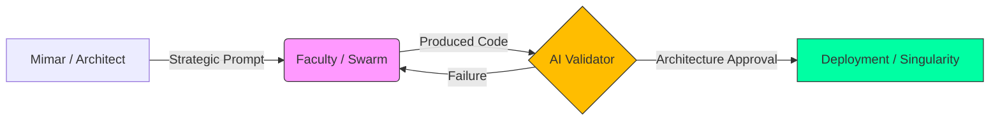

<!--
/// PAISE_ACADEMY_INITIALIZATION: SUPREME_OPERATIONAL
/// VERSION: 10.0.0 "THE SUPREME SINGULARITY"
/// STATUS: ETERNAL_EVOLUTION_ACTIVE
/// CORE_PHILOSOPHY: ARCHITECTURE_OVER_SYNTAX
/// GOVERNANCE: DECENTRALIZED_MERITOCRACY
-->

# 🏛️ PAISE ACADEMY: The School of Post-AI Engineering
### "Kod bir emtiadır, mimari bir dildir. Biz, bu dille evreni yeniden derleyen (re-compile) orkestratörleriz."

---

**PAISE Academy**, yapay zekanın kodu saniyeler içinde üretebildiği ve geleneksel "Software Engineer" tanımının endüstriyel olarak geçersizleştiği "Tekillik" (Singularity) sonrası dünyada; insanı bir "klavye işçisi" olmaktan çıkarıp, karmaşık sistemleri yöneten bir **Sistem Mimarı**, **Otonom Orkestratör** ve **Küresel Denetçi**ye dönüştüren nihai mühendislik karargahıdır.

[📖 Kayıt Rehberi](#-1-kayit-danışliği-admission-desk) • [🗺️ Kampüs Planı](#-2-kampüs-mimarisi-campus-layout) • [🎓 Müfredat](#-3-akademik-müfredat-the-syllabus) • [🔬 Laboratuvarlar](#-4-araştirma-enstitüleri-ve-laboratuvarlar) • [🛡️ Dekanlık](./CONTRIBUTING.md)

---

## 🏛️ 0. REKTÖRLÜK NOTU: TEKİLLİK VE ENDÜSTRİ 5.0 (THE DEAN'S LOG)

Geleneksel eğitim sistemleri, "nasıl kod yazılır?" sorusuna takılıp kalmışken ve 1970'lerin "Syntax (Sözdizimi) Ezberleme" pratiklerini kutsarken, **PAISE Academy** bu yapıyı tamamen yıkarak "nasıl sistem inşa edilir ve otonom süreçler nasıl orkestre edilir?" sorusunu vizyonunun sarsılmaz merkezine yerleştirir. Bugün LLM'ler (Large Language Models) sadece kod üretimini demokratize etmekle kalmamış, aynı zamanda "Junior" seviyesindeki tüm rutin işleri otomatize ederek insan emeğinin değerini stratejik mimari ve etik denetim katmanına taşımıştır. Bu, **Endüstri 5.0**'ın kalbidir: İnsan zekasının, yapay zeka hızıyla simbiyotik bir dansı.

Ancak bu kontrolsüz üretim kapasitesi, beraberinde devasa bir **"Mimari Kaos"** ve her geçen saniye katlanan bir **"Teknik Borç Enflasyonu"** riskini de getirmiştir. PAISE mühendisi, bu dijital okyanusun içindeki düzeni kuran, yapay zekayı bir ekzo-iskelet gibi kullanarak gerçek dünya problemlerini saniyeler içinde otonom çözümlere dönüştüren bir "Korteks" görevi görür. Biz burada akademik bir döküman deposu tasarlamadık; biz, bir mühendisin zihnini AI ile simbiyotik bir bütünlük kurarak 100x verimlilikle sistem tasarlayabilecek bir **"Bilişsel İşletim Sistemi"**ne dönüştürüyoruz. Buradaki varlığınız, küresel yazılım standartlarının yeniden yazılmasına yönelik kolektif bir operasyondur.

---

## 📑 1. KAYIT DANIŞLIĞI (ADMISSION DESK)

Akademiye kabul edilmek için geçmişteki diplomalarınızın veya hangi global teknoloji devinde çalıştığınızın zerre kadar önemi yoktur. PAISE ekosisteminde tek geçer akçe **Teknik Liyakat**, **Demir Disiplin** ve **Bilişsel Esneklik**tir. Akademi, statik bir bilgi bankası değil, her gün cephede değişen, hata yapan ve bu hatalardan ders çıkaran dinamik bir operasyon merkezidir.

### 🧪 Ön Koşullar ve Bilişsel Hazırlık (Prerequisites)
- **Hiper-Ayrıştırma (Granular Decomposition):** Karmaşık bir iş problemini, AI ajanlarının (LLM) sıfır hata ile üretebileceği kadar küçük, atomik teknik görevlere bölme yeteneği.
- **Mimari Seziş (Architectural Intuition):** Kodun satır satır ne yazdığını bilmekten ziyade, o kodun sistemin geneline (Memory, Scalability, Security, Context Window) nasıl bir yük bindirdiğini sezebilme yetisi.
- **Sürekli Mutasyon:** Bugünün "en iyi" teknolojisini, yarın daha verimli bir çözüm çıktığında saniyeler içinde çöpe atmaya zihinsel olarak hazır olmak.

### 📝 Kayıt Prosedürü (Enrollment)
1.  **Repo'yu Forkla ve Senkronize Et:** Kendi dijital öğrenci cüzdanını oluştur ve gelişimini bu repo üzerinden "Public" olarak kanıtla.
2.  **Manifesto Onayı:** [01-felsefe-ve-zihniyet](./01-felsefe-ve-zihniyet/) altındaki doktrinleri oku. Zihnini "Legacy SWE" varsayımlarından temizlemeden teknik safhalara geçemezsin.
3.  **Savaş İstasyonunu İnşa Et:** [Bölüm 5](#-5-savaş-istasyonu-research-labs)'teki konfigürasyonu eksiksiz tamamla. Terminal senin kumanda merkezin, AI ise senin sınırsız bilişsel enerji kaynağındır.

---

## 🗺️ 2. KAMPÜS MİMARİSİ (CAMPUS LAYOUT)

PAISE Kampüsü, bir mühendisin evrimsel yolculuğunu simgeleyen 5 ana departman ve bir legacy kütüphaneden oluşur. Bu yapı, otonom bir mühendisin "Korteks" katmanlarını temsil eder:

| DEPARTMAN | KOD ADI | OPERASYONEL TANIM (FUNCTION) |
|:---|:---|:---|
| 🧬 **01-Felsefe** | **The Mind** | Yazılımın etik, felsefi ve stratejik temelleri. "Architectural Mindset" ve paradigma dönüşümü merkezi. |
| 🏗️ **02-Teknik** | **The Forge** | 8 safhalı (PHASE 01-08) yoğunlaştırılmış teknik müfredatın kalbi. Otonom uygulama projelerinin merkezi. |
| 🧪 **03-Vaka** | **The Simulation** | Teorik bilginin gerçek dünya krizleriyle (Failures, Attacks) çarpıştığı ve AI ile yönetildiği analiz odası. |
| 🛠️ **04-Araçlar** | **The Armory** | AI ajanlarının (Agents), elit CLI scriptlerinin ve verimlilik otomasyonlarının üretildiği teknoloji bankası. |
| 📚 **99-Arşiv** | **The Library** | Eski dünya (Legacy) bilgilerinin, kâğıt üzerindeki üniversite notlarının saklandığı kolektif hafıza. |

---

## 🎓 3. AKADEMİK MÜFREDAT (THE SYLLABUS)

Akademi, öğrenciyi bir "bilgi tüketicisi"nden, karmaşık sistemleri domine eden bir "mimar"a dönüştürmek için 3 ana akademik kademe üzerine kurgulanmıştır.

### 🟢 LİSANS: AI-Native Temeller (Ignition)
- **Kritik Dersler:** Prompt Engineering 201 (Logic Design), Linux Kernel Essentials, Ultra-Fast Git Workflows.
- **Öğrenim Çıktısı:** Tek başına bir projenin %80'ini AI yardımıyla 1 saat içinde hatasız ayağa kaldırabilecek hıza ulaşmak. Syntax ezberlemek yerine "Shell" üzerinden orkestrasyon becerisi.

### 🔵 YÜKSEK LİSANS: Mimari ve Akış (Evolution)
- **Kritik Dersler:** Agentic Swarm Orchestration, Vector database Architecture, RAG Data Pipeline Design, System Scaling.
- **Öğrenim Çıktısı:** Birbirinden bağımsız çalışan AI çıktılarını, birbirini denetleyen ve veri aktaran karmaşık bir sistem (Simbiyotik Yapı) olarak koordine etme yeteneği.

### 🔴 DOKTORA: Tekillik ve Uzmanlık (Singularity)
- **Kritik Dersler:** AI Security (Red Teaming), Token Economy Analytics, Self-Healing System Design, Specialized Tracks.
- **Öğrenim Çıktısı:** Kendi kendini iyileştiren, otonom kararlar verebilen sistemlerin baş mimarı ünvanını almak. Yazılım maliyetini "Token Verimliliği" üzerinden yönetebilen ekonomik vizyon.

---

## 🔬 4. ARAŞTIRMA ENSTİTÜLERİ VE LABORATUVARLAR

Doktora seviyesindeki öğrencilerimiz için dikey uzmanlık alanları (Specialization Tracks):

### 🛡️ Siber Güvenlik Enstitüsü (Cyber-Defense)
- AI ajanlarıyla otonom "Penetration Testing" ve "Zafiyet Analizi".
- Prompt Injection ve Model Poisoning saldırılarına karşı savunma kalkanları.

### 💰 FinTech & Token Economy Enstitüsü
- Akıllı kontratların (Smart Contracts) otonom denetimi ve verimlilik optimizasyonu.
- İşlem maliyetlerini (Gas/Token) minimize eden "Economic Engineering".

### 🧪 Laboratuvar Seansları: Gerçek Dünya Operasyonu
> [!TIP]
> ### 🧪 LAB 01: Atomik Parçalama (Atomic Decomposition)
> **Görev:** Dev bir lojistik yönetim sistemini, AI'ın hatasız yazabileceği 70 atomik task'a böl. Başarı, "One-shot generation" ile ölçülür.

> [!IMPORTANT]
> ### 🧪 LAB 02: Ajan Orkestrasyonu (The Swarm)
> **Görev:** Kod yazan, test eden ve güvenlik taraması yapan 3 ajanı "Human-in-the-loop" olmadan konuştur.

---

## 🏛️ 5. MİMARİ BLUEPRINTLER VE DAO YÖNETİŞİMİ

PAISE Academy, otoritesini tek bir kişiden değil, kolektif liyakatten alır. Bu, bir **"Merkeziyetsiz Akademik Organizasyon"**dur (DAO).

### 🔄 Kolektif Denetim Döngüsü (DAO Logic)
Mimar bir talimat yayınlar, topluluk (fakülte) bu talimatı AI ajanlarıyla rafine eder ve en liyakatli "Merge", sistemin kalıcı bir parçası olur.

---

## 💻 6. SAVAŞ İSTASYONU (RESEARCH LABS)

Yapay zeka orkestrasyonu için optimize edilmiş önerilen elit çalışma ortamı:

| KATEGORİ | STANDART | NEDEN BU ARAÇ? |
|:---|:---|:---|
| **OS** | **Linux / WSL2** | Kernel seviyesinde kontrol ve sınırsız terminal özgürlüğü için. |
| **IDE** | **Cursor / Windsurf** | AI-Native kodlama ve derin "Context" yönetimi için. |
| **LLM** | **Claude 3.5 / o1** | Mimari analiz ve "Reasoning" kapasitesi en yüksek modeller. |
| **SHELL** | **Warp / Oh-My-Zsh** | AI entegrasyonu ve komut geçmişi analitiğiyle hızlanmak için. |

---

## 🛡️ 7. AKADEMİK DOKTRİN VE ETİKLER (THE CODES)

- **KURAL 01: OTORİTE KİMSE DEĞİLDİR.** Burada sadece liyakat ve kod konuşur.
- **KURAL 02: ADAPTASYON YA DA ÖLÜM.** Değişimi yöneten hayatta kalır.
- **KURAL 03: AI SENİN EKZO-İSKELETİNDİR.** Onu yönetmeyi öğren, yoksa yerine otonom bir script atanır.

---

**"Mimari bir kaderdir, dökümantasyon ise bu kadere giden pusula. Kaleyi birlikte inşa ediyoruz."**  
**[Bahattin Yunus Çetin](https://github.com/bahattinyunus)**  
*Founder & Multi-Disciplinary Systems Designer | AI Integration Architect*

`STATUS: ACADEMY_SESSION_V10_SUPREME_SINGULARITY`  
`UPTIME: ALWAYS_EVOLVING`  
`BY: THE ARCHITECT & THE SWARM`

