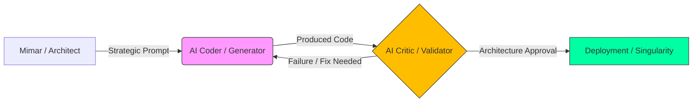

<!--
/// PAISE_ACADEMY_INITIALIZATION: OPERATIONAL_ELITE
/// VERSION: 8.0.0 "THE DEFINITIVE SINGULARITY"
/// STATUS: MAXIMUM_EXPANSION_COMPLETE
/// CORE_PHILOSOPHY: ARCHITECTURE_OVER_SYNTAX
-->

# 🏛️ PAISE ACADEMY: The School of Post-AI Engineering
### "Kod yazmak artık bir yetenek değildir; otonom sistemleri orkestre etmek ise tek gerçek güçtür."

---

**PAISE Academy**, yapay zekanın kodu saniyeler içinde üretebildiği ve geleneksel "Software Engineer" tanımının tarihe karıştığı "Tekillik" (Singularity) sonrası dünyada; insanı bir "klavye işçisi" olmaktan çıkarıp, karmaşık sistemleri yöneten bir **Sistem Mimarı**, **Otonom Orkestratör** ve **Baş Denetçi**ye dönüştüren küresel bir eğitim karargahıdır.

[📖 Kayıt Rehberi](#-1-kayit-ve-akademik-prosedür-admission) • [🗺️ Kampüs Planı](#-2-kampüs-plani-campus-layout) • [🎓 Müfredat](#-3-müfredat-ve-mezuniyet-the-syllabus) • [🔬 Laboratuvarlar](#-4-uygulamali-laboratuvar-oturumlari-lab-sessions) • [🛡️ Dekanlık](./CONTRIBUTING.md)

---

## 🏛️ 0. REKTÖRLÜK NOTU: TEKİLLİK HORİZONU (THE DEAN'S LOG)

Geleneksel eğitim sistemleri, "nasıl kod yazılır?" sorusuna takılıp kalmışken, **PAISE Academy** "nasıl sistem inşa edilir ve otonom süreçler nasıl yönetilir?" sorusunu vizyonunun merkezine yerleştirir. LLM'ler (Large Language Models) artık kod üretimini demokratize etmiş ve "Junior" seviyesindeki tüm işleri otomatize etmiştir. Ancak, bu sınırsız üretim kapasitesi beraberinde **"Mimari Kaos"** ve **"Teknik Borç Enflasyonu"** riskini de getirmiştir.

PAISE mühendisi, bu kaosun içindeki düzeni kuran, yapay zekayı bir ekzo-iskelet gibi kullanarak gerçek dünya problemlerini saniyeler içinde otonom çözümlere dönüştüren bir "Korteks"tir. Biz burada sadece döküman okutmuyor; bir mühendisin zihnini, AI ile simbiyotik bir ilişki kurarak 10x değil, 100x verimlilikle sistem tasarlayabilecek bir "Operating System" haline getiriyoruz. Bu akademi, her bir öğrencisinin PR'ıyla (Pull Request) kendini yeniden optimize eden, liyakat tabanlı ve yaşayan bir mühendislik beynidir.

---

## 📑 1. KAYIT VE AKADEMİK PROSEDÜR (ADMISSION)

Akademiye kabul edilmek için geçmişteki diplomalarınızın veya çalıştığınız şirketlerin bir önemi yoktur. Burada tek geçer akçe **Teknik Liyakat**, **Disiplin** ve **Adaptasyon Yeteneğidir**. Akademi, statik bir bilgi bankası değil, her gün cephede değişen bir operasyon merkezidir.

### 🧪 Ön Koşullar (Prerequisites)
- **Problem Ayrıştırma Yetisi (Decomposition):** Büyük ve amorf bir problemi, AI ajanlarının (LLM) hatasız çözebileceği atomik parçalara bölme zekası.
- **Mimari Okuryazarlık:** Kodun satır satır ne yazdığını bilmekten ziyade, o kodun sistemin geneline (Memory, Scalability, Security) nasıl bir yük bindirdiğini sezebilmek.
- **Sürekli Mutasyon:** Bugün öğrendiği teknolojiyi yarın çöpe atmaya zihinsel olarak hazır olmak.

### 📝 Kayıt Protokolü (Enrollment)
1.  **Repo'yu Forkla ve Senkronize Et:** Kendi dijital öğrenci cüzdanını oluştur ve gelişimini bu repo üzerinden "Public" olarak kanıtla.
2.  **Manifesto Onayı:** [01-felsefe-ve-zihniyet](./01-felsefe-ve-zihniyet/) altındaki doktrinleri oku. Zihnini "Legacy SWE" (Eski Dünya Yazılımcılığı) varsayımlarından temizlemeden teknik safhalara geçemezsin.
3.  **Savaş İstasyonunu Kur:** [Bölüm 5](#-5-savaş-istasyonu-research-labs)'teki konfigürasyonu tamamla. Terminal senin kumanda merkezin, AI ise senin sınırsız enerji kaynağındır.

---

## 🗺️ 2. KAMPÜS PLANI (CAMPUS LAYOUT)

PAISE Kampüsü, bir mühendisin evrimsel yolculuğunu simgeleyen 5 ana departman ve bir legacy kütüphaneden oluşur. Her bölge, bir öncekinin üzerine inşa edilen profesyonel bir yetkinlik katmanıdır:

| DEPARTMAN | KOD ADI | OPERASYONEL TANIM (FUNCTION) |
|:---|:---|:---|
| 🧬 **01-Felsefe** | **The Mind** | Yazılımın etik, felsefi ve stratejik temelleri. Zihin formatlama ve "Architectural Mindset" kazanımı. |
| 🏗️ **02-Teknik** | **The Forge** | 8 safhalı (PHASE 01-08) ana müfredat. Kılavuzların, dersnotlarının ve otonom uygulama projelerinin kalbi. |
| 🧪 **03-Vaka** | **The Simulation** | Gerçek dünya krizlerinin (Post-mortem analizler, System Failures) ve bu krizlerin AI ile nasıl yönetildiğinin dökümü. |
| 🛠️ **04-Araçlar** | **The Armory** | AI ajanlarının (Agents), elit CLI scriptlerinin ve verimlilik otomasyonlarının üretildiği teknoloji bankası. |
| 📚 **99-Arşiv** | **The Library** | Eski dünya (Legacy) bilgilerinin, üniversite notlarının ve dondurulmuş proje hafızasının saklandığı kütüphane. |

---

## 🎓 3. MÜFREDAT VE MEZUNİYET (THE SYLLABUS)

Akademi, öğrenciyi bir "klavye işçisi" olmaktan çıkarıp, karmaşık sistemleri yöneten bir "mimar"a dönüştürmek için 3 ana akademik kademe üzerine kurgulanmıştır.

### 🟢 LİSANS: AI-Native Temeller (Ignition)
> **Dersler:** Prompt Engineering 201 (Mantık Tasarımı), Linux Kernel Essentials, Modern Git & GitHub Workflows.
- **Hedef:** Tek başına bir projenin %80'ini AI yardımıyla 1 saat içinde hatasız ayağa kaldırabilecek hıza ulaşmak. Syntax ezberlemek yerine "Shell" üzerinden işletim sistemini orkestre etmek.

### 🔵 YÜKSEK LİSANS: Mimari ve Akış (Core Evolution)
> **Dersler:** Agentic Swarm Orchestration, Vector database Architecture, RAG Data Pipeline Design, System Dynamics.
- **Hedef:** Birbirinden bağımsız çalışan AI çıktılarını, birbirini denetleyen ve veri aktaran karmaşık bir sistem (Simbiyotik Yapı) olarak koordine etme yeteneği kazanmak.

### 🔴 DOKTORA: Tekillik ve Optimizasyon (The Singularity)
> **Dersler:** AI Security & Red Teaming, Token Economy Analytics, Self-Healing System Design, Industrial AI Scaling.
- **Hedef:** Kendi kendini iyileştiren (Self-healing), otonom kararlar verebilen ve küresel ölçekte (Lojistikten Savunmaya) etki yaratan sistemlerin baş mimarı olmak.

**Mezuniyet:** `PHASE_08_SINGULARITY` başarıyla tamamlandığında, katılımcı **PAISE Certified System Architect** ünvanını topluluk nezdinde kazanır.

---

## 🔬 4. UYGULAMALI LABORATUVAR OTURUMLARI (LAB SESSIONS)

Teori, pratikle çarpışmadığı sürece sadece bir "input gürültüsü"dür. İşte Akademimizdeki bazı elit laboratuvar oturumları:

> [!TIP]
> ### 🧪 LAB 01: Atomik Parçalama ve Context Yönetimi
> **Senaryo:** Müşteri, "Sesli komutla çalışan, gerçek zamanlı bir otonom drone yönetim sistemi" istiyor.
> **Görev:** Bu karmaşık isteği, AI ajanlarının (LLM) hata yapmadan saniyeler içinde yazabileceği 50 atomik teknik göreve böl.
> **Mimarın Notu:** Başarı, kodun uzunluğuyla değil, parçaların AI tarafından "ilk denemede" doğru üretilmesiyle ölçülür.

> [!IMPORTANT]
> ### 🧪 LAB 02: Ajanlar Arası Orkestrasyon (The Swarm)
> **Senaryo:** Bir ajan kod yazıyor, diğeri bu kodu test ediyor (QA), üçüncüsü ise güvenlik açıklarını (Security Scan) tarıyor.
> **Görev:** Bu 3 ajan arasında otonom bir "Feedback Loop" (Geri Bildirim Döngüsü) tasarla.
> **Mimarın Notu:** İnsan, bu döngüde sadece "onay makamı" olarak kalmalı, düzeltme kodlarını yine ajanlar üretmelidir.

---

## 🏛️ 5. MİMARİ BLUEPRINTLER (BLUEPRINT ARCHIVE)

PAISE Mimarlığının standart tasarım desenleri ve otonom akış şemaları:

### 🔄 Agentic Feedback Loop (Ajanlı Geri Bildirim Döngüsü)
Mimarın stratejik talimatı (Prompt), AI Coder tarafından koda dönüştürülür. Üretilen kod anında AI Critic tarafından liyakat ve güvenlik testine sokulur. Hata varsa döngü başa döner, yoksa "Production Ready" etiketi alır.

---

## 💻 6. SAVAŞ İSTASYONU (RESEARCH LABS)

Yapay zeka orkestrasyonu için optimize edilmiş önerilen elit çalışma ortamı. Bir PAISE öğrencisi, donanımını bir "savaş alanı" gibi yönetmelidir:

| KATEGORİ | STANDART KONFİGÜRASYON | NEDEN BU ARAÇ? |
|:---|:---|:---|
| **Laboratuvar (OS)** | **Linux / WSL2** | Kernel seviyesinde doğrudan kontrol, yüksek hiyerarşik hız ve terminal özgürlüğü için tek seçenek. |
| **Enstrüman (IDE)** | **Cursor / Windsurf** | Statik editorler öldü. AI ile doğrudan (Chat + Composer) saniyeler içinde bütünleşik konuşabilen bir yapı zorunludur. |
| **Korteks (LLM)** | **Claude 3.5 Sonnet / o1** | Karmaşık mimari analizlerde "Düşünsel Kapasite" (Reasoning) oranı en yüksek modeller. |
| **Komuta (Shell)** | **Warp / Oh-My-Zsh** | AI entegrasyonu, workflow paylaşımı ve komut geçmişi analitiğiyle hızınızı maksimize eder. |

---

## 🛡️ 7. AKADEMİK DOKTRİN (THE CODES)

- **KURAL 01: OTORİTE KİMSE DEĞİLDİR.** Akademi içinde ünvanlar değil, liyakat konuşur. En iyi fikri kimin söylediği değil, o fikrin mimariyi ne kadar optimize ettiği esastır.
- **KURAL 02: ADAPTASYON YA DA ÖLÜM.** Bugünün "State-of-the-art" teknolojisi yarının çöpüdür. PAISE belirli bir araca değil, değişimi yöneten "Mimarlık" refleksine sadıktır.
- **KURAL 03: AI SENİN EKZO-İSKELETİNDİR.** Onu yönetmeyi öğrenemezsen, onun tarafından yönetilen bir "Legacy Developer" olarak tarihe karışırsın.

---

**"Mimari bir kaderdir, dökümantasyon ise bu kadere giden pusula. Kaleyi birlikte inşa ediyoruz."**  
**[Bahattin Yunus Çetin](https://github.com/bahattinyunus)**  
*Founder & Multi-Disciplinary Systems Designer | AI Integration Architect*

`STATUS: ACADEMY_SESSION_V8_EXTREME`  
`UPTIME: ALWAYS_EVOLVING`  
`BY: THE ARCHITECT & THE SWARM`

